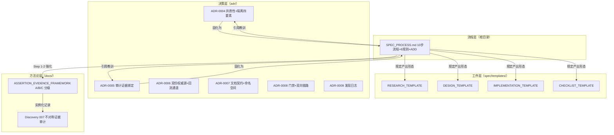

# Spec_Workflow Code Wiki

> **Wiki 版本**: v1.30（2026-09-09 P-027 step-enforce 覆盖盲区修复批（用户指令「登记并修复 step-enforce 的盲区」）：**盲区** = step-enforce hook files 正则仅收四文档精确名，不匹配 P-003 命名约定前遗留前缀命名（COMMUNITY_ECOSYSTEM_RESEARCH.md / STEP_GATE_CHECKLIST.md 等 `*_四文档` 形态）→ **P-026 批次实际未被 hook 门禁强制**（吃狗粮手动补跑 step-gate 掩盖），应走管线批次可静默绕过门禁 → **M7 样本 ㉛ 入账**（1 P2，形态 II=0 不入分桶；samples 30→31 / p2 41→42，m7_stats --write 重生成）；**修复** = [step-gate-enforcement DESIGN](spec/step-gate-enforcement/DESIGN.md) **v1.0→v1.1**（§4.2 files 收窄说明 + §9 追记）+ `scripts/step_enforce.py` FEATURE_RE 扩展 `[A-Z0-9_]+_` 前缀四文档（`*_TEMPLATE.md`/PLAN/`*_AUDIT.md` 不触发）+ **历史批次豁免（P-020 前不追溯）** + `.pre-commit-config.yaml` files 正则同步；覆盖核对 = 新纳入 15 feature 中 13 个为 P-020 前批次（豁免），仅 step-gate（P-020）/ community-ecosystem（P-026）纳入强制且均有 session；**五场景验收** = CER 触发（P-026 exit 0）/ 标准四文档（P-025 exit 0）/ 历史豁免（P-019 skip）/ 无映射（templates exit 2）/ 边界排除（AUDIT/PLAN/TEMPLATE 不触发）；三通道全绿 + spec_runner selftest 38/38（runner 零改动回归）；PROGRESS P-027 done + ADR-0011 v1.6→v1.7 追记 + declared progress_tasks 26→27；**v1.29（2026-09-09 P-026 CER §2.6 可行性判定补充调研批（用户指令「2.6 兼容与可行性矩阵 可行性判定需要补充调研 给出清晰的判断 吃狗粮执行 测试step-gate是否起效」）：**CER v1.9**——§2.6 矩阵四个模糊项四路 WebSearch 取证给出清晰判定（u14app **可行** v1.0.0 active/OpenAI 兼容端点+Searxng 本地轴/SSRF #153 提示；Alibaba **不复用** 通义 30B-A3B 重栈+repo 2026-02 停滞；AAT **可行** PyPI v0.1.2 uvx 与既有 mcp_paper-search 重叠可选；Gigaxity **不可行** Qwen3-30B-A3B 重资源+外部 key）+ 版本盲区 + §4.3 局限 5 收窄；断言计数不变（26/3/13/4）；**吃狗粮 step-gate 起效测试** = P-026 五步决策链 `step-gate --expect` exit 0 + verify-anchor 起效（2 真实 3 URL soft 设计语义）；PROGRESS P-026 done + §9 CER v1.9 同步 + declared progress_tasks 25→26；**v1.28（2026-09-09 P-025 独立验证批（用户指令「按照吃狗粮执行出路 C」——ADR-0011 A+C 决策出路 C 实施）：**`spec/independent-verify/` 第 22 feature 目录**（RESEARCH v1.0 + DESIGN v1.0 + CHECKLIST v1.0 accepting）——**spec_runner.py v1.4.0**（`verify-anchor --session` 子命令：decision 锚点真实性机械核查——文件存在 + 章节标题**精确匹配**（标题首 token 去尾点，`4.` 命中 §4 不命中 4.1）+ 行号上界，URL soft exit 2；selftest **38/38** = 31 + F30-F36）+ **SPEC_PROCESS RULE-1 补独立 pass 取证清单**（审查输入 = 事件流 + verify-anchor + git 状态；纯登记型无 diff 合法；只验位置可达不验断言对错）；只读零副作用（P-022 教训）；**吃狗粮自证** = P-025 session 决策链 3 步过 step-gate exit 0 + 自身锚点 3 条过 verify-anchor exit 0；历史 session 取证（p020 v2 6 锚点含行号 / p023 2 / p024 1）全真实；declared 21→22 / 24→25 + 目录树 + §9 索引 + doc_registry 同步；ADR-0011 追记（出路 C 落地）；**v1.27（2026-09-09 P-024 step-gate 流程强制批（用户指令「开启后续吃狗粮spec工作流」——ADR-0011 A+C 决策出路 A 实施）：**`spec/step-gate-enforcement/` 第 21 feature 目录**（RESEARCH v1.0 + DESIGN v1.0 + CHECKLIST v1.0 accepting）——pre-commit **第四 hook `step-enforce`**（files 收窄 spec/ 四文档）+ **spec_runner.py v1.3.0**（`step-enforce --pid` 前缀定位 specwf-p0xx-* session + 复用 step-gate 校验；selftest **31/31** = 28 + F27-F29）+ `scripts/step_enforce.py`（hook 入口：feature→P 映射，缺位 exit 2）；批次级强制（存在+非空）+ 只读零副作用（P-022 教训）；**吃狗粮自证** = P-024 session 过 step-enforce exit 0；declared 20→21 / 22→23 / hooks 3→4 + 目录树 + §9 索引 + doc_registry 同步；ADR-0011 追记；**v1.26（2026-09-09 ADR-0011 决策收口：用户裁决「ADR-0011 决策为A + C 组合收口」→ **proposed → accepted**（决策 = A 流程强制 + C 独立验证，B 排除暂缓；**A 失效条件已命中** P-021/022/023 三连批待实施指令，C 待 A 落地）；docs/adr/README + ADR-0007 附录 A + CODE_WIKI 四处状态同步；**v1.25（2026-09-09 M7 样本 ㉚ 入账：ADR-0011 v1.2 例证 P1（上轮独立 pass 修复凭 PROGRESS 印象写「P-021/022 走」与 sessions E1 实测不符——4 应走批次仅 1 走 3 未走，系统性失效）→ 复核修复 v1.3（六处 + 判定准则适用限定「P-020 起新批次」+「机械可核」定义）；M7 samples 29→30 / form2_total 69→70（m7_stats --write 重生成）；CODE_WIKI 三处 M7 计数同步；**v1.24（2026-09-09 ADR-0011 落档：P-023 决策链缺失排查——step-gate 未生效（触发依赖 = 值守机制非强制 + 表演性决策软肋 = 证据自报抗不住表演）+ 社区 4 轮检索三出路 A/B/C 三问预演登记**仅登记不实施**；docs/adr/README 索引 + ADR-0007 附录 A（v1.5→v1.6）+ declared.adr_files 7→8 + §9 ADR 表 + §10 adr/ 列表同步；**v1.23（2026-09-09 P-023 drift-gate / 意图图-证据图概念吸收批（用户指令「跑吃狗粮测试 按 spec 工作流开始 运行到懒加载 gate 部分即可」）：**`spec/drift-gate/` 第 20 feature 目录**（[RESEARCH](spec/drift-gate/RESEARCH.md) v1.0 + [DESIGN](spec/drift-gate/DESIGN.md) v1.0 两件套——Layer-0 概念登记：SGE 双图校验思想 → repo_stats「意图→证据→缺口」闭环演进候选；ADR-0010 三问懒加载审核（Q1 Layer-0 / Q2 触发驱动 pattern_lib_version 2 / Q3 副作用 0）全过但**仅登记不实施**）；CER §4 候选表 + PROGRESS P-023 + doc_registry 同步；declared 计数 19→20 / 22→23；**v1.22（2026-09-08 P-022 缺陷修复批示实施+落档：**`spec/defect-fixes/` 第 19 feature 目录**（[DESIGN](spec/defect-fixes/DESIGN.md) v1.2 verified + [CHECKLIST_FUNC](spec/defect-fixes/CHECKLIST_FUNC.md) v1.0 accepting——两缺陷均来自 P-020 吃狗粮活体实证）：gate auto-commit 修复 = A+B 修正后采纳（subagent 审查无否决项 + 用户裁决 D1；**spec_runner.py v1.2.0**：`git_snapshot` 改 opt-in 门控默认关（SR_GIT_AUTOCOMMIT=1）+ 精确 sid 单文件 + 会话目录 git 根派生 + --no-verify + selftest 增 F25/F26 = **28/28**）与 DIS-008 规则化（用户裁决 D2：AGENTS.md 禁止事项两条 + 第 4/5 次复发追记）；P-022 done；declared spec_feature_dirs 18→19 + progress_tasks 21→22 + §2.1 树 + §9 索引 + doc_registry 同步；三通道全绿；v1.21（2026-09-08 P-020 step-gate 决策产物管线吃狗粮全流程（用户指令「执行每步决策产物管线（step-gate）按照吃狗粮方式开始流程 且需要执行懒加载审核」）：CER §3.5 裁定落地——**ADR-0010 首例懒加载审核正式闭环**：`spec/step-gate/` 三件套（[STEP_GATE_CHECKLIST](spec/step-gate/STEP_GATE_CHECKLIST.md) v1.2 **accepted** 三问 8/8 全过 + [DESIGN](spec/step-gate/DESIGN.md) v1.0 决策事件 schema 复用 FWK-DECISION-RECORD 八字段/step 序表五步/三类规则 exit 0/1/2 + [CHECKLIST_FUNC](spec/step-gate/CHECKLIST_FUNC.md) v1.1 accepting 12/12）；**spec_runner.py v1.1.0**（EVENTS+"decision"+cmd_gate_step+parser step-gate+selftest F20-F24）——selftest **26/26**（原 21 项回归零破坏）；**吃狗粮实证（Q2b E2）**：session `specwf-p020-20260908v2` 五步决策链 `step-gate --expect research design implement verify finalize` → **exit 0**，下一轮 RULE-1/RULE-5 审查臂以事件流为唯一输入（「声明=重数」推广到流程执行层）；CER v1.7 候选表吸收标注（分层归属 = Layer-1，契约 Layer-0）→ P-020 done 登记；三通道全绿（dc_validator 77 文件/m7_stats/repo_stats 0 违规）；无新增 M7 样本；v1.20（2026-09-08 CER v1.3 补分层归属列：**ADR-0010 验收条件之二闭环**——COMMUNITY_ECOSYSTEM_RESEARCH v1.2→v1.3，§3.4 补强判定矩阵新增「分层归属（ADR-0010 Q1）」列（6 候选分层：AGENTS.md 桥 L0 / 决策产物管线 L1 / drift-gate L0 / ARC L1 / DeepEval+调研链 L1 / ADR 三层 L0 + 不复用组标不适用）；三问门禁 Q1 批量预演 = CER"建议"评级的机制性解释；三通道全绿；v1.19（2026-09-08 step-gate 三问门禁验收清单：**第 17 feature 目录 `spec/step-gate/`**（STEP_GATE_CHECKLIST v1.0 pending——ADR-0010 三问门禁在 P-020 的首例实例化，8 子项验收：契约落位 FWK-DECISION-RECORD 复用 / 实现落 tools/spec_runner / 单向依赖 / 激活触发器声明 / 全链映射 / 源码零足迹 / 文档零强制 / 工具链零变化）；repo_stats 声明对账 16→17 + §2.1 树 + §9 索引 + doc_registry 同步；三通道全绿；v1.18（2026-09-08 ADR-0010 懒加载架构原则 accepted：**懒加载从 P-019 具体实现退役误解澄清 → 升格为候选吸收强制门禁**——新 ADR-0010（v1.0 proposed → 独立 subagent 审计（1P1+4P2+3P3：Langfuse 判例归因/D6 与零副作用混淆、验证表 E1 越级、引文节定位错位、L1-L7 分工遗漏、阈值推导缺失、机械可回答自相矛盾）→ v1.1 修正 → 用户确认 **proposed → accepted**）：三问门禁 = 放哪层（Layer-0/Layer-1）/ 激活条件 / 未激活零副作用；与 D6（管外部依赖）+ P-009 L1-L7（管 runner 自身模块）互补，约束候
选吸收准入边界；七份 ADR 全 accepted；docs/adr/README + ADR-0007 附录 A（v1.4→v1.5）+ 覆盖对象同步；三通道全绿（dc_validator 71 文件 / m7_stats / repo_stats 0 违规）；验收条件挂 P-020 首例走三问 + community-ecosystem 补分层归属列；v1.17（2026-09-08 P-019 spec-runner-homing 实施批（用户指令「好的，进入实施批」）：**Spec_Runner 并入本仓落地**——8 文件全量平移至 `tools/spec_runner/`（spec_runner.py/README/sessions×4/templates×2，hash 逐字节核对一致；外仓 F:\Spec_Runner 冻结存档）；四件套齐（RESEARCH v1.1 + DESIGN v1.0（D1 落点=tools 独立目录绕开对账键）+ IMPL v1.0 verified + CHECKLIST v1.0 accepting 7/7）；**上游修订注三处**（LANGGRAPH §6「独立仓库」子句 / spec-runner DESIGN D1 / IMPL commit 锚退役——本框架首例执行层裁决反悔，修订机制与先例同等重要）；验证 = selftest 21/21 + gate 入流 replay OK + adapter dry-run 装配正确 + 三通道全绿（dc_validator 68 文件 / m7_stats / repo_stats 0 违规）+ **C7 零新增 M7 样本**（纯部署变更零发现）；活动指针改写完毕、历史叙事保留（语义甄别）；tools/ 树登记 + 覆盖对象同步；PROGRESS P-019 done；v1.16.1（2026-09-08 P-019 归巢调研 v1.0→v1.1 用户裁决修正轮（用户指令「spec_runner 放在 spec_workflow 文件夹下面可以方便管理 读写 请重新分析」）：SPEC_RUNNER_HOMING_RESEARCH **v1.0→v1.1**（6A+2B+3C+2H）——**动机纠正 = 单仓管理便利（非去依赖）→ C1 改判「否决并入」→「采纳并入为候选方向」**：新增 A6 实证 = Spec_Runner 仓 git remote 为空/单分支/5 commit 全服务本仓（D1「独立生命周期」论据 27 天实证弱化为零——无独立用户/推送/用途，实为本仓内聚组件隔离在外仓）；管理便利收益（双仓双提交/路径切换摩擦 + 事件流 E1 证据与 M7 账本同仓 + 单人仓无共享场景）> 并入改动成本（上游裁决修订/repo_stats 对账/漂移防线退役/sessions 入库 = 机械性一次性工作）；懒加载分层降级为并入前过渡机制（并入后 RUNNER 探测自然退役）；三通道全绿 + R7 重数一致；无新增 M7 样本；PROGRESS P-019 追记；v1.16（2026-09-08 P-019 spec-runner-homing 归巢调研批（用户指令「按照 spec_workflow 的规范进行吃狗粮开发 先基于上两轮分析进行调研」，吃狗粮 = 以 P-019 为例跑 Spec 工作流 Step 1，调研对象 = 上一轮 P-017 交付物的结构假设）：**`spec/spec-runner-homing/` 第 16 feature 目录**（SPEC_RUNNER_HOMING_RESEARCH v1.0：5A+2B+3C+2H，全仓内 E1 取证零 WebSearch）——**依赖面实况 = 零代码依赖**（本仓对 Spec_Runner 全部引用为文档指针：PROGRESS/CODE_WIKI 指针 + spec-runner 四件套绝对路径锚 + community-ecosystem 引用；scripts/ 三校验器与三个 hook grep 命中 0 处——D1「双向零依赖」实施态与声明态一致；唯一外部路径位点 = P-017 接入示例配置区 RUNNER，属自举配置非依赖）；**三方案裁决**：C1 维持双仓否决并入（并入动机对象不存在 + 推翻 LANGGRAPH §6「独立仓库」与 DESIGN D1「两类可执行件分属两仓」双层上游裁决 + repo_stats 对账漂移）；C2 采纳懒加载分层（文档层自足现状 + 工具层 adapter RUNNER 存在性探测，缺失即 exit 2 + 安装指引，~15 行小改不触 runner 本体）；C3 P-019 编号撞号处理（本批占用，P-018 §3.5 决策产物管线顺延 P-020）；实施期 dc_validator/m7_stats 一次通过 + R7 重数一致（自引用剔除注记）；无新增 M7 样本；PROGRESS P-019 in-progress（实施批待用户裁决触发）；v1.15.2（2026-09-08 P-018 吃狗粮 review 深度审计批（用户指令「以本次开发为例进行吃狗粮测试 按 spec 流程盲区扫描 可行性 版本 兼容」）：COMMUNITY_ECOSYSTEM_RESEARCH **v1.1→v1.2**（self-dogfooding 深度 review 捕获 **1P1+2P2+8P3** → **M7 样本 ㉙ 入账**（C 类计数声明 10 实为 12，form2_total 68→69 / samples 28→29——「C 类裸奔」覆盖不对称再实证》：P1 = §0 C 类计数虚报 2；P2 = C-10 编号引用错位（实为 C-12）+ §4.2 验证表未同步 v1.1 新增断言 5 行；P3 = §2.5「三类」实为两类 / 版本成熟度缺失族 /「G2」自造编号去除 / §3.5 step-evidence 精化（metadata.evidence+step_id）/ 兼容矩阵新增 §2.6；补充取证 = gpt-researcher 官方支持 OPENAI_BASE_URL（三机 LM Studio 可直接接）+ searx/duckduckgo 替 Tavily + 多代理 Reviewer「研究-审核-修正」循环（第四同构佐证 C-12）——**H4 部分解除**；核心结论与 §3.5 裁定不变）；gpt-researcher 结论已补入接入示例（Spec_Runner commit 71c7ae6：adapter v1.1 docstring + README「调研步接入候选」节）；PROGRESS P-018 追记；v1.15.1（2026-09-08 P-018 补充调研批（用户提问「每步骤是否有框架/skill/MCP 可补强 + 可否强制每步给出决策引用依据供下轮审查」）：COMMUNITY_ECOSYSTEM_RESEARCH **v1.0→v1.1**（+9A+1B+3C+1H = 25A+3B+10C+4H）——步骤级工具盘点 §2.5（调研链：gpt-researcher 29.2k★ 规划者-执行者+引用报告 / Gigaxity MCP 六工具引用绑定+矛盾检测+CRAG 质量门 / AAT 跨 agent 统一安装 skills+MCP / Agent Leaderboard 发现入口；ADR 强制门禁三项目：adr-governance ADL=机器可读 spec+CI 强制执行循环 / ADR Kit 三层分阶段 enforcement+lint 从 ADR 生成+supersede 不编辑 / ADR 侵食三层防御=禁止事项显式化→差分静态检查→CI+清单自查）；**§3.5 强制决策产物管线裁定 = 可行且优先**——十步流程每步产出 FWK-DECISION-RECORD「决策记录事件」（event: decision，八字段+evidence 引用 E1-E4）入 Spec_Runner 流，`step-gate` 机械校验（字段完整/引用非空可解析/每步恰一条），下一轮 RULE-1/RULE-5 审查臂以事件流为唯一输入——「声明=重数」从文档层推广到流程执行层；采纳路径 = P-019 小流程（编号已被 P-019 spec-runner-homing 占用，顺延 P-020）；PROGRESS P-018 追记；v1.15（2026-09-08 P-018 社区同类框架生态调研批（用户指令「调研分析社区当前类似优秀的开源框架 是否可以补强复用」）：**`spec/community-ecosystem/` 第 15 feature 目录**（COMMUNITY_ECOSYSTEM_RESEARCH v1.0：16A+2B+7C+3H，四轮 WebSearch 取证）——社区四簇与本框架方法论高度同构：spec 宪法类（Superpowers 130k★ 强制 spec 管线+子代理审查 / SpecKit constitution / **Spec Growth Engine drift gate=spec-code 漂移阻塞合并 + 意图图 vs 证据图双图校验**）/ AGENTS.md 开放标准（60k+ 仓库 23 工具原生识别，Linux 基金会托管）/ 决策溯源图（**ARC** trace/impact/check + adr-kit ADR 变 guardrails + assay 评估吸收工作台）/ LLM 评测（promptfoo 并入 OpenAI；DeepEval pytest 臂；Langfuse OTel 平台）；**补强判定=分层吸收待用户裁决**：立即候选 = AGENTS.md 桥（零依赖工具互操作）+ drift-gate 概念（repo_stats pattern_lib_version 2 关联）；候选议程 = ARC 作 P-015 方向 A 轻量先导 + DeepEval 第二臂；不复用 = Superpowers/SpecKit 本体（软形态）+ Langfuse（重平台违零依赖）；**外部印证登记**（spec-reviewer≙独立 pass / constitution≙SPEC_PROCESS / 三起 Agent 事故归因缺口≙M7 动机）；实施期 M4 拦截 3 P1（A 声明 15 实 16 + B 机读块格式 + H 标记缺失）同轮修正；PROGRESS P-018 done + 已完成表；v1.14（2026-09-07 P-017 Spec_Runner 接入扩散批：**通用接入模板 + 具体接入示例落地**（用户指令「请生成一个通用的接入脚本模板，方便其他项目快速集成 Spec_Runner」+「将上一轮工作落档 然后生成一个具体接入示例」；产出物全部在 F:\Spec_Runner 仓，本仓零新增——登记归档）：`templates/spec_runner_adapter.py`（通用样板 v1.0，commit 871c257——零依赖编排壳：不改 gate 语义/不复制 runner 逻辑；session 自动 `{PREFIX}-{name}-{yyyymmdd}`；dry-run 预览 + exit 透传可嵌 pre-commit/CI；`myproj` probe 实证 `sessions/myproj-probe-20260907.jsonl`）+ `templates/examples/spec_workflow_adapter.py`（**具体接入示例** v1.0，commit 8be82bb——Spec_Workflow 自举成品：PREFIX=specwf / CWD=F:\Spec_Workflow / GATES=dc-validator+m7-stats+repo-stats+pre-commit 四门禁，照抄改 RUNNER/PREFIX/CWD/GATES 四处即接入）；实测通过 = dry-run 命令装配正确 + probe 真实入流（gate verdict=pass exit=0）+ replay 1 rows OK——事件即 E1，指针形态 `Spec_Runner:sessions/specwf-probe-20260907.jsonl#seq1`；三步接入流程成文（复制→配置→probe 自检）；README 增「其他项目接入（模板）/具体接入示例」两节；PROGRESS P-017 done；无新增 M7 样本（接入样板属 runner 仓模板资产，本仓无计数声明位点，全流程实测无发现）；v1.13（2026-08-27 P-009 实施批：**Spec_Runner 仓落地（F:\Spec_Runner，commit `4ea703d`）**——spec_runner.py 519 行（七模块全低于 LOC 预算上界，**LG H2 完全解除**：设计级 ~550-850 + 实施级 519 双吻合）+ selftest **21/21**（stdlib mock server + 计数机械自增；两轮修正实录留档 IMPL §4——require-gate 同流语义澄清 + F18 断言格式，均测试侧非实现缺陷）+ **首个真实运行 = 本仓三 gate 入流**（dc-validator/m7-stats/repo-stats 全 pass + replay OK + fork OK——事件流即 E1，指针形态 `Spec_Runner:sessions/p009-first-run-001.jsonl#seq1-3`）+ 双仓漂移防线（IMPL 锚 Spec_Runner commit hash）+ spec-runner 四件套齐（IMPL v1.0 verified + CHECKLIST v1.0 accepting 22/22 有条件通过，独立 pass 待触发）；**runner 已可用**——run/gate/status/replay/fork 五命令全实测，RULE-1 流程层物理化（gate 物理化 + 同 sid 强制新流）交付；解锁项维持：LG H3（端点就绪时异构审查臂）/ dsh H2（工作站+端点双就绪时 adapter 选型实测）；LangGraph (a)/(b)/(c) 观察期开始（三条件均未现）；v1.12（2026-08-26 P-009 设计批：Spec_Runner 薄壳 runner 由触发驱动态转正式执行（用户指令「继续处理 P-009」= 触发裁决显式行使，与 LangGraph 升级条件 (a)/(b)/(c) 正交登记）——**spec/spec-runner/ 两件套落地**（第 14 feature 目录，设计批先行裁决：三问三答 = 设计批先行 / 独立仓库 F:\Spec_Runner / 选型开放结构）：RESEARCH v1.0（设计批增量——三端点 E1 复核仍不可达（LG H3 维持，连续两次同结论）/ LG H2 设计级 LOC 拆解 ~550-850 吻合（B1 七模块 + 三脚本先例对照）/ 3C 裁决登记）+ DESIGN v1.0（**D1-D7**：双仓结构 + 双向零依赖 / L1-L7 逐条落地映射（append-only 写入器无 rewrite 路径 / 新 session_id 强制 exit 2 / log writer 固定）/ **gate = 流程门禁执行器**（RULE-1 流程层物理化——审查 gate 未过实施不可启动；verdict 纯机械无 LLM 判断）/ adapter 开放结构（裸 API 默认 + DshSDKAdapter 候选，L7 不受选型影响）/ 端点就绪门控（承 P-010 方案 Z）/ 零依赖 stdlib only / 五命令面 + 事件行十字段 schema 定稿）+ 实施批五步规格（DESIGN §6——首个真实运行 = 本仓三 gate 入流，自身落地即 E1）；M4 首跑拦截 H 标记形态 P1（`[LG-H2]` 非 `[H#]` 契约，同㉔ 族）→ M7 样本㉘ 入账（形态 II=0 同⑭⑱㉔ 处置，samples 27→28）；实施批待触发——解锁项 LG H3（端点）/ dsh H2（工作站+端点）/ LG H2 实施级；v1.11（2026-08-26 P-016 独立 pass 批：决策记录 schema 契约批独立 pass 完成（用户指令「好的，执行独立 pass」）——异步独立子代理审计 + 主臂源码复核双通道捕获 **1P2（「find_similar_decisions 检索消费 reasoning_embedding 余弦」机制归属错位：实际默认路径 = context_graph.py find_precedents_by_scenario 词袋 Jaccard + 图结构分，`reasoning_embedding` 余弦仅属 decision_query.py find_precedents_hybrid 分支）+ 2P3（CHECKLIST §2 措辞过度声明已精确化 / 契约 depends 设计选择维持）**→ **M7 样本㉗ 入账**（form2_total 67→68 / samples 26→27，quote 转述引文字段**本仓首例**——机制归属错位：行号锚点正确而语义归属错位）+ 四文档版本化（RESEARCH v1.3→v1.4 §2.5/H3/B2 basis 分路径修正 + 契约 v1.0→v1.1 §3 + DESIGN v1.0→v1.1 D2 依据二 + CHECKLIST v1.0→v1.1 §8.2 独立 pass 追记，22/22 → 通过）；**D2 无损分流裁决不受影响**（两检索路径均不消费 confidence，M7 样本㉗ 已如实标注）；v1.10（2026-08-23 P-016 决策记录 schema 吸收（B 方案契约批）：**`docs/DECISION_RECORD_CONTRACT.md`（FWK-DECISION-RECORD v1.0）落地**——Semantica（semantica-agi，MIT）决策 schema 吸收为独立契约（ADR-0007 附录 A 入册，v1.3→v1.4）：八字段（锚定源码级 record_decision 签名 + bi-temporal）+ 三载体映射（M7/ADR/PROGRESS）+ 关系类型（CAUSED/INFLUENCED/PRECEDENT_FOR）+ I-1~I-4 不变式；**D2 severity 无损分流否决有损编码**（confidence=决策置信度≠严重性 + 检索不消费 confidence）；双用途 = 决策记录结构化自查视角（即刻）+ 方向 A 导入唯一映射权威（触发时）；spec/decision-schema/ 两件套（DESIGN D1-D4 + CHECKLIST 22/22 accepting）；RESEARCH v1.3 裁决推进「暂不结合」→「分层结合」（B 层激活）；无新增 M7 样本（契约批无计数声明位点，dc_validator/repo_stats 首跑即过）；v1.9.1（2026-08-23 P-015 review 深度审计批：SEMANTICA_ABSORPTION_RESEARCH v1.0→v1.1——同基座深度 review（RULE-1 时序独立，RULE-5 降级标注）+ 盲区扫描（Iron Law 四类 + 证据分级 + 环境维度）捕获 1P1+3P2+6P3：P1 = §0 C 类计数声明 3 实为 4（【C】不参与 R7 机械看护边界外，review 臂重数捕获——与㉕ A 类 14→15 构成**同一报告两轮各错一次**，A 类有 M4 门禁/C 类裸奔的覆盖不对称实证）；P2 = 消歧段"Hawksight-AI 前身"无源断言降级 + 版本成熟度缺失（补 0.6.5 断言）+ Win10×faiss 环境门槛盲区（H4）；形态 II=4（计数×2 + B 类 basis 锚点编号×2——章节号族新变体：A 类无编号体系却引"A2/A6"）→ 样本㉖ 入账（form2_total 63→67 / samples 25→26）；v1.9（2026-08-23 P-015 semantica-absorption 调研收束批：Semantica（semantica-agi）图原生决策溯源基础设施调研——15A+2B+3C+3H，结论「暂不结合，先例检索补位为候选议程」（方向 A 价值最高：M7/ADR 决策导入 Context Graph 获 find_similar_decisions 式语义先例召回，稀侵入不违零依赖不变式；方向 C 位置冲突否决）；dc_validator M4 全量首跑拦截 §0 声明计数（A=14 实为 15）→ 样本㉕ 入账（形态 II=1 计数入分桶，form2_total 62→63 / samples 24→25）；v1.8（2026-08-23 P-010 promptfoo M7 对比臂声明式评测落地批：`scripts/pf_m7_eval.py`（第四可执行件，run/record/selftest 三子命令，275 行 selftest 13/13——**非 hook**，评测运行器与三校验器分工不同）+ `spec/promptfoo-m7-eval/`（第 11 个 feature 目录，四件套 + promptfooconfig.yaml 双臂矩阵模板）+ 方案 Z 端点门控（三机 LM Studio 实测不可达——不可达即 exit 1 不调 promptfoo，首轮评测 + LG H5 实测端点就绪触发）+ Review 轮 P1×2/P2×3/P3×3 修复实录 → M7 样本㉔ 入账（形态 II=0 同⑮ 处置，samples 23→24 / form2_total 62 不变）+ CHECKLIST v1.1 accepting（35/35 有条件通过，独立 pass 待触发）+ PROGRESS P-010 done（主动队列清空）+ DEV-LOG-007 + 门面快照同步；v1.7.4（2026-08-23 m7-hits-block 独立 pass 批：同基座降级审查（DeepSeek V4 Pro，RULE-1 时序独立满足，RULE-5 模型异质性降级标注——生成端/审查端同基座）+ DR-B/C 专项 fixture 补齐（F15/F16，selftest 14→16 项 40→44 断言）+ `scripts/m7_stats.py` LOC 828→845 回填 + 四件套落档（IMPLEMENTATION → verified / CHECKLIST → accepted / RESEARCH audit_status CLOSED）；v1.7.3（2026-08-23 ㉓ 入账批：P-014 真异基座独立 pass（DeepSeek V4 Pro，RULE-1+RULE-5 双满足）捕获 repo_stats 自身文档 fixture 计数词漂移——「19 fixture」4 处停旧（F20 TDD fixture 落地未回写计数词）→ 样本㉓ 入账（form2_total 61→62 / view_layer_pct 65%→64%）+ 四件套落档 accepted/verified + 门面快照同步；v1.7.2（2026-08-22 ㉒ 入账批：P-014 收口批独立 review 捕获 PROGRESS 依据列「八度」计数词停旧——repo_stats 边界外首个 post-toolization 复发（review 臂捕获，pattern_lib_version 2 候选议程，[REPO_STATS_AUDIT](spec/repo-stats/REPO_STATS_AUDIT.md)）→ M7 样本㉒ 入账（form2_total 60→61 / view_layer_pct 66%→65%）+ ㉒ 轮 verify 首跑 9 活靶全修正 + 门面快照同步；v1.7.1 于 2026-08-22 P-014 收口：CHECKLIST v1.1 accepting（有条件通过，独立 pass 待触发）+ PROGRESS P-014 done + DEV-LOG-006 + M7 样本㉑（首跑 7 真靶全捕获）+ DIS-010 toolized；v1.7 于 2026-08-22 P-014 落地：视图层机械枚举校验器 `scripts/repo_stats.py`（第三可执行件，**对账器非再生成器**——只报偏差永不代改）+ §10 stats 机读声明块（模式库 21 条数据驱动 / 载体两级 living-facade / 门面快照基准）+ pre-commit hook repo-stats 入册——「声明 = 机械重数」从 M7 账本外推到视图层，[DIS-010](docs/discoveries/README.md) 处置落地；v1.6.2 于 2026-08-22 终值修正：⑳轮捕获⑲轮「修完即绿」8 处实际未写入——修完即绿由模式扫描对账确认；v1.6.1 于 2026-08-22 修正轮：三轮共 22 项漂移修正（样本⑲——**修正轮是「视图的修正视图」**）；v1.6 于 2026-08-21 P-011 落地：M7 §5 hits 机读块 + `scripts/m7_stats.py`（第二可执行件）+ hook m7-stats。当前态：M7 样本①-㉚（形态 II 70 处——样本⑭⑮㉔㉘ 非形态 II）、spec/ 十六 feature 目录（community-ecosystem + spec-runner-homing 新增）、四可执行件四 hook + tools/spec_runner）；前版见 git 历史）
> **覆盖对象**: 本仓库全部文档与工具（宪法 SPEC_PROCESS v1.4、ADR-0004~0011 八份、Discovery 007 v1.3 + DIS-007~010、断言证据框架 v1.4.2 + 事实核查框架 v1.0 + 决策记录契约 v1.1、5 个模板（四件套 + ADR）、M7 证据账本（含 §5 hits 机读块）、discoveries 索引、PROGRESS、dev-log ×7、spec/ 二十二 feature 目录、`tools/spec_runner/`（P-019 归巢）、`scripts/dc_validator.py` + `scripts/m7_stats.py` + `scripts/repo_stats.py` + `scripts/pf_m7_eval.py` + `scripts/step_enforce.py` + `.pre-commit-config.yaml` 四 hook）
> **仓库性质**: 方法论文档仓库为体、最小工具层为用 —— 可执行件 = DC 契约校验器 + M7 统计校验器 + 视图层枚举校验器（三校验器）+ promptfoo 评测运行器（均 Python 侧零第三方依赖；pf_m7_eval 调外部 promptfoo CLI）+ Spec_Runner 薄壳 runner（tools/spec_runner/，P-019 归巢）+ pre-commit 四 hook（+ step-enforce 流程强制，P-024）；其余"运行方式" = 工作流的执行方式（见 §6）

---

## 1. 项目概览

### 1.1 项目定位

本仓库是一套 **Spec 驱动开发规范**（Spec-Driven Development）的完整方法论，服务于"单人开发者 + LLM Agent"的研究/工程工作流，核心目标是 **最大限度抑制 LLM 生成内容中的幻觉（hallucination）与形式化审查表演**——任何 agent 框架都无法消除幻觉，只能某种程度地抑制。

- **起源**: `math-finance-reasoning` 项目（金融数学推理框架）的流程规范，自 v1.2.1 起自包含化，可跨项目复制迁移
- **哲学基础**: "不信任系统" —— 不信任 LLM 断言（断言分级证据）、不信任自查（Review 独立性规则）、不信任测试通过（ADD Iron Law）、不信任审查勾选（取证矩阵）
- **核心原则链**: 调研先行 → 文档驱动 → 多轮 Review 抑制幻觉 → TDD 实现 → 审查验收

### 1.2 解决的问题

| 问题 | 本仓库的对策 | 落点 |
|------|------------|------|
| LLM 调研报告含虚构文献/版本/公式 | 断言 A/B/C 分级 + 生成端强制证据 | `docs/ASSERTION_EVIDENCE_FRAMEWORK.md` |
| Review checkbox 与正文同次写入（"并发自查"） | Review 时序独立规则 | `SPEC_PROCESS.md` 规则 1 |
| 从测试总数推算验收统计（虚报） | 统计溯源规则 | `SPEC_PROCESS.md` 规则 2 |
| 条件 skip 测试消失（skip-and-forget） | 隔离四要素 | `SPEC_PROCESS.md` 规则 3 |
| 单 agent 既写又审无对抗 | 单视角声明 + 异构第二会话 | `SPEC_PROCESS.md` 规则 4/5 |
| 审计"全绿表演"（无证据绑定的✅） | 取证矩阵 E1-E5 | `SPEC_PROCESS.md` 规则 6 + ADR-0005 |
| 测试通过 ≠ 设计落地 | ADD 四阶段审计 | `SPEC_PROCESS.md` Step 10 |
| 文档契约违规（front-matter 缺失/词表越界/断链/计数手填）逃逸到提交后 | DC1-DC4 契约 + pre-commit 机械拦截（R7 计数重数） | `scripts/dc_validator.py` + `.pre-commit-config.yaml`（P-007） |
| M7 账本统计（样本数/分桶算术/跨表对账/P 汇总）手工登记漂移 | hits 机读块（声明 = 机械重数）+ 表算术/跨表不变式校验 + pre-commit 拦截 | `scripts/m7_stats.py` + M7 §5（P-011） |
| 聚合视图文档手写枚举计数漂移（无失效检测的缓存副本，[DIS-010](docs/discoveries/README.md)） | stats 机读声明块（声明 = 机械重数外推到视图层）+ 模式扫描对账 + 门面快照基准 + pre-commit 拦截 | `scripts/repo_stats.py` + CODE_WIKI §10（P-014） |

### 1.3 版本演进

| 版本 | 日期 | 变更 |
|------|------|------|
| v1.0-v1.0.x | 2026-08-01 前 | 初始 10 步流程 |
| v1.1 | 2026-08-01 | M6 元审计后增补 Review 独立性规则（时序独立/统计溯源/环境确定性） |
| v1.2 | 2026-08-01 | 外部对标后：规则 3 升级为隔离四要素、新增规则 5 异质性约束、Step 8 增派生需求项（依据 ADR-0004） |
| v1.2.1 | 2026-08-16 | **自包含化**：全部教训内联正文，移除对 ADR/元审计报告/本地 skill 路径的内容依赖，可跨项目迁移 |
| v1.3 | 2026-08-16 | 新增规则 6 审计证据绑定：Step 10 取证矩阵标准化（E1-E5 证据五分类、双向映射、诚实结果列、最高等级绑定、风险分级执行）（依据 ADR-0005） |
| v1.4 | 2026-08-17 | cpp-hub-absorption Tier2：Step 2 Review 升格**门禁语义**（R4 语义 (a)-(d)，满足前禁止进 Step 3）+ Step 8 增双向引用/断言延续两项 + Step 2/10 发现记录集成点（依据 ADR-0008/0009，第二次回流） |

---

## 2. 整体架构

### 2.1 物理目录结构

```
f:\Spec_Workflow/
├── SPEC_PROCESS.md              # ★ 流程宪法 v1.4：10 步 + 6 规则 + 门禁 + ADD
├── CODE_WIKI.md                 # 本 Wiki
├── .pre-commit-config.yaml      # repo-local 四 hook（dc-validator + m7-stats + repo-stats + step-enforce）
├── adr/                         # 架构决策记录（八份，全 accepted）
│   ├── ADR-0004-...quarantine.md     # 异质性约束 + 隔离四要素（→ v1.2）
│   ├── ADR-0005-...binding.md        # 审计证据绑定（→ v1.3）
│   ├── ADR-0006-...authority.md      # 断言框架双份权威源（回流通道）
│   ├── ADR-0007-...contract.md       # 统一文档契约（→ v1.3，附录 A 命名空间登记权威）
│   ├── ADR-0008-...gate.md           # Step 2 门禁 + Step 8 双向链路（→ v1.4）
│   └── ADR-0009-...discoveries.md    # 发现日志机制（2026-08-19 首次重审 = 机制保留）
├── docs/                        # 方法论层
│   ├── 007_hallucination_audit_...md     # Discovery 007 v1.3（toolized；追记 DR-6）
│   ├── ASSERTION_EVIDENCE_FRAMEWORK.md   # 断言分级证据框架 v1.4.2（STEP_GAP 两态 + R7 + §10 下游分工）
│   ├── FACT_CHECK_FRAMEWORK.md           # 事实核查框架 v1.0（CHK-/FC- 编号，FWK-ASSERTION 下游补充，2026-08-21 吸收）
│   ├── DECISION_RECORD_CONTRACT.md       # 决策记录契约 v1.1（FWK-DECISION-RECORD：schema 八字段 + 三载体映射 + I-1~I-4，Semantica schema 吸收，P-016）
│   └── M7_EVIDENCE_LOG.md                # M7 证据账本（唯一活载体；样本①-㉛ + §5 hits 机读块，形态 II 70 处）
│   ├── PROGRESS.md                       # 待办登记（P-001~P-027 登记在册 27 项——P-001 至 P-027 全 done，剩触发驱动项）
│   ├── adr/README.md                     # ADR 索引（命名空间权威 = ADR-0007 附录 A）
│   ├── discoveries/README.md             # 发现三态索引（DIS-007~010；DR-6 追记）
│   └── dev-log/                          # DEV-LOG-001~007（事件叙事）
├── scripts/
│   ├── dc_validator.py         # DC 契约校验器（DC1-DC4 + R7，零第三方依赖，P-007）
│   ├── m7_stats.py             # M7 统计校验器（hits 机读块 + 表算术 + 跨表对账，R7 同构，P-011）
│   ├── repo_stats.py           # 视图层枚举校验器（stats 块 + 模式扫描 + 清单比对，对账器非再生成器，P-014）
│   └── pf_m7_eval.py           # promptfoo 评测运行器（run/record/selftest，双臂端点门控 + 机械解析，P-010；非 hook）
├── tools/
│   └── spec_runner/            # Spec_Runner 薄壳 runner 归巢（P-019：spec_runner.py + README + sessions/ 事件流 + templates/×2——原独立仓库 F:\Spec_Runner 并入，8 文件 hash 核对一致；外仓冻结存档）
└── spec/
    ├── templates/              # 5 个标准模板（四件套 + ADR_TEMPLATE，P-003 Step F）
    ├── doc-contract/PLAN.md    # 文档规范改造方案 v1.6（verified，P-003 done）
    ├── cpp-hub-gap-analysis/   # 差距分析 RESEARCH + AUDIT（第二次回流依据）
    ├── cpp-hub-absorption/     # 吸收复用四件套（DESIGN v1.0 + IMPL + CHECKLIST，已验收）
    ├── adr0006-pointer/        # ADR-0006 决策 3 调研（P-001 依据，已执行）
    ├── langgraph-upgrade/      # LangGraph 框架化调研（P-006 done，RESEARCH v1.2）
    ├── deepseek-harness/       # DeepSeek Harness 调研与吸收裁决（P-012 done，RESEARCH v1.0）
    ├── skill-enhancement/      # 开源 skill 生态增强调研（P-013 done，RESEARCH v1.1）
    ├── precommit-dc-validator/ # DC 契约校验器四件套（P-007 done，P-008 独立 pass 后 verified/accepted）
    ├── m7-hits-block/          # M7 hits 机读块四件套（P-011 done，独立 pass 待触发）
    ├── repo-stats/             # 视图层枚举校验器四件套（P-014：repo_stats.py + §10 stats 块 + repo-stats hook）
    ├── promptfoo-m7-eval/      # promptfoo 对比臂评测四件套 + config 模板（P-010：pf_m7_eval.py + 双臂矩阵 + 方案 Z 门控）
    ├── semantica-absorption/   # Semantica（semantica-agi）图原生决策溯源框架调研（P-015：RESEARCH 结论 = 暂不结合登记候选，先例检索补位为候选议程）
    ├── decision-schema/        # 决策记录 schema 吸收 B 方案契约批（P-016：DESIGN D1-D4 + CHECKLIST，产出 FWK-DECISION-RECORD）
    ├── spec-runner/            # Spec_Runner 薄壳 runner 四件套（P-009 done：RESEARCH + DESIGN D1-D7 + IMPL + CHECKLIST——独立仓库 F:\Spec_Runner commit 4ea703d）
    ├── community-ecosystem/    # 社区同类框架生态调研（P-018 done：26A+3B+13C+4H，v1.6 吃狗粮审计轮——6P2+5P3 修正；v1.7 §3.5 首裁定已吸收 P-020 done；**v1.8 吸收状态同步轮——AGENTS.md 桥 P-021 已吸收 + 决策产物管线 P-020/A/C 出路 P-024/P-025 全落地**，ARC 升优先候选待裁决）
    ├── spec-runner-homing/     # Spec_Runner 归巢调研（P-019 done：外部路径依赖面取证 = 零代码依赖，三方案裁决 C1 维持双仓 / C2 懒加载分层 / C3 编号协调）
    ├── step-gate/              # P-020 决策产物管线吃狗粮全流程（ADR-0010 首例：STEP_GATE_CHECKLIST v1.2 accepted 三问 8/8 + DESIGN v1.0 + CHECKLIST_FUNC v1.1 accepting——decision 事件 + step-gate 命令落地 spec_runner v1.1.0）
    ├── defect-fixes/           # P-022 缺陷修复批（done：DESIGN v1.2 verified + CHECKLIST_FUNC v1.0 accepting——gate auto-commit A+B（spec_runner v1.2.0）+ DIS-008 规则化 AGENTS.md 两条）
    ├── agents-md-bridge/       # AGENTS.md 桥文件生成（P-021，CER C-01：根 AGENTS.md = SPEC_PROCESS 操作摘要桥，ADR-0010 三问审核通过，Layer-0）
    ├── drift-gate/             # drift-gate / 意图图-证据图概念吸收（P-023：RESEARCH + DESIGN 两件套，Layer-0 概念登记——repo_stats 演进候选，ADR-0010 三问全过但仅登记不实施，pattern_lib_version 2 触发驱动）
    ├── step-gate-enforcement/  # step-gate 流程强制（P-024 出路 A 实施：pre-commit 第四 hook step-enforce + spec_runner step-enforce 命令——批次级提交门禁，ADR-0011 accepted A+C 决策落地，只读零副作用）
    └── independent-verify/     # 独立验证（P-025 出路 C 实施：spec_runner verify-anchor 命令——decision 锚点真实性机械核查（文件存在 + 章节精确匹配 + 行号上界），审查臂查系统真实状态，只读零副作用）
```

### 2.2 逻辑架构分层



四层职责：

| 层 | 目录 | 职责 | 变更频率 |
|----|------|------|---------|
| **流程层** | 根 `SPEC_PROCESS.md` | 工作流宪法：10 步流程、Review 规则、ADD 审计、取证矩阵 | 随 ADR 升版 |
| **决策层** | `adr/` | 记录"为什么这样设计流程"的架构决策（背景/决策/替代方案/后果/验证/失效条件） | 追加式 |
| **方法论层** | `docs/` | 可独立复用的专项方法（断言分级证据框架）+ 其发现过程记录（Discovery） | 低 |
| **工件层** | `spec/templates/` | feature 开发时直接复制的 4 份文档骨架 | 极低 |

### 2.3 核心工作流总览（10 步 × 5 阶段）


### 2.4 工作流架构全景图


> 上图与 README 共用同一套 Anthropic 风格视觉资产（`docs/assets/readme/`）：5 阶段 × 10 步流向（Review 门禁步浅橘底标识）/ 四文档管道 / 审计反馈回路（P1 清零出口）/ RULE 行 / ADD 审计 + DC1-DC4 契约。

**5 阶段 × 10 步流程**：

| 阶段 | 步骤 | 角色 | 产出 |
|------|------|------|------|
| Phase 1 调研 | Step 1-2 | 用 MCP 工具链（paper-search / english-search / WebSearch）收集证据，标注置信度；Step 2 Review 排除虚构文献、版本号、arXiv 编号 | RESEARCH.md |
| Phase 2 设计 | Step 3-4 | 架构选择、模块划分、接口定义；Step 4 检查"设计是否基于已验证调研""有无论证驱动归因扭曲" | DESIGN.md |
| Phase 3 实施 | Step 5-6 | 工程细节：依赖版本、兼容性、接口签名；Step 6 验证 stdlib API 下限、PyPI 版本真实性 | IMPLEMENTATION.md |
| Phase 4 验收 | Step 7-8 | 编写可测试 Checklist；Step 8 对四文档做两两对齐（RESEARCH↔DESIGN↔IMPLEMENTATION↔CHECKLIST） | CHECKLIST.md |
| Phase 5 实现 | Step 9-10 | TDD 先写测试再写实现；Step 10 执行 ADD 审计，产出取证矩阵（E1-E5 证据绑定） | 代码 + 审计报告 |

**Review 门禁**：Step 2/4/6/8 的 Review 非"同次生成打勾"——RULE-1 强制独立 pass 执行。Step 2 还包含门禁语义（v1.4，ADR-0008）：FALSIFIED 断言已改写、CONFLICT/STEP_GAP 已仲裁、双源满足，满足前禁止进入 Step 3。

每个 feature 在 `spec/<feature>/` 下产出 4 份文档（RESEARCH → DESIGN → IMPLEMENTATION → CHECKLIST），实现代码在别处（本仓库只管流程不管代码）。

---

## 3. 主要模块职责（逐文档详解）

### 3.1 [SPEC_PROCESS.md](./SPEC_PROCESS.md) —— 流程宪法

**职责**: 定义 10 步 Spec 流程、6 条 Review 独立性规则、ADD 审计方法（内联）、取证矩阵规范、ADR/开发日志的记录约定、新 feature 启动流程。是整个工作流的唯一权威入口。

**关键内容块**:

| 内容块 | 位置 | 说明 |
|--------|------|------|
| 10 步流程图 | 文首 | ASCII 图，5 阶段 × 10 步，每步标注工具与产出路径 |
| 文档目录结构 | §文档目录结构 | `spec/<feature>/` 四文档约定 |
| Review 独立性规则 1-6 | §Review 检查清单 | 反幻觉核心机制（见 §3.3） |
| ADD 内联方法 | §与 ADD 的关系 | Iron Law + 审计四阶段 + 产出修复循环（v1.2.1 起自包含） |
| 取证矩阵 | §取证矩阵 | E1-E5 证据分级表 + 矩阵形态示例 + 风险分级执行 + 复核方式 |
| 与 ADR 关系 | §与 ADR 的关系 | 何时立 ADR（选型/边界调整/重大选型） |
| 启动流程 | §启动新 feature 的流程 | 6 步操作清单 |

#### 10 步流程逐步说明

| Step | 阶段 | 动作 | 产出 | Review 点 |
|------|------|------|------|----------|
| 1 | 调研 | 用 mcp_paper-search / mcp_english-search / mcp_research-tools / mcp_scholar-mirror / WebSearch / WebFetch / SearchCodebase 调研 | （素材） | — |
| 2 | 调研 | 按 RESEARCH 模板成文；验证所有文献引用（arXiv 编号/作者/年份）；标注置信度 | `spec/<feature>/RESEARCH.md` | Step 2 Review（5 项） |
| 3 | 设计 | 架构选择、模块划分、接口定义、数据流 | `DESIGN.md` | — |
| 4 | 设计 | 检查设计是否基于已验证调研、有无未验证假设、有无论证驱动归因扭曲 | — | Step 4 Review（5 项，含替代方案≥2、职责边界） |
| 5 | 实施 | 工程细节：版本、依赖、兼容性、接口签名；排除低效操作 | `IMPLEMENTATION.md` | — |
| 6 | 实施 | 依赖版本真实性、stdlib API 下限检查、签名可实现性 | — | Step 6 Review（6 项） |
| 7 | 验收 | 每个验收项可测试、有明确通过条件 | `CHECKLIST.md` | — |
| 8 | 验收 | 四文档两两对齐检查 + 派生需求登记 | — | Step 8 Review（6 项，须在四文档完稿后执行） |
| 9 | 实现 | 先写测试（基于 CHECKLIST）再写实现；**测试通过 ≠ 设计落地** | 代码+测试 | — |
| 10 | 实现 | 运行全部验收项；执行 ADD；产出取证矩阵；记开发日志；更新 PROGRESS.md | 审计报告 | 取证矩阵受规则 6 约束 |

### 3.2 Review 六大规则（反幻觉机制核心）

> 位于 `SPEC_PROCESS.md` §Review 检查清单。六条规则按"防什么失效模式"组织：


| # | 规则 | 防的失效模式 | 关键条款 |
|---|------|-------------|---------|
| RULE-1 | **时序独立** | review checkbox 与正文同一次 Write 打勾（M6 并发自查） | checkbox 只能在文档完稿后的独立 pass 勾选；同次生成的须标 `[自查·并发]` 待复核升级为 `[已复核]` |
| RULE-2 | **统计溯源** | 从 pytest 总数推算分项通过数（M2 §10.1 虚报） | 验收统计只能来自逐项核对表（每行附测试名/实测值），禁止推算 |
| RULE-3 | **隔离四要素**（v1.2 升级） | skip-and-forget 反模式 | 被隔离测试须有 Owner / Deadline（30 天修复或删除）/ 降权运行（仍跑仍记录，只是不阻塞）/ Re-qualification（恢复阻塞需证明稳定性） |
| RULE-4 | **单 Agent 自查声明** | 既写又审的结构性无对抗 | 同 agent 自查结论标 `自查（单视角）`；文献依据：同上下文反思纠错率 <2%（arXiv:2510.08308），自我纠错盲区率 64.5%（arXiv:2507.02778） |
| RULE-5 | **审查异质性约束**（v1.2 预注册） | 同质 Multi-Agent Debate 无效且贵（36 场景胜率<20%、3-5x token，arXiv:2502.08788） | reviewer 与 implementer 用**异构基座**（不同模型家族）；reviewer 输出**只标记、永不改写实现**（单向权限，防 answer corruption） |
| RULE-6 | **审计证据绑定**（v1.3） | 无证据绑定的"全绿表演"（✅ 成本 O(1)、复核成本 O(n)） | 审计报告必含取证矩阵；四条子规则见 §3.5 |

> 规则稳定 ID（RULE-1~6）与机读登记块（来源事故/失效条件/拦截记录）见 `SPEC_PROCESS.md` §规则登记（DC4，P-003 落地）。

### 3.3 ADD 审计子系统（Audit-Driven Development）

> 位于 `SPEC_PROCESS.md` §与 ADD 的关系（v1.2.1 起内联，不再依赖外部 skill）。

**Iron Law（铁律）**: `测试通过 ≠ 设计落地` —— 测试只能证明代码做了*某件事*，不能证明做的是*设计要求的那件事*。这是 Step 10 独立于 Step 9 的全部理由。

**审计四阶段**:

| 阶段 | 审什么 | 方向 | 典型失效 |
|------|--------|------|---------|
| Phase 0: Spec 质量门 | DESIGN.md 本身 | —— | 规格模糊（"合理处理"）则不可审计，退回重写 |
| Phase 1: 完整性 | 设计元素在代码中有实现吗 | design → code | 设计了错误处理分支，代码里没有 |
| Phase 2: 忠实度 | 实现与设计一致吗 | 双向对照 | 静默偏离：自作主张的简化/重排/"等价"改写 |
| Phase 3: 必要性 | 代码行为都有设计依据吗 | code → design | 无依据行为 = 未受控派生需求 |
| Phase 4: 语义 | 字面合规但违背设计意图吗 | 意图层 | 机械合规但意图错位（原型案例：定价数学正确但定价对象错了） |

**产出与修复循环**:
- 问题分级：**P1** 阻断验收 / **P2** 应修 / **P3** 提示（每项附代码位置 + 设计条文引用）
- 循环：检测 → 修复 → 复审，直至 P1 清零
- **审计者永不自动修复**（与规则 5 单向权限同构，防自信但错误的批评腐蚀实现）
- 审计报告记入开发日志

> 注意：~~`CHECKLIST_TEMPLATE.md` §8.2 的问题分级表为 P0/P1/P2/P3 四级（比正文多一级 P0），两处存在轻微不一致~~ **已解决（P-003 T8a/T8b，2026-08-18）**：CHECKLIST 模板 §8.2 删 P0 行、§10.2 同步改为"所有 P1 项通过"——问题严重性分级全仓统一 P1/P2/P3 三级；"P0"仅存"P0 审计项"一种语义（见 §6.4 消歧）。

### 3.4 取证矩阵（v1.3 新增，Step 10 审计报告标准节）

> 规则 6 的操作形态。每行一条取证记录，三要素：**取证手段（含等级）× 覆盖项（审计项编号集合）× 结果（诚实结果列）**。

**证据五分类（按可重放性定级）**:

| 等级 | 类型 | 特性 | 附加约束 |
|------|------|------|---------|
| E1 | 可重放命令（git diff / pytest / --collect-only） | 第三方可原样重放 | 无 |
| E2 | 运行时脚本取证 | 可重跑但**场景自选** | 须附场景选择理由，或含对抗性场景（防场景选择偏差） |
| E3 | 静态读码行号 | 可核对但**随重构腐烂** | 强制绑定 commit hash（`L124@<hash>` 格式） |
| E4 | 盲区扫描 / 判断陈述 | 不可直接重放 | 必须以"发现 N 项"语气（零发现须声明扫描范围），禁裸✅ |
| E5 | 推测 / 未执行 | 无证据 | **禁止出现在审计结论中**，只能进"未覆盖项"清单 |

**四条子规则**:
1. **双向映射**：每个审计项至少绑一条 E1-E4 证据；每条证据标注覆盖的审计项集合
2. **诚实结果列**（Goodhart 防御）："发现 N 项"（N≥1）合法正常；禁止定额化（不得要求"必须发现问题"）；零发现不直接判合规，触发**降级重扫**（换更高等级证据或换角度重扫一次，仍零发现方可记合规并声明范围）
3. **最高等级绑定**：E1/E2 可得却只绑 E4 = 静默降级（伪造成本回归 O(1)）
4. **风险分级执行**：P0 审计项（不变式、隔离边界、安全相关——注意此处 P0 是*审计项风险*分级）全量执行 + 必须 E1/E2；其余抽查执行

**机制原理**（威慑论证，非已证定理）: 写"✅"成本 O(1) 而复核成本 O(n)；抽查概率 p>0 时，形式化审查期望成本 ≥ p×证据重放成本；E1 伪造须预生成工件、成本≈真实执行 —— 约束把"假装审查"的最低成本抬升至"真实审查"的成本。

**复核方式**: 复审者优先抽两类行 —— "高等级可得却绑低等级"（静默降级嫌疑）与 E4 行；行号证据按 commit hash 回溯历史版本核对。

### 3.5 [docs/ASSERTION_EVIDENCE_FRAMEWORK.md](./docs/ASSERTION_EVIDENCE_FRAMEWORK.md) —— 断言分级证据框架

**职责**: 约束**调研阶段**（Step 1-2）的 LLM 产出质量。核心思想：**生成端强制证据，审计端不信任引文 —— 不对称配置**。

**断言三级分类**:

| 级别 | 定义 | 生成端要求 | 审计端手段 |
|------|------|-----------|-----------|
| **A 事实类** | 单点外部可验证（版本/公式/参数语义/章节页码/函数签名/源码行为） | URL + 原文引文（≤3 行、可 grep）；缺则入"假设区"禁入正文 | 机械核验（脚本：链接存活 + 引文页内 grep + 首页身份） |
| **B 推断类** | 综合多源推理（"X 与 Y 不同"/"共 N 套"/"无库实现 Z"） | 编号推理链、逐步注源、禁"显然" | 探针 + 双盲重推导（链接核验对 B 类**无效**） |
| **C 判断类** | 决策/优先级/scope 取舍 | rationale + 假设声明 | 只查假设是否显式 |

**附加规则**: 阻断性断言双源（≥2 独立来源，否则标 `[单源-待二核]`）；引文禁止转述；自动下载 PDF 须先验证首页身份（EuropePMC PMID 错配教训）。

**红线**: *引文核验只证明"看过该页"，不证明"结论可从该页推出"* —— B 类永远需要独立重推导。

**B 类三阶段审计**（详见 §4.1 的脚本接口）:
1. **机械反证探针**（脚本、零 LLM）：按推理算子查对照表生成探针 —— 等价/互斥→赋值语句 grep；存在/不存在→候选库枚举零命中；计数→枚举全集再数；传递/依赖→调用图 BFS；跨库一致→同输入数值 diff
2. **双盲重推导**：auditor 只见 {命题, 源证据}，不见原推理文本（防锚定效应复制跳步）；与原链 difflib 比对 → 结论不一致=CONFLICT 进仲裁；**结论一致但步数不同=STEP_GAP**（跳步藏身处，不是通过，须复查差额步）
3. **仲裁**：仅裁决分歧步，不重跑全链

**来源**: Phase 7C 调研审计复盘 —— 3 审计 agent 全量重查 126 条声明，发现调研报告（本身是"排幻觉清单"）含 8 处实质错误（7A+1B），反事实验证 7/8 可被"链接+引文"生成期拦截，唯一 B 类（CI5"三套临界值表"）由机械探针终结。

### 3.6 [docs/007_hallucination_audit_asymmetric_evidence.md](./docs/007_hallucination_audit_asymmetric_evidence.md) —— Discovery 007

**职责**: 上述框架的**发现过程记录**（研究日志形态），状态 toolized（DC2 词表化改标，原 RESOLVED；v1.3 追记 DR-6——命题扩展至人写校验工具，见 §7）。

**核心发现**: 幻觉点清单的作者（调研 agent）与清单要防的对象（弱记忆/凭印象断言）是同一类系统 —— 清单本身必然继承同类缺陷。错误三形态：
- **I. 无据断言**（全源零命中仍写出）——危害极高
- **II. 弱记忆填充**（版本号/章节号/数值常量错位）——危害中
- **III. 把正确事实标成幻觉**（证据全对、综合推理错）——**危害最高**，下游会"修正"到错误方向，且无法被"要求给链接"拦截

另含工具链副发现（EuropePMC 回退错配 PDF / Sci-Hub 失效 / Semantic Scholar openAccessPdf 最有效 / PDF 排版分拆容错 / **官方文档不是真值**——statsmodels 与 arch 官方文档都写错 ZA 1992 刊名）及潜在论文方向（arXiv AI4Research / NeurIPS 工作流短文，需 ≥2 个调研周期量化数据）。

### 3.7 [adr/](./adr/) —— 架构决策记录

**职责**: 记录流程规范本身的架构决策。每份 ADR 含标准节：元数据 / 背景 / 决策 / 考虑的替代方案（≥2 个否决项）/ 后果（正面/负面/中性）/ 验证（文献验证表 + 待验证项 + **失效条件**）/ 修订历史。

| ADR | 日期 | 决策 | 固化到 SPEC_PROCESS |
|-----|------|------|--------------------|
| [ADR-0004](./adr/ADR-0004-adopt-external-benchmark-heterogeneity-quarantine.md) | 2026-08-01 | 采纳外部对标结论（MAD 文献清算 / 业界 quarantine 四要素 / DO-178C RTM 双向追溯），选择性吸收 5 项修订 | 规则 3 升级四要素、规则 5 异质性+单向权限、Step 8 派生需求登记（v1.2） |
| [ADR-0005](./adr/ADR-0005-audit-evidence-binding-spec-workflow.md) | 2026-08-16 | Step 10 审计报告增设取证矩阵，受 5 条规则约束（证据五分类/双向映射/诚实结果列/最高等级绑定/风险分级） | 规则 6 + 取证矩阵操作模板（v1.3） |
| [ADR-0006](./adr/ADR-0006-assertion-framework-dual-copy-authority.md) | 2026-08-16 | 断言框架双份并存（本仓 v1.0 vs Cpp_Hub v1.1 同日漂移一代）→ 本仓库为权威源 + 回流通道（人工纪律）；回流频度 <1 次/季度触发重审 | 框架 v1.2 回吸收；2026-08-17 回流通道首次批量使用（P-002） |
| [ADR-0007](./adr/ADR-0007-unified-document-contract.md) | 2026-08-17 | 统一文档契约五决策：M7_EVIDENCE_LOG 唯一活载体 / G1-G4→DC1-DC4（K8s+SE+ICSE 实证佐证）/ 命名空间登记补全 / design 入 type 词表 / 状态词英文 token | 附录 A 命名空间权威登记 + 附录 B P0 消歧；PLAN v1.5 联动待 P-003 |
| [ADR-0008](./adr/ADR-0008-spec-process-review-gate-and-bidirectional-check.md) | 2026-08-17 | Step 2 Review 升格门禁（R4 语义 (a)-(d)，内部 E1 实证三例：pilot 拦截/M6 全绿表演/计数错漏网）+ Step 8 双向引用/断言延续 | SPEC_PROCESS v1.4 门禁块 + Step 8 +2 项 |
| [ADR-0009](./adr/ADR-0009-discoveries-log-mechanism.md) | 2026-08-17 | Discoveries 三态索引（open/resolved/toolized）+ Step 2/10 双集成点——学习回路"事故→规则"载体；DIS-008 首登（同文件并行 Edit 静默回滚）；2026-08-19 失效条件首次重审 = 机制保留（零新增系登记纪律设计结果） | docs/discoveries/README.md + SPEC_PROCESS 集成点 ×2 |
| [ADR-0010](./adr/ADR-0010-lazy-loading-architecture-gate.md) | 2026-09-08 | 懒加载架构原则——Layer-0/Layer-1 分层作为候选吸收的强制门禁（三问：放哪层/激活条件/未激活零副作用） | 新增门禁位点三处（吸收裁决表/候选池维护/tools 目录对账）；验收条件挂 P-020 首例走三问 |
| [ADR-0011](./adr/ADR-0011-step-gate-trigger-dependency-and-theatrical-decision.md) | 2026-09-09 | step-gate 未生效排查（P-021/022/023 三连批决策链缺失）——确认触发依赖 + 表演性决策软肋；**决策 = A+C 组合收口（accepted）**，B 排除暂缓 | A 失效条件已命中待实施指令；C 待 A 落地（触发驱动） |

**ADR-0005 的范围声明**（重要）: 仅约束 spec 工作流的审查验收环节，**不改变**金融数学推理框架（sixlayer/六层架构/Lean4 验证策略）的任何设计；若 sixlayer L5 要复用须另立 ADR。

**ADR-0004 的 5 项决策要点**: (1) L1 对抗审查加异质性（异构基座）+ 单向权限（reviewer 永不改写实现）约束；(2) skip 审计升级 quarantine 四要素；(3) 反向追溯告警 P3→P1；(4) 新增派生需求登记（derived requirements，DO-178C §5.5.e 语义）；(5) 增量 mutation + equivalent mutant 排除。

### 3.8 [spec/templates/](./spec/templates/) —— 模板系统

4 份模板与 10 步流程的产出严格对应，每份内嵌对应 Step 的 Review 自查 checkbox：

| 模板 | 对应 Step | 关键章节 | 特点 |
|------|----------|---------|------|
| [RESEARCH_TEMPLATE](./spec/templates/RESEARCH_TEMPLATE.md) | 1-2 | 调研目标/方法（工具表）/发现（文献条目含验证状态✅⚠️）/综合分析（置信度★）/幻觉抑制审查/对设计的输入/参考文献 | 文献条目强制"验证状态"字段 |
| [DESIGN_TEMPLATE](./spec/templates/DESIGN_TEMPLATE.md) | 3-4 | 设计目标/依据（调研结论→设计决策追溯表）/架构/接口定义/替代方案（≥2 否决）/数据结构/错误处理/**不变式**/职责边界审查 | 不变式 = ADD 审计依据；显式职责边界（ADR-0002 语义） |
| [IMPLEMENTATION_TEMPLATE](./spec/templates/IMPLEMENTATION_TEMPLATE.md) | 5-6 | 技术栈版本表/依赖版本验证表/文件结构/模块实施/兼容性（含 stdlib）/错误处理实施/不变式实施/测试策略/实施步骤 | 每接口标注"签名一致性: 与 DESIGN §4.x 一致✅"；低效操作排除表 |
| [CHECKLIST_TEMPLATE](./spec/templates/CHECKLIST_TEMPLATE.md) | 7-8, 10 | 文档一致性验收（四文档两两对齐表+术语一致性表）/功能/接口/不变式/错误处理/性能/兼容性验收/**ADD 审计（Phase 0 质量门打分 + 发现分级 + Iron Law 四类盲区检查）**/验收统计与决定/签字 | 验收统计须逐项核对（规则 2）；§8.1 Spec 质量门五维打分（可测试约束/模块映射/接口契约/修正项/跨模块契约，档位 A/B/C） |

---

## 4. 关键"类与函数"说明（接口契约层）

> 本仓库自 P-007 起含**最小工具层**：`scripts/dc_validator.py`（DC 契约校验器，仓库内，见 §4.4）。断言审计器 `assertion_audit.py` 仍**有意不进本仓库**（本地 scripts/ 惯例），但其接口契约在 `ASSERTION_EVIDENCE_FRAMEWORK.md` 中完整公开，此处汇总。

### 4.1 外部关联工具: `scripts/assertion_audit.py`（B 类断言审计器）

**状态**: 本地工具，不在本仓库；内置 CI5/NP/计数/STEP_GAP 四个离线自检示例，commit c0d1d09 时 `demo` 4/4 通过。auditor 可插拔（manual / OpenAI 兼容端点，支持 LM Studio 三机）。

**CLI 接口**:

```bash
# 离线自检（4 个内置示例：CI5 证伪 / NP 存活 / 计数证伪 / STEP_GAP 检出）
python scripts/assertion_audit.py demo

# 审计闭环：从调研报告的 ```assertions 机读块提取并审计 B 类断言
python scripts/assertion_audit.py audit --input <报告.md> \
    --auditor openai --base-url <LM Studio端点> --report <审计输出.md>
```

**核心函数**（§4.3 脚本骨架，三阶段流水线）:

```python
def audit_class_b(assertion, source_evidence, auditor_agent):
    """
    assertion:       {conclusion, op_type, claimed_chain}
    source_evidence: 各依赖源的 A 级证据（已核验为真）
    auditor_agent:   独立 agent（未见过原报告的推理文本 —— 双盲硬条件）

    Phase 1: probe = PROBE_REGISTRY[assertion.op_type]   # 机械探针，零 LLM
             命中 → Verdict(False, "mechanically-falsified", evidence)
    Phase 2: 双盲重推导 → 结论不一致=CONFLICT / 步数差=STEP_GAP / 一致=PASS
    Phase 3: 仲裁（仅 CONFLICT/STEP_GAP 触发，只裁决分歧步）
    """
```

**`PROBE_REGISTRY` 算子-探针对照**（6 个 op，5 个有探针）:

| op 类型 | 断言形态 | 探针 | probe.params |
|---------|---------|------|--------------|
| equivalence | "X 与 Y 相同/不同" | 赋值/调用语句 grep（`falsify_on_hit`） | falsifier_pattern + direction |
| existence | "没有库实现 Z" | 候选库枚举 + 符号零命中 | symbols + candidates + claim |
| counting | "共 N 套" | 枚举全集再数（非记忆计数） | definition_pattern + expected_count |
| transitivity | "A 基于 B" | import/调用链 BFS | entry + target |
| cross_library | "库1 与库2 公式相同" | 同输入两端数值 diff | cmd_a + cmd_b + keys + tol |
| causal | "因 X 所以 Y" | **无机械探针**，probe 置 null | — |

**审计状态词表**（固定，不得自造；框架 v1.3 起 STEP_GAP 分型两态）: `FALSIFIED`（机械证伪）/ `SURVIVED`（存活）/ `CONFLICT`（双盲结论相反）/ `STEP_GAP_CLOSED`（疑跳步已被一手证据机械闭合）/ `STEP_GAP_OPEN`（疑跳步待仲裁）/ `UNCERTAIN` / `PENDING`（待人工）/ `NO_PROBE`

### 4.2 机读接口: 报告内嵌 ```assertions 登记块

调研报告（按框架 §7 模板生成）的**附录 B** 必须含机器可读断言登记块，字段与 `assertion_audit.py` 严格一致 —— 使"报告成为审计工具的直接输入"（报告即审计输入闭环）:

```json
[
  {
    "id": "B1",
    "conclusion": "<结论陈述一句>",
    "op": "equivalence|existence|counting|transitivity|cross_library|causal",
    "claimed_chain": [
      {"step": 1, "text": "<步骤>", "source": "<依赖源label|null>"}
    ],
    "sources": [
      {"label": "<源名>", "path": "<本地路径|null>", "url": "<URL|null>", "quote": "<引文|null>"}
    ],
    "probe": {"type": "<与op对应>", "files": ["<文件/目录>"], "params": {}}
  }
]
```

**正文标注规则**（R1-R6）: 每条断言行内标 【A】/【B#ID】/【C】；【A】紧跟 "(源: URL; 引文: ≤3行)"；【B#ID】正文只写结论、证据只在附录 B；阻断性断言双源；假设区 [H#] 与正文严格分离；FALSIFIED 断言必须改写并记修订。

### 4.3 调研工具链（Step 1 依赖的 MCP 服务）

| 工具 | 用途 |
|------|------|
| mcp_paper-search | 学术论文搜索（arXiv/PubMed/Semantic Scholar 等 10+ 库） |
| mcp_english-search | 网络/PDF/新闻/学术搜索 |
| mcp_research-tools | arXiv/Semantic Scholar 检索、文献下载、LaTeX 编译、研究图谱 |
| mcp_scholar-mirror | 镜像检索、按年检索、DOI 取文（NP2 裁决的关键路径） |
| WebSearch / WebFetch | 通用搜索与页面抓取（引用验证主力） |
| SearchCodebase | 现有代码库语义搜索 |

### 4.4 仓库内工具: `scripts/dc_validator.py`（DC 契约校验器，P-007）

**职责**: 把 DC1-DC4 文档契约 + R7 计数规则从"事后审计发现"（P2-1/P2-3 均由此暴露）前移为"提交瞬间拦截"。契约的机器可读定义——权威源 = PLAN v1.6 §1 DC1-DC4 + ADR-0007 D4/D5 + 框架 v1.4 R7；五条不变式（只读/确定性/零新规则/单一真值源/异构于生成端，DESIGN §8）。零第三方依赖（stdlib 手写 front-matter 解析），推荐 `python -S -E` 运行。退出码：0 通过 / 1 违规 / 2 工具自身错误。

| 检查模块 | 内容 |
|---------|------|
| front-matter（M1） | 可解析（首行式/标题后式两形态）；装饰性 `---` 分隔线不误判（开围栏后首个非空行须为 `key: value` 形态——dry-run 实测误报修复，selftest F10 回归） |
| 七字段 + 词表（M2/M3） | DC1 字段齐全；DC2 type 六类 / status 二档（词表常量逐字符复制自 DESIGN §6.3，I-4 单一真值源） |
| 命名空间（M4） | DC4 id 全仓唯一 |
| 断链（M4） | DC3 档 1 相对链接可解析（档 2-4 外部/源项目标注豁免） |
| 计数（M5） | §0 统计表计数 = `grep -c` 机械重数（R7——拦截形态 II 手填计数，M7 样本⑨⑩ 的拦截通道） |

**CLI**:

```bash
python -S -E scripts/dc_validator.py                     # 全仓全检查（默认 --check-all）
python -S -E scripts/dc_validator.py file1.md file2.md   # 指定文件（pre-commit staged 语义）
python -S -E scripts/dc_validator.py --check-counting    # 单项组合（--check-frontmatter/--check-namespace/--check-links）
python -S -E scripts/dc_validator.py --selftest          # 内嵌自测（13 fixture）
pre-commit run dc-validator --all-files                  # hook 通道（.pre-commit-config.yaml，repo: local）
```

**selftest 计数惯例**: 计数由 expect 调用自增，不手填——v1.0 曾硬编码"12/12"实调 13 个 expect（DR-6，DESIGN §10.2 风险 1 预注册命中，M7 样本⑨），修复即 R7 原则应用于工具自身。

### 4.5 仓库内工具: `scripts/m7_stats.py`（M7 统计校验器，P-011）

**职责**: 把 M7 证据账本的聚合统计从手工登记变为 **hits 机读块声明 + 机械重数校验**，并把校验前移到提交瞬间（R7 同构——dc_validator 管 §0 统计表，本工具管 M7 账本；两者退出码 0/1/2 语义逐字一致）。权威源 = [M7_HITS_DESIGN](spec/m7-hits-block/M7_HITS_DESIGN.md) §4；六条不变式（默认只读 + 写守卫 / 确定性 / 零新规则 / 单一真值源（表头名序校验防列重排）/ 异构于生成端 / 声明 = 重数）。零第三方依赖。

| 校验面（check_id） | 内容 |
|---------|------|
| 样本表（m7-sample） | 编号 1..N 连续 / 列数 7 / 日期合法（P2）/ 形态II复发前导整数 / 发现列 P 标记和 ≤ 前导总数；非标准发现单元格（样本③ 形态）P3 非阻断计入 cells_nonstandard |
| 分桶表（m7-bucket） | 行算术（小计 = 行和）/ 列算术（合计 = 列和）/ 单元格域 {整数, —} |
| 跨表（m7-xtable） | 分桶合计 = pre_ledger 基线 + 样本"形态II复发"列和（手工登记"加样本忘加分桶"主失效模式的拦截项） |
| hits 块（m7-hits） | 块唯一 + JSON 可解析 + 逐字段声明 = 重数 |

**CLI**（登记工作流：手工追加样本行 → `--write` 重生成 → commit 时 hook 复验）:

```bash
python scripts/m7_stats.py                              # 校验 M7 账本（默认）
python scripts/m7_stats.py --write                      # 校验先行，重数值重写 §5 hits 块（写守卫：失衡账本拒写）
python scripts/m7_stats.py --write --seed-pre-ledger 6  # hits 块缺失时 bootstrap（基线人工声明）
python scripts/m7_stats.py --selftest                   # 内嵌自测（16 fixture，44 断言）
pre-commit run m7-stats --all-files                     # hook 通道（files 收窄至 M7 路径）
```

**hits 机读块字段**（M7 §5，无时间态字段——确定性）: samples / form2_by_field（version/section/constant/line/count/quote/mapping）/ form2_total / form2_pre_ledger（声明量，先于账本的 Phase 7C 基线 6）/ form2_from_samples / findings（p1/p2/p3/unlabeled/cells_nonstandard——历史非整齐形态如实容纳，禁止回改）。

### 4.6 仓库内工具: `scripts/repo_stats.py`（视图层枚举校验器，P-014）

**职责**: 把聚合视图文档（CODE_WIKI / discoveries 索引 / README 双语 / evidence.svg）的手写枚举计数从"无失效检测的缓存副本"（[DIS-010](docs/discoveries/README.md)）变为 **stats 机读块声明 + 模式扫描对账**。权威源 = [REPO_STATS_DESIGN](spec/repo-stats/REPO_STATS_DESIGN.md) §4 + CODE_WIKI §10 stats 块（模式库/载体分类/声明/基准的数据唯一登记处，I-4 数据驱动——代码零模式常量）；七条不变式；与 m7_stats 的本质差异 = **对账器非再生成器**（无 --write，prose 位点永不代改，只报偏差）。零第三方依赖。

| 校验面（check_id） | 内容 |
|---------|------|
| stats 块（rs-stats） | 块唯一 + JSON schema + 模式可编译 + truth 绑定域 + 载体存在性 |
| 真值枚举（rs-truth） | 七通道真值（FS/hits/DIS/派生）+ doc_registry front-matter 版本 |
| 声明对账（rs-decl） | declared 逐键 = 机械重数（P1） |
| 模式扫描（rs-pattern） | living 载体命中值 = 真值（P2）/ facade 命中值 = 快照基准（P3 非阻断） |
| 清单比对（rs-list） | §2.1 树 spec/ 子目录双向 + §9 索引行双向 + doc_registry 载体行版本（链接形态定位） |

**CLI**（对账制工作流：真值源前进 → 人工同步 prose 与 stats 声明 → verify 全绿 → commit）:

```bash
python scripts/repo_stats.py              # verify 全量对账（本地直跑）
python scripts/repo_stats.py --selftest   # 内嵌自测（20 fixture + F7 双变体 + I-1 只读断言，不触工作树）
pre-commit run repo-stats --all-files     # hook 通道（作用域 = 视图载体集 ∪ 真值源集，DESIGN §3.4）
```

### 4.7 仓库内工具: `scripts/pf_m7_eval.py`（promptfoo 评测运行器，P-010）

**职责**: 把「同一报告 × 同基座/异基座审查」从手动切基座升级为 **声明式对比评测**——`promptfooconfig.yaml` 定义双 provider 臂（base-model/cross-model）+ 测试矩阵，本工具封装运行/解析/登记三环节。与三校验器分工不同：**非 pre-commit hook**（评测由端点就绪触发，非提交瞬间拦截）。权威源 = [PROMPTFOO_M7_EVAL_DESIGN](spec/promptfoo-m7-eval/PROMPTFOO_M7_EVAL_DESIGN.md)；Python 侧零第三方依赖（promptfoo CLI 以子进程调用，不进 Python 依赖树）。方案 Z 哲学：**端点不可达即阻断（exit 1 不调 promptfoo），绝不假造评测数据**（I-6）。

| 环节 | 内容 |
|------|------|
| run | env 三件套重定向（沙箱 SQLite 绕过，RESEARCH A4）+ 双臂 TCP 预检门控 + provider 变量注入（${endpoint}/${model}/${endpoint2}/${model2}，不硬编码 IP）→ 调 promptfoo eval 子进程 |
| record | results.json 机械解析（provider.label / success / gradingResult.pass / latencyMs / cost 直取 JSON，不经 LLM 转述，I-4）→ M7 §1 样本行草案（发现列 P 分级留人工归并，防假精确） |
| selftest | 13 断言 / 6 fixture（F1-F6：解析/门控/兜底/异常路径，不依赖外部端点） |

**CLI**（首轮评测由端点就绪触发——三机 LM Studio 端点 2026-08-23 实测均不可达，方案 Z 门控如实阻断）:

```bash
python scripts/pf_m7_eval.py run --config spec/promptfoo-m7-eval/promptfooconfig.yaml \
    --endpoint http://<A机>:1234 --model <基座> --endpoint2 http://<B机>:1234 --model2 <异基座>
python scripts/pf_m7_eval.py record --results results.json   # 机械解析 + M7 样本行草案
python scripts/pf_m7_eval.py selftest                        # 内嵌自测（13 断言）
```

**错误处理**（DESIGN §7 全四行）: 端点不可达 → P1 提示 + exit 1（不调 promptfoo）；promptfoo 未安装 → FileNotFoundError 兜底 + 安装提示 + exit 1；未知异常 → 顶层 try/except + exit 2；退出码语义与三校验器逐字一致（0/1/2）。

---

## 5. 依赖关系

### 5.1 文档间内部依赖


关键依赖语义:
- **ADR → SPEC_PROCESS**: ADR 记录决策，SPEC_PROCESS 是其固化落点（v1.2 ← ADR-0004；v1.3 ← ADR-0005）
- **v1.2.1 自包含化**: SPEC_PROCESS 正文已内联 ADR-0001~0003 的教训（归因扭曲案例、职责边界语义）与 M6/M2 案例 —— 仓库中**不存在** ADR-0001~0003 文件，但不影响 SPEC_PROCESS 独立使用
- **框架 ↔ 工具**: ASSERTION_EVIDENCE_FRAMEWORK 公开 assertion_audit.py 的接口契约，工具本体在本地 scripts/（不进库）

### 5.2 悬空引用（迁移时注意，P-003 DC3 标注后账目）

| 引用位置 | 指向 | 状态（DC3 四档归类） |
|---------|------|------|
| ADR-0004/0005 元数据"相关文档" | `META_AUDIT_EXTERNAL_BENCHMARK.md`、`META_AUDIT_IMPROVEMENT_REPORT.md` | `[外部·未随迁]`——f:\ 根 + Cpp_Hub + Crucix 三处零命中实证（DC3 第 3 档） |
| ADR-0004 | `ADR-0003-pure-technical-lean4-solution.md` | `[外部·未随迁]`——同上三处零命中实证（断档显式登记于 ADR-0007 附录 A，不补写） |
| Discovery 007 | `PHASE7C_RESEARCH.md` | `[源项目·Cpp_Hub/docs/research/PHASE7C_RESEARCH.md]`——探针实证可解析（DC3 第 2 档） |
| Discovery 007 / 框架 | `scripts/assertion_audit.py` | `[本地工具·仓库外]`——本地 scripts/ 惯例，不进库（DC3 第 4 档） |

### 5.3 外部文献依赖（规则的证据基础）

| 依据 | 来源 | 支撑的规则 |
|------|------|-----------|
| MAD 同质辩论 36 场景胜率<20%、3-5x token；异质性是增益主源 | arXiv:2502.08788（ICLR 2025）+ arXiv:2311.17371（ICML 2024） | 规则 5 异质性约束 |
| 辩论使模型 33% 更可能强化偏见；answer corruption | When Debate Fails（2025，⚠️二手转述） | 规则 5 单向权限 |
| LLM 自我纠错盲区率 64.5%；fresh context 有效 | arXiv:2507.02778 | 规则 4/5 |
| 同上下文"再想一遍"纠错率 <2% | arXiv:2510.08308 | 规则 4 |
| 双向追溯 / 派生需求单独标识验证 / 独立验证分级 | DO-178C §5.5.e、§6.3（适航标准） | Step 8 派生需求、取证矩阵双向映射 |
| 增量 mutation / mutant 选择 | Google, IEEE TSE 2022 | ADR-0004 决策 5 |
| quarantine 四要素（owner/deadline/re-qualify/降权运行） | deflaky.com + pie.inc 行业实践 | 规则 3 |
| LLM-as-judge 自我偏好；RAG 引文核验≠结论可推出 | Zheng et al. 2023（MT-Bench）；Gao et al. 2023（RARR） | 断言框架 §2 缺口论证 |

### 5.4 运行环境依赖

| 依赖 | 用途 | 必需性 |
|------|------|--------|
| Markdown 渲染环境（支持 mermaid 的查看器） | 阅读流程图 | 建议 |
| MCP 工具集（§4.3） | Step 1 调研、NP2 类 DOI 取文 | Step 1 必需 |
| `scripts/assertion_audit.py` | B 类断言审计闭环、demo 自检 | 仅调研审计时需要（须从源项目获取） |
| `scripts/dc_validator.py`（Python 3.12 实测，零依赖） | DC 契约提交瞬间拦截（`python -S -E` 直跑或 pre-commit hook） | 建议（pre-commit 4.6.2 + `pre-commit install` 后自动） |
| LM Studio 端点（OpenAI 兼容） | assertion_audit 的 auditor 后端 | 可选（有 manual 模式） |
| pytest / git | Step 9-10 的 E1 级证据生成 | 目标项目侧 |

---

## 6. 项目运行与使用方式

> 本仓库"运行" = 按流程执行工作流。三种典型用法：

### 6.1 启动新 feature（标准路径）

1. 在目标项目的 `spec/` 下创建 `<feature>/` 目录
2. 从本仓库 `spec/templates/` 复制 4 个模板到该目录（RESEARCH / DESIGN / IMPLEMENTATION / CHECKLIST）
3. 从 Step 1 开始执行 10 步流程（§3.1 表格），每步完成打勾对应的 Review（遵守规则 1 时序独立：**完稿后的独立 pass 才能勾选**）
4. 每步完成后更新目标项目 `docs/PROGRESS.md`
5. 产生架构决策时按 ADR 模板（`spec/templates/ADR_TEMPLATE.md`）记 ADR 到 `adr/`
6. 完成后记开发日志到 `docs/dev-log/`（`DEV-LOG-XXX-<feature>-<action>.md`：做了什么/决策依据/遇到的问题/下一步）

> **路径约定差异**: ~~SPEC_PROCESS 约定 `docs/spec/<feature>/`，模板物理位于 `spec/templates/`~~ **已统一（P-003 S2，2026-08-18）**：feature 目录约定 = `spec/<feature>/`（SPEC_PROCESS v1.4 与本仓库物理结构一致，`docs/spec/` 全仓 grep 零命中）。

### 6.2 调研审计闭环（断言框架路径）

1. 调研 agent 按 `ASSERTION_EVIDENCE_FRAMEWORK.md` §3 的 prompt 约束模板执行（每断言标 A/B/C 级 + 规定形式证据）
2. 报告按 §7 模板骨架生成：断言统计表（§0）→ 正文（R1-R6 标注规则）→ 附录 B ```assertions 机读块 → 附录 C 假设区
3. 运行 `python scripts/assertion_audit.py audit --input <报告.md> --auditor openai --base-url <端点> --report <输出.md>`
4. 审计结论以 "## 审计结论 (日期)" 章节追加回报告末尾，逐断言回填状态词表（FALSIFIED/SURVIVED/CONFLICT/STEP_GAP/...）
5. FALSIFIED → 正文改写并记修订；STEP_GAP/CONFLICT → 进仲裁；`[单源-待二核]` → 补第二源或降级假设区；假设区条目在进 spec 前须转为 A/B 或清除

### 6.3 迁移到其他项目

v1.2.1 起 SPEC_PROCESS 自包含，整仓复制即可使用：
- 正文中的 M6/M2 等历史案例为源项目实测教训，**迁移时可替换为新项目自身案例，规则本身不变**
- 悬空引用（§5.2）不阻塞使用：SPEC_PROCESS 不依赖那些文件的内容
- 建议为目标项目的历史决策补立 ADR（本仓库的 adr/ 可作为格式范本）

### 6.4 已知注意事项

- **两处 P0/P1-P3 分级语义**：~~ADD 问题严重性分级（CHECKLIST 模板另有 P0 级）~~ **分级差异已消解（P-003 T8a，2026-08-18）**——问题严重性全仓统一 P1/P2/P3；现存唯一 P0 语义 = 取证矩阵的"P0 审计项"（不变式/隔离边界/安全相关的高风险审计项，须全量 + E1/E2 证据），完整消歧见 ADR-0007 附录 B
- **规则 1 的执行纪律**：同一次生成的 review 章节必须标 `[自查·并发]`，事后独立 pass 复核后才能升级 `[已复核]` —— 这是 M6 教训的直接防线
- **审计者永不自动修复**：任何 review/audit 输出只标记问题，修复由实现者执行后交复审
- **官方文档不是真值**：关键断言需双源（statsmodels/arch 官方文档均写错过 ZA 1992 刊名）
- **提交契约拦截（P-007 起；P-011 加 m7-stats；P-014 加 repo-stats；P-024 加 step-enforce）**：`.pre-commit-config.yaml` 装 repo-local 四 hook——dc-validator（`files: \.md$`：front-matter/词表/命名空间/断链/计数）+ m7-stats（`files: ^docs/M7_EVIDENCE_LOG\.md$`：hits 块声明 = 重数 + 表算术 + 跨表对账）+ repo-stats（作用域 = 视图载体集 ∪ 真值源集：stats 块声明 = 机械重数 + 模式扫描 + 清单比对）+ step-enforce（`files: ^spec/<feature>/(RESEARCH|DESIGN|IMPLEMENTATION|CHECKLIST*).md$`：应走管线批次 commit 须有决策流，ADR-0011 出路 A）——违规在提交瞬间被机械拦截；绕过 hook 的直接提交前须手动跑 `python -S -E scripts/dc_validator.py` + `python scripts/m7_stats.py` + `python scripts/repo_stats.py`（b541705 教训：绕过 hook 的提交会积累到下一次全量校验才爆）

---

## 7. 历史教训案例库（规则的实证来源）

| 案例 | 失效模式 | 沉淀为 |
|------|---------|--------|
| M1 | 自查确认偏差（有外部证据却不修正 = 重演 M1） | ADR-0004 否决"维持原建议"的理由 |
| M2 §10.1 | 从 pytest 总数推算分项，4 项零测试虚报 7/7 通过 | 规则 2 统计溯源 |
| M6 并发自查 | review checkbox 与正文同次 Write 打勾 | 规则 1 时序独立 |
| M6 `Decimal.ulp` | "版本已验证"声明失实（3.12+ API 跑在 3.11，22 测试失败） | Step 6 stdlib API 下限检查 |
| ADR-0001 案例 | 论证驱动归因扭曲（2008 CDO 多因案例被裁剪为单因） | Step 4 Review 检查项 |
| ADR-0002 决策 | 职责边界混淆（职责外 vs 能力边界） | Step 4 Review + DESIGN 模板 §2.3 |
| Phase 7C（126 条→8 错，7A+1B） | 幻觉清单自身含幻觉；类型 III"把正确标成幻觉"不可被链接拦截 | 断言分级框架 + assertion_audit.py |
| 形态 II 计数复发（M7 样本①-㉙，69 处；样本⑭⑮㉔㉘ 非形态 II——格式/撞名类） | 防幻觉产物自身计数虚报（LANGGRAPH A=14→11；dc_validator selftest 12/12→13/13；ADR0006 A=7→8；治理收束轮 feature 目录 5→6 + 样本数混轴 16→11——收束轮自身产出含错，规律② 至今最强实例） | R7 机械计数规则 + M7 账本分桶 + pre-commit M5 模块（提交瞬间拦截，覆盖 §0 统计表）+ **m7_stats hits 块（P-011：账本自身统计也进机械对账——登记计数错误的账本不再裸奔）** + **repo_stats 视图层对账（P-014：视图载体声明=重数——㉒ 首证边界外计数词仍需 review 臂兜底）** + 全仓 grep 机械枚举对账（兜底层，拦截 prose 计数） |
| NP2 τ_T(k) | λ̂−λ̃ 差形式全源零命中（无据断言）；裁决经 scholar-mirror → Semantic Scholar 绿色副本 → pypdf 提取 eq.(12) 四源冻结 β̂₀² | A 类强制证据规则、双源规则 |
| EuropePMC 回退 | DOI 查询返回无关 PLOS One 论文（链接有效内容错配） | 证据身份验证规则 |

**待验证项**（M7 试点移交）: 异构 reviewer 检出率增益、quarantine 四要素执行摩擦、派生需求登记文书成本、证据绑定版 vs 普通版审计报告的可抽查率/检出率差、零发现降级重扫触发频率。

---

## 8. 术语表

| 术语 | 定义 |
|------|------|
| **Spec 流程** | 10 步 5 阶段的文档驱动开发流程（调研→设计→实施→验收→实现） |
| **ADD** | Audit-Driven Development，审查驱动开发；Iron Law：测试通过 ≠ 设计落地 |
| **ADR** | Architecture Decision Record，架构决策记录 |
| **MCP** | Model Context Protocol，LLM 外接工具协议（paper-search 等调研服务） |
| **RTM** | Requirements Traceability Matrix（DO-178C），需求追溯矩阵；双向 = 每需求有测试 ∧ 每测试有需求依据 |
| **派生需求 (derived requirement)** | 非 upstream 推导、实施中自行产生的需求；无上游追溯链，须单独标识与验收（DO-178C §5.5.e） |
| **隔离四要素 (quarantine)** | Owner / Deadline(30天) / 降权运行 / Re-qualification |
| **异构基座** | reviewer 与 implementer 使用不同模型家族（Heter-MAD 增益主源） |
| **单向权限** | reviewer 输出只标记、永不直接改写实现（防 answer corruption） |
| **answer corruption** | 自信但错误的批评带偏/覆盖本来正确的实现 |
| **取证矩阵** | Step 10 审计报告标准节：取证手段 × 覆盖项 × 结果 |
| **E1-E5** | 证据按可重放性五级：可重放命令/运行时脚本/静态行号(绑 commit hash)/盲区扫描/推测(禁入结论) |
| **诚实结果列** | 约束过程不约束结论倾向；"发现 N 项"合法，零发现触发降级重扫 |
| **降级重扫** | 零发现时换更高等级证据或换角度重扫一次，仍零发现方可记合规 |
| **断言 A/B/C 分级** | 事实类(单点可验证)/推断类(综合多源)/判断类(决策权衡) |
| **不对称配置** | 生成端强制证据，审计端不信任引文（引文核验只证明"看过该页"） |
| **双盲重推导** | auditor 只见 {命题, 源证据}，独立推理后与原链比对（防锚定） |
| **STEP_GAP / STEP_GAP_CLOSED / STEP_GAP_OPEN** | 双盲结论一致但重推导步数更多 → 原链跳步藏身处（不是通过）；v1.3 起判定必落两态——CLOSED（差额步已被一手证据机械闭合，免仲裁）/ OPEN（未闭合，进仲裁）；历史报告旧词读作 OPEN |
| **机械反证探针** | 按推理算子生成的脚本化证伪手段（grep/枚举/调用图/数值 diff），零 LLM |
| **Goodhart 防御** | 约束证据形态而非结论倾向，防规则退化为"每行必须✅"的新形式主义 |
| **P0 审计项** | 不变式/隔离边界/安全相关的审计项（须全量执行 + E1/E2 证据）；≠ 问题严重性 P0-P3 |
| **`[自查·并发]` / `[已复核]`** | review 章节的时序标记（规则 1） |
| **`[单源-待二核]`** | 阻断性断言仅单一来源时的标注，须补第二源 |
| **假设区 [H#]** | 无证据断言的隔离区，禁止进入正文结论 |

---

## 9. 文档索引

| 文件 | 一句话定位 |
|------|-----------|
| [SPEC_PROCESS.md](./SPEC_PROCESS.md) | 流程宪法：10 步流程 + 6 条 Review 规则 + 门禁 + ADD + 取证矩阵（v1.4，自包含） |
| [adr/ADR-0004](./adr/ADR-0004-adopt-external-benchmark-heterogeneity-quarantine.md) | 采纳外部对标：异质性约束 + 隔离四要素 + RTM 反向追溯 + 派生需求（→ v1.2） |
| [adr/ADR-0005](./adr/ADR-0005-audit-evidence-binding-spec-workflow.md) | 审计证据绑定：取证矩阵五规则（→ v1.3） |
| [adr/ADR-0006](./adr/ADR-0006-assertion-framework-dual-copy-authority.md) | 双份权威源决策 + 回流通道（2026-08-17 首次批量使用） |
| [adr/ADR-0007](./adr/ADR-0007-unified-document-contract.md) | 统一文档契约五决策 + 命名空间登记权威（附录 A/B） |
| [adr/ADR-0008](./adr/ADR-0008-spec-process-review-gate-and-bidirectional-check.md) | Step 2 门禁 + Step 8 双向链路（→ v1.4） |
| [adr/ADR-0009](./adr/ADR-0009-discoveries-log-mechanism.md) | Discoveries 发现日志机制（学习回路载体） |
| [adr/ADR-0010](./adr/ADR-0010-lazy-loading-architecture-gate.md) | 懒加载架构原则：候选吸收三问门禁（Layer-0/Layer-1 + 激活条件 + 零副作用） |
| [adr/ADR-0011](./adr/ADR-0011-step-gate-trigger-dependency-and-theatrical-decision.md) | step-gate 未生效排查：触发依赖 + 表演性决策软肋 + **决策 = A+C 组合（accepted）** |
| [docs/007](./docs/007_hallucination_audit_asymmetric_evidence.md) | Discovery 007：幻觉清单自身含幻觉的发现记录（126→8 错误复盘） |
| [docs/ASSERTION_EVIDENCE_FRAMEWORK.md](./docs/ASSERTION_EVIDENCE_FRAMEWORK.md) | 断言分级证据框架 v1.4.2：A/B/C + 不对称配置 + B 类三阶段审计 + STEP_GAP 两态 + R7 计数机械枚举 |
| [docs/DECISION_RECORD_CONTRACT.md](./docs/DECISION_RECORD_CONTRACT.md) | 决策记录契约 v1.1（FWK-DECISION-RECORD）：Semantica schema 吸收——八字段 + 三载体映射（M7/ADR/PROGRESS）+ 关系类型 + I-1~I-4（severity 无损分流；方向 A 导入唯一映射权威） |
| [docs/M7_EVIDENCE_LOG.md](./docs/M7_EVIDENCE_LOG.md) | M7 证据账本：审查对比臂样本①-㉛ + 形态 II 复发分桶（70 处/7 字段类型）+ §5 hits 机读块 + 命中率 baseline（唯一活载体，ADR-0007 D1） |
| [docs/discoveries/README.md](./docs/discoveries/README.md) | 发现三态索引：DIS-007（toolized）/ DIS-008（open）/ DIS-009（resolved）/ DIS-010（toolized）；维护纪律含首次重审记录（2026-08-19） |
| [docs/PROGRESS.md](./docs/PROGRESS.md) | 待办登记：P-001~P-027 在册 27 项（P-001 至 P-027 全 done；主动队列清空，剩触发驱动项） |
| [docs/adr/README.md](./docs/adr/README.md) | ADR 本地索引（命名空间权威 → ADR-0007 附录 A） |
| [docs/dev-log/](./docs/dev-log/) | DEV-LOG-001（doc-contract+ADR-0006）/ 002（cpp-hub-absorption）/ 003（precommit-dc-validator）/ 004（治理收束）/ 005（m7-hits-block）/ 006（repo-stats）/ 007（promptfoo-m7-eval） |
| [spec/cpp-hub-absorption/](./spec/cpp-hub-absorption/) | 第二次回流四件套：DESIGN v1.0 + IMPLEMENTATION + CHECKLIST（39/40 已验收） |
| [spec/cpp-hub-gap-analysis/](./spec/cpp-hub-gap-analysis/) | 差距分析 RESEARCH（16A+4B）+ AUDIT（形态 II 三实例谱系） |
| [spec/doc-contract/](./spec/doc-contract/) | 文档规范改造方案（PLAN v1.6，P-003 done：DC1-DC4 契约 + §6 M7 账本指针化） |
| [spec/adr0006-pointer/](./spec/adr0006-pointer/) | ADR-0006 决策 3 迁移指针调研（P-001 依据，已执行） |
| [spec/langgraph-upgrade/](./spec/langgraph-upgrade/) | LangGraph 框架化调研 v1.2（P-006 done：不整体迁移，薄壳 runner 方案 B） |
| [spec/precommit-dc-validator/](./spec/precommit-dc-validator/) | DC 契约校验器四件套（P-007/P-008 done：dc_validator.py + pre-commit hook，verified） |
| [spec/deepseek-harness/](./spec/deepseek-harness/) | DeepSeek Harness 调研与吸收裁决（P-012 done，RESEARCH v1.0） |
| [spec/skill-enhancement/](./spec/skill-enhancement/) | 开源 skill 生态增强调研（P-013 done，RESEARCH v1.1） |
| [spec/m7-hits-block/](./spec/m7-hits-block/) | M7 hits 机读块四件套（P-011 done：m7_stats.py + hits 块 + m7-stats hook） |
| [spec/repo-stats/](./spec/repo-stats/) | 视图层枚举校验器四件套（P-014 done：repo_stats.py + CODE_WIKI §10 stats 块 + repo-stats hook，对账器非再生成器） |
| [spec/promptfoo-m7-eval/](./spec/promptfoo-m7-eval/) | promptfoo 对比臂评测四件套 + config 模板（P-010 done：pf_m7_eval.py 评测运行器 + 双臂矩阵 + 方案 Z 端点门控，CHECKLIST accepting） |
| [spec/semantica-absorption/](./spec/semantica-absorption/) | Semantica（semantica-agi）图原生决策溯源框架调研（P-015 done：RESEARCH v1.4，结论 = 暂不结合，先例检索补位候选议程；v1.1 = review 深度审计批 / v1.2 = 源码补充核验批（9 条源码直读级断言）/ v1.3 = A+B 联合实现分析（契约-实现分层，候选议程完整规格）/ v1.4 = 独立 pass 机制归属修正（find_similar_decisions 检索两路径分述）） |
| [spec/decision-schema/](./spec/decision-schema/) | 决策记录 schema 吸收 B 方案契约批（P-016 done：DESIGN v1.1（D1-D4 决策）+ CHECKLIST v1.1（22/22 通过，独立 pass 完成）——产出 FWK-DECISION-RECORD v1.1） |
| [spec/spec-runner/](./spec/spec-runner/) | Spec_Runner 薄壳 runner（P-009 done：RESEARCH v1.0 + DESIGN v1.0（D1-D7）+ IMPLEMENTATION v1.0（verified，锚 Spec_Runner commit 4ea703d）+ CHECKLIST v1.0（22/22 accepting）——runner 已可用，LG H2 解除；LG H3/dsh H2 随端点解锁） |
| [spec/community-ecosystem/](./spec/community-ecosystem/) | 社区同类框架生态调研（P-018 done：COMMUNITY_ECOSYSTEM_RESEARCH v1.9（26A+3B+13C+4H）——四簇盘点 + 分层吸收判定 + §2.5 步骤级工具盘点 + §2.6 兼容矩阵 + §3.5 强制决策产物管线裁定可行且优先；v1.2 吃狗粮审计轮（M7 样本 ㉙）；v1.3 §3.4 补"分层归属（ADR-0010 Q1）"列（闭环 ADR-0010 验收条件之二）；v1.4 ponytail 补充调研批（7 级决策阶梯 = ADR-0010 生成端镜像，概念吸收 Layer-0）；v1.5 候选池深入调研批（§3.4.1 候选逐项建议：ARC 重大演进 v0.8.0/0 依赖/ledger-to-driver 路线图——升级为优先候选待裁决；ADR Kit 双仓独立演化确认——吸收点并入 P-020；ponytail: 注释=技术债账本登记；A/B/C 计数不变）；v1.6 §3.4/§3.4.1 吃狗粮审计轮（6P2+5P3 修正：Ponytail 版本锁 v4.8.x / ARC 矩阵状态同步 / B3 basis C 编号同步至 C-13 / 采纳路径 P-019→P-020 / A-08 引用修正 / 盲区登记更新）；v1.7 P-020 吸收闭环轮（§3.5 首裁定「每步决策产物管线」已按采纳路径完整执行——P-020 done 2026-09-08）；v1.8 吸收状态同步轮（AGENTS.md 桥 P-021 已吸收 + 决策产物管线 P-020/A/C 出路 P-024/P-025 全落地）；**v1.9 §2.6 可行性判定补充调研批（2026-09-09，用户指令「2.6 矩阵可行性判定补充调研 给出清晰判断 吃狗粮执行 测试 step-gate 是否起效」）**：四路 WebSearch 取证给出清晰判定——u14app 可行（v1.0.0 active，OpenAI 兼容端点 + Searxng 本地轴，SSRF #153 提示）/ Alibaba 不复用（通义 30B-A3B 重栈 + repo 2026-02 停滞）/ AAT 可行（PyPI v0.1.2 uvx，与既有 mcp_paper-search 重叠可选）/ Gigaxity 不可行（Qwen3-30B-A3B 重资源 + 外部 key）；断言计数不变；**P-026 吃狗粮 = step-gate 起效实证**（五步决策链 exit 0）+ verify-anchor 起效实证（2 真实 3 URL soft 设计语义）） |
| [spec/spec-runner-homing/](./spec/spec-runner-homing/) | Spec_Runner 归巢（P-019 done：RESEARCH v1.1（6A+2B+3C+2H）——依赖面取证 = 零代码依赖；v1.1 用户裁决修正 C1 改判采纳并入（A6 实证 Spec_Runner 无 remote/全 commit 服务本仓）→ 实施批：8 文件并入 tools/spec_runner/（hash 核对）+ 上游修订注三处 + 四件套齐 + CHECKLIST 独立 pass 7/7 accepted） |
| [spec/step-gate/](./spec/step-gate/) | P-020 决策产物管线吃狗粮全流程（ADR-0010 首例：STEP_GATE_CHECKLIST v1.2 accepted（三问 8/8 全过 → P-020 获准立项）+ DESIGN v1.0（decision 事件 schema 八字段 + step 序表五步 + step-gate 三类规则 exit 0/1/2）+ CHECKLIST_FUNC v1.1 accepting 12/12（spec_runner.py v1.1.0 + selftest 26/26 + 五步链 exit 0 实证）） |
| [spec/defect-fixes/](./spec/defect-fixes/) | P-022 缺陷修复批（DESIGN v1.2 verified + CHECKLIST_FUNC v1.0 accepting——gate auto-commit A+B 修复（spec_runner v1.2.0：门控默认关 + 精确 sid 单文件 + 会话目录 git 根派生 + selftest 28/28）+ DIS-008 规则化（AGENTS.md 禁止事项两条 + 第 4/5 次复发追记）） |
| [spec/agents-md-bridge/](./spec/agents-md-bridge/) | AGENTS.md 桥文件生成（P-021 done，CER C-01 落地：DESIGN v1.1 verified（§1.1 收益分析：工具互操作入口 / 行为对齐+护栏前置 / 零成本正收益 / 方法论收益四层 + H1 诚实边界=升级触发驱动）+ CHECKLIST v1.0 accepted 20/20 + 独立 pass 4/4——根 AGENTS.md = SPEC_PROCESS 操作摘要桥（五段，零可漂移声明 I-1）；ADR-0010 三问懒加载审核正式执行（Layer-0/生成即激活/副作用 0，通过）；doc_registry + repo_stats 同步） |
| [spec/drift-gate/](./spec/drift-gate/) | P-023 drift-gate / 意图图-证据图概念吸收（RESEARCH v1.0 + DESIGN v1.0 两件套——Layer-0 概念登记：SGE 双图校验思想 → repo_stats「意图→证据→缺口」闭环演进候选；ADR-0010 三问懒加载审核（Q1 Layer-0 / Q2 触发驱动 pattern_lib_version 2 / Q3 副作用 0）全过但**仅登记不实施**；关联 pattern_lib_version 2，触发驱动） |
| [spec/step-gate-enforcement/](./spec/step-gate-enforcement/) | P-024 step-gate 流程强制（出路 A 实施：DESIGN v1.1（P-027 覆盖盲区追记）+ RESEARCH v1.0 + CHECKLIST v1.0 accepting——ADR-0011 accepted A+C 决策落地 = pre-commit 第四 hook step-enforce + spec_runner step-enforce 命令（批次级提交门禁，只读零副作用）） |
| [spec/independent-verify/](./spec/independent-verify/) | P-025 独立验证（出路 C 实施：RESEARCH v1.0 + DESIGN v1.0 + CHECKLIST v1.0 accepting——ADR-0011 accepted A+C 决策落地 = spec_runner verify-anchor 命令（decision 锚点真实性机械核查：文件存在 + 章节精确匹配 + 行号上界，URL soft）+ SPEC_PROCESS RULE-1 独立 pass 取证清单） |
| [spec/templates/RESEARCH_TEMPLATE.md](./spec/templates/RESEARCH_TEMPLATE.md) | Step 2 调研文档模板 |
| [spec/templates/DESIGN_TEMPLATE.md](./spec/templates/DESIGN_TEMPLATE.md) | Step 3 设计文档模板（含不变式与职责边界） |
| [spec/templates/IMPLEMENTATION_TEMPLATE.md](./spec/templates/IMPLEMENTATION_TEMPLATE.md) | Step 5 实施文档模板（依赖/签名/兼容性验证表） |
| [spec/templates/CHECKLIST_TEMPLATE.md](./spec/templates/CHECKLIST_TEMPLATE.md) | Step 7 验收 checklist 模板（含 ADD Phase 0 质量门与验收统计） |
| [spec/templates/ADR_TEMPLATE.md](./spec/templates/ADR_TEMPLATE.md) | ADR 模板（P-003 Step F 新增：元数据/范围声明/背景/决策/替代方案/后果/验证骨架，DC1 front-matter） |

---

## 10. 机读声明块（stats）

> **用途**: `scripts/repo_stats.py`（P-014，[DIS-010](docs/discoveries/README.md) 处置落地）的扫描契约唯一登记处——模式库（数据非代码：正则 / 真值绑定 / 作用域 / 捕获组，I-4）、载体两级分类（living = 阻断；facade = 时点快照 + 真值指针，P3 非阻断）、实体计数声明（声明 = 机械重数，rs-decl）、门面快照基准与误报白名单。运行：`python scripts/repo_stats.py`（verify）；提交瞬间由 pre-commit hook `repo-stats` 复验。
> **维护工作流（对账制，非再生成制）**: 真值源前进（新样本 / 新 feature 目录 / 新文档 / 新 hook）→ 人工同步视图 prose **与**本块声明 → verify 至全绿 → commit。工具只报偏差、永不代改——与 m7_stats 的 `--write` 再生成制相反（prose 不可机械重建）。
> **试扫否决记录（pattern_lib_version 1）**: PT-3（DIS 范围对账）否决——T6 真值口径为 discoveries 全文 DIS 编号 min/max（索引含源项目 DIS-001~006 行 → 真值 1-10），与本仓序列声明的 prose 形态语义不同轴，登记必产误报；DIS 范围漂移暂无机械看护（低频位点，人工同步兜底）。
> **已知未覆盖**: evidence.svg 复发规律数大数节点（TRUTH_KEYS 封闭枚举无对应绑定键）；README.en 词形数字（Five）；§2.1 树 scripts/ 文件级条目（树清单比对契约仅覆盖 spec/ 子目录）；PT-4/PT-8 以负向后顾排除述史/引用形态（PT-4：`(?<!L)` 行号引用「L4 feature 目录」+ `(?<![.\d])` 版本号片段「v1.5 feature 目录」；PT-8：`(?<!扩为)`——历史叙事非当前态声明，不走 suppress 白名单，suppress 为文件粒度会误杀同文件其余位点）。doc_registry 载体行定位 = 链接形态（文件链接或父目录链接），label 子串会误命中叙事行（dev-log 行「002（cpp-hub-absorption）」，F20）。

```stats
{
  "pattern_lib_version": 1,
  "carriers": {
    "living": ["CODE_WIKI.md", "docs/discoveries/README.md"],
    "facade": ["README.md", "README.en.md", "docs/assets/readme/evidence.svg"]
  },
  "patterns": [
    {"id": "PT-1", "regex": "形态 II [^。\\n；]{0,20}?(\\d+) 处", "truth": "hits.form2_total"},
    {"id": "PT-1E", "regex": "(\\d+) logged recurrences", "truth": "hits.form2_total", "scope": ["README.en.md"]},
    {"id": "PT-2", "regex": "样本 ?①[-–]([①-㉟])", "truth": "hits.samples"},
    {"id": "PT-2E", "regex": "samples ①[-–]([①-㉟])", "truth": "hits.samples", "scope": ["README.en.md"]},
    {"id": "PT-4", "regex": "(?<!L)(?<![.\\d])([一二三四五六七八九十]+|\\d+) feature 目录", "truth": "fs.spec_feature_dirs"},
    {"id": "PT-5", "regex": "dev-log ×(\\d+)", "truth": "fs.dev_logs"},
    {"id": "PT-5B", "regex": "DEV-LOG-\\d{3}~(\\d{3})", "truth": "fs.dev_logs"},
    {"id": "PT-6A", "regex": "ADR-(\\d{4})~(\\d{4})\\s*([一二三四五六七八九十\\d]+)份", "truth": "fs.adr_files", "group": 3},
    {"id": "PT-6B", "regex": "架构决策记录（([一二三四五六七八九十\\d]+)份", "truth": "fs.adr_files", "scope": ["CODE_WIKI.md"]},
    {"id": "PT-6C", "regex": "架构决策记录 ×(\\d+)", "truth": "fs.adr_files", "scope": ["README.md"]},
    {"id": "PT-6D", "regex": "decision records ×(\\d+)", "truth": "fs.adr_files", "scope": ["README.en.md"]},
    {"id": "PT-6E", "regex": "([一二三四五六七八九十\\d]+)份 ADR", "truth": "fs.adr_files", "scope": ["README.md"]},
    {"id": "PT-7A", "regex": "(\\d+) 个(?:标准)?模板（", "truth": "fs.templates", "scope": ["CODE_WIKI.md"]},
    {"id": "PT-7B", "regex": "(\\d+) 个模板", "truth": "fs.templates", "scope": ["README.md"]},
    {"id": "PT-7C", "regex": "(\\d+) templates", "truth": "fs.templates", "scope": ["README.en.md"]},
    {"id": "PT-7D", "regex": "([一二三四五六七八九十\\d]+)份可直接复制", "truth": "fs.templates", "scope": ["README.md"]},
    {"id": "PT-8", "regex": "(?<!扩为)(双|两|三|四) hook", "truth": "fs.hooks"},
    {"id": "PT-9", "regex": "视图层合计 (\\d+) 处", "truth": "derived.view_layer_total"},
    {"id": "PT-10", "regex": "占形态 II 总量 (\\d+)%", "truth": "derived.view_layer_pct"},
    {"id": "PT-11", "regex": "P-(\\d{3})~P-(\\d{3})", "truth": "fs.progress_tasks", "group": 2}
  ],
  "declared": {
    "spec_feature_dirs": 22,
    "adr_files": 8,
    "dev_logs": 7,
    "scripts": 5,
    "templates": 5,
    "hooks": 4,
    "progress_tasks": 27
  },
  "view_layer_samples": [11, 16, 17, 18, 19, 20, 21],
  "doc_registry": [
    {"label": "SPEC_PROCESS.md", "path": "SPEC_PROCESS.md"},
    {"label": "ASSERTION_EVIDENCE_FRAMEWORK", "path": "docs/ASSERTION_EVIDENCE_FRAMEWORK.md"},
    {"label": "cpp-hub-absorption", "path": "spec/cpp-hub-absorption/CPP_HUB_ABSORPTION_DESIGN.md"},
    {"label": "doc-contract", "path": "spec/doc-contract/PLAN.md"},
    {"label": "langgraph-upgrade", "path": "spec/langgraph-upgrade/LANGGRAPH_UPGRADE_RESEARCH.md"},
    {"label": "deepseek-harness", "path": "spec/deepseek-harness/DEEPSEEK_HARNESS_RESEARCH.md"},
    {"label": "skill-enhancement", "path": "spec/skill-enhancement/SKILL_ENHANCEMENT_RESEARCH.md"},
    {"label": "semantica-absorption", "path": "spec/semantica-absorption/SEMANTICA_ABSORPTION_RESEARCH.md"},
    {"label": "decision-schema", "path": "spec/decision-schema/DESIGN.md"},
    {"label": "spec-runner", "path": "spec/spec-runner/SPEC_RUNNER_DESIGN.md"},
    {"label": "community-ecosystem", "path": "spec/community-ecosystem/COMMUNITY_ECOSYSTEM_RESEARCH.md"},
    {"label": "spec-runner-homing", "path": "spec/spec-runner-homing/SPEC_RUNNER_HOMING_RESEARCH.md"},
    {"label": "step-gate", "path": "spec/step-gate/STEP_GATE_CHECKLIST.md"},
    {"label": "defect-fixes", "path": "spec/defect-fixes/DESIGN.md"},
    {"label": "agents-md-bridge", "path": "spec/agents-md-bridge/DESIGN.md"},
    {"label": "drift-gate", "path": "spec/drift-gate/DESIGN.md"},
    {"label": "step-gate-enforcement", "path": "spec/step-gate-enforcement/DESIGN.md"},
    {"label": "independent-verify", "path": "spec/independent-verify/DESIGN.md"}
  ],
  "facade_baseline": {
    "README.md": {"as_of": "2026-08-23", "values": {"hits.samples": 26, "hits.form2_total": 67, "fs.adr_files": 6, "fs.templates": 5}},
    "README.en.md": {"as_of": "2026-08-23", "values": {"hits.samples": 26, "hits.form2_total": 67, "fs.adr_files": 6, "fs.templates": 5}},
    "docs/assets/readme/evidence.svg": {"as_of": "2026-08-23", "values": {"hits.samples": 26, "hits.form2_total": 67}}
  },
  "suppress": [
    {"pattern_id": "PT-4", "file": "CODE_WIKI.md", "note": "版本头 mega-line 混合历史事件叙事（v1.12 第 14 feature 目录 = 时点快照值）与当前态声明，PT-4 逐命中比对无法区分语义——spec_feature_dirs 改由 declared + rs-list（目录树清单比对）覆盖，2026-09-08 P-018 轮首次暴露登记"},
    {"pattern_id": "PT-1", "file": "CODE_WIKI.md", "note": "同 PT-4 族：版本头历史段含 form2_total 旧值（v1.11 等「67→68」变更叙事 = 时点值），与当前态混淆——hits.form2_total 改由 m7_stats hits 块唯一声明 + 当前态位点手动同步，2026-09-08 P-018 ㉙ 轮暴露登记"},
    {"pattern_id": "PT-2", "file": "CODE_WIKI.md", "note": "同 PT-1 族：版本头历史段含 samples 旧值（「26→27」等变更叙事）——hits.samples 改由 m7_stats hits 块唯一声明，2026-09-08 P-018 ㉙ 轮暴露登记"}
  ]
}
```
