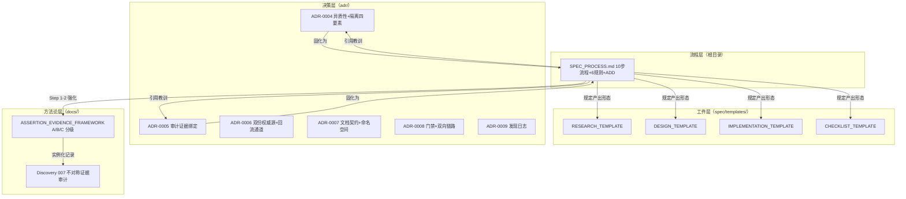
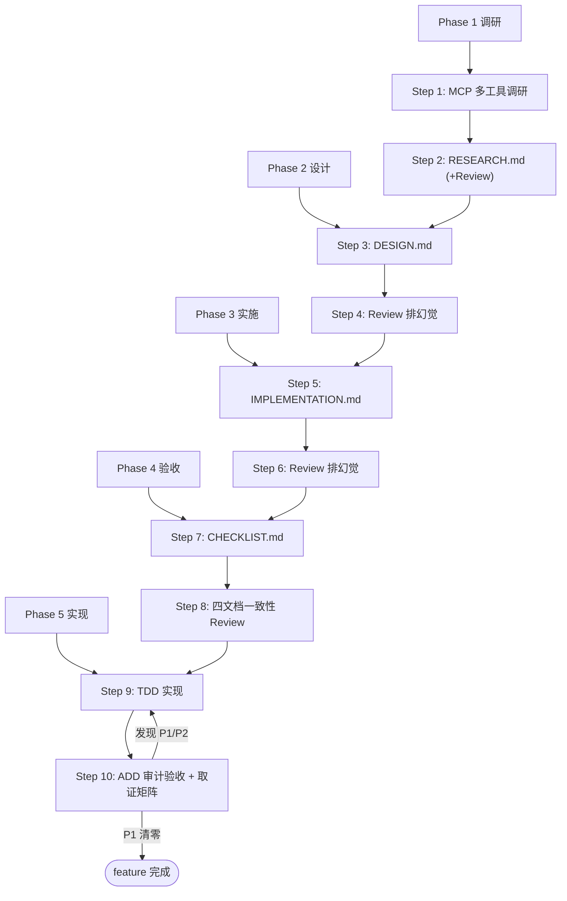
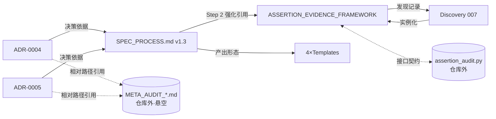

# Spec_Workflow Code Wiki

> **Wiki 版本**: v1.1（2026-08-17，第二次回流批次后同步：+ADR-0006~0009 / +M7 账本 / +discoveries / +spec 三 feature 目录 / SPEC_PROCESS v1.4 / 框架 v1.4）
> **覆盖对象**: 本仓库全部文档（宪法 SPEC_PROCESS v1.4、ADR-0004~0009 六份、Discovery 007、断言证据框架 v1.4、4 个模板、M7 证据账本、discoveries 索引、PROGRESS、dev-log ×2、spec/ 三 feature 四件套）
> **仓库性质**: 纯文档型方法论仓库 —— 无源代码、无构建系统、无运行时；"运行方式" = 工作流的执行方式（见 §6）

---

## 1. 项目概览

### 1.1 项目定位

本仓库是一套 **Spec 驱动开发规范**（Spec-Driven Development）的完整方法论，服务于"单人开发者 + LLM Agent"的研究/工程工作流，核心目标是 **系统性排除 LLM 生成内容中的幻觉（hallucination）与形式化审查表演**。

- **起源**: `math-finance-reasoning` 项目（金融数学推理框架）的流程规范，自 v1.2.1 起自包含化，可跨项目复制迁移
- **哲学基础**: "不信任系统" —— 不信任 LLM 断言（断言分级证据）、不信任自查（Review 独立性规则）、不信任测试通过（ADD Iron Law）、不信任审查勾选（取证矩阵）
- **核心原则链**: 调研先行 → 文档驱动 → 多轮 Review 排除幻觉 → TDD 实现 → 审查验收

### 1.2 解决的问题

| 问题 | 本仓库的对策 | 落点 |
|------|------------|------|
| LLM 调研报告含虚构文献/版本/公式 | 断言 A/B/C 分级 + 生成端强制证据 | `docs/ASSERTION_EVIDENCE_FRAMEWORK.md` |
| Review checkbox 与正文同次写入（"并发自查"） | Review 时序独立规则 | `SPEC_PROCESS.md` 规则 1 |
| 从测试总数推算验收统计（虚报） | 统计溯源规则 | `SPEC_PROCESS.md` 规则 2 |
| 条件 skip 测试消失（skip-and-forget） | 隔离四要素 | `SPEC_PROCESS.md` 规则 3 |
| 单 agent 既写又审无对抗 | 单视角声明 + 异构第二会话 | `SPEC_PROCESS.md` 规则 4/5 |
| 审计"全绿表演"（无证据绑定的✅） | 取证矩阵 E1-E5 | `SPEC_PROCESS.md` 规则 6 + ADR-0005 |
| 测试通过 ≠ 设计落地 | ADD 四阶段审计 | `SPEC_PROCESS.md` Step 10 |

### 1.3 版本演进

| 版本 | 日期 | 变更 |
|------|------|------|
| v1.0-v1.0.x | 2026-08-01 前 | 初始 10 步流程 |
| v1.1 | 2026-08-01 | M6 元审计后增补 Review 独立性规则（时序独立/统计溯源/环境确定性） |
| v1.2 | 2026-08-01 | 外部对标后：规则 3 升级为隔离四要素、新增规则 5 异质性约束、Step 8 增派生需求项（依据 ADR-0004） |
| v1.2.1 | 2026-08-16 | **自包含化**：全部教训内联正文，移除对 ADR/元审计报告/本地 skill 路径的内容依赖，可跨项目迁移 |
| v1.3 | 2026-08-16 | 新增规则 6 审计证据绑定：Step 10 取证矩阵标准化（E1-E5 证据五分类、双向映射、诚实结果列、最高等级绑定、风险分级执行）（依据 ADR-0005） |
| v1.4 | 2026-08-17 | cpp-hub-absorption Tier2：Step 2 Review 升格**门禁语义**（R4 语义 (a)-(d)，满足前禁止进 Step 3）+ Step 8 增双向引用/断言延续两项 + Step 2/10 发现记录集成点（依据 ADR-0008/0009，第二次回流） |

---

## 2. 整体架构

### 2.1 物理目录结构

```
f:\Spec_Workflow/
├── SPEC_PROCESS.md              # ★ 流程宪法 v1.4：10 步 + 6 规则 + 门禁 + ADD
├── CODE_WIKI.md                 # 本 Wiki
├── adr/                         # 架构决策记录（六份，全 accepted）
│   ├── ADR-0004-...quarantine.md     # 异质性约束 + 隔离四要素（→ v1.2）
│   ├── ADR-0005-...binding.md        # 审计证据绑定（→ v1.3）
│   ├── ADR-0006-...authority.md      # 断言框架双份权威源（回流通道）
│   ├── ADR-0007-...contract.md       # 统一文档契约（附录 A 命名空间登记权威）
│   ├── ADR-0008-...gate.md           # Step 2 门禁 + Step 8 双向链路（→ v1.4）
│   └── ADR-0009-...discoveries.md    # 发现日志机制（学习回路载体）
├── docs/                        # 方法论层
│   ├── 007_hallucination_audit_...md     # Discovery 007（toolized）
│   ├── ASSERTION_EVIDENCE_FRAMEWORK.md   # 断言分级证据框架 v1.4（STEP_GAP 两态 + R7）
│   ├── M7_EVIDENCE_LOG.md                # M7 证据账本（对比臂数据唯一活载体，ADR-0007 D1）
│   ├── PROGRESS.md                       # 待办登记（P-001~P-005）
│   ├── adr/README.md                     # ADR 索引（命名空间权威 = ADR-0007 附录 A）
│   ├── discoveries/README.md             # 发现三态索引（DIS-007/008）
│   └── dev-log/                          # DEV-LOG-001/002（事件叙事）
└── spec/
    ├── templates/              # 4 个标准模板
    ├── doc-contract/PLAN.md    # 文档规范改造方案 v1.4（P-003 待执行）
    ├── cpp-hub-gap-analysis/   # 差距分析 RESEARCH + AUDIT（第二次回流依据）
    ├── cpp-hub-absorption/     # 吸收复用四件套（DESIGN v1.1 + IMPL + CHECKLIST，已验收）
    └── adr0006-pointer/        # ADR-0006 决策 3 调研（P-001 待执行）
```

### 2.2 逻辑架构分层



四层职责：

| 层 | 目录 | 职责 | 变更频率 |
|----|------|------|---------|
| **流程层** | 根 `SPEC_PROCESS.md` | 工作流宪法：10 步流程、Review 规则、ADD 审计、取证矩阵 | 随 ADR 升版 |
| **决策层** | `adr/` | 记录"为什么这样设计流程"的架构决策（背景/决策/替代方案/后果/验证/失效条件） | 追加式 |
| **方法论层** | `docs/` | 可独立复用的专项方法（断言分级证据框架）+ 其发现过程记录（Discovery） | 低 |
| **工件层** | `spec/templates/` | feature 开发时直接复制的 4 份文档骨架 | 极低 |

### 2.3 核心工作流总览（10 步 × 5 阶段）



每个 feature 在 `docs/spec/<feature>/` 下产出 4 份文档（RESEARCH → DESIGN → IMPLEMENTATION → CHECKLIST），实现代码在别处（本仓库只管流程不管代码）。

---

## 3. 主要模块职责（逐文档详解）

### 3.1 [SPEC_PROCESS.md](./SPEC_PROCESS.md) —— 流程宪法

**职责**: 定义 10 步 Spec 流程、6 条 Review 独立性规则、ADD 审计方法（内联）、取证矩阵规范、ADR/开发日志的记录约定、新 feature 启动流程。是整个工作流的唯一权威入口。

**关键内容块**:

| 内容块 | 位置 | 说明 |
|--------|------|------|
| 10 步流程图 | 文首 | ASCII 图，5 阶段 × 10 步，每步标注工具与产出路径 |
| 文档目录结构 | §文档目录结构 | `docs/spec/<feature>/` 四文档约定 |
| Review 独立性规则 1-6 | §Review 检查清单 | 反幻觉核心机制（见 §3.3） |
| ADD 内联方法 | §与 ADD 的关系 | Iron Law + 审计四阶段 + 产出修复循环（v1.2.1 起自包含） |
| 取证矩阵 | §取证矩阵 | E1-E5 证据分级表 + 矩阵形态示例 + 风险分级执行 + 复核方式 |
| 与 ADR 关系 | §与 ADR 的关系 | 何时立 ADR（选型/边界调整/重大选型） |
| 启动流程 | §启动新 feature 的流程 | 6 步操作清单 |

#### 10 步流程逐步说明

| Step | 阶段 | 动作 | 产出 | Review 点 |
|------|------|------|------|----------|
| 1 | 调研 | 用 mcp_paper-search / mcp_english-search / mcp_research-tools / mcp_scholar-mirror / WebSearch / WebFetch / SearchCodebase 调研 | （素材） | — |
| 2 | 调研 | 按 RESEARCH 模板成文；验证所有文献引用（arXiv 编号/作者/年份）；标注置信度 | `docs/spec/<feature>/RESEARCH.md` | Step 2 Review（5 项） |
| 3 | 设计 | 架构选择、模块划分、接口定义、数据流 | `DESIGN.md` | — |
| 4 | 设计 | 检查设计是否基于已验证调研、有无未验证假设、有无论证驱动归因扭曲 | — | Step 4 Review（5 项，含替代方案≥2、职责边界） |
| 5 | 实施 | 工程细节：版本、依赖、兼容性、接口签名；排除低效操作 | `IMPLEMENTATION.md` | — |
| 6 | 实施 | 依赖版本真实性、stdlib API 下限检查、签名可实现性 | — | Step 6 Review（6 项） |
| 7 | 验收 | 每个验收项可测试、有明确通过条件 | `CHECKLIST.md` | — |
| 8 | 验收 | 四文档两两对齐检查 + 派生需求登记 | — | Step 8 Review（6 项，须在四文档完稿后执行） |
| 9 | 实现 | 先写测试（基于 CHECKLIST）再写实现；**测试通过 ≠ 设计落地** | 代码+测试 | — |
| 10 | 实现 | 运行全部验收项；执行 ADD；产出取证矩阵；记开发日志；更新 PROGRESS.md | 审计报告 | 取证矩阵受规则 6 约束 |

### 3.2 Review 六大规则（反幻觉机制核心）

> 位于 `SPEC_PROCESS.md` §Review 检查清单。六条规则按"防什么失效模式"组织：

| # | 规则 | 防的失效模式 | 关键条款 |
|---|------|-------------|---------|
| 1 | **时序独立** | review checkbox 与正文同一次 Write 打勾（M6 并发自查） | checkbox 只能在文档完稿后的独立 pass 勾选；同次生成的须标 `[自查·并发]` 待复核升级为 `[已复核]` |
| 2 | **统计溯源** | 从 pytest 总数推算分项通过数（M2 §10.1 虚报） | 验收统计只能来自逐项核对表（每行附测试名/实测值），禁止推算 |
| 3 | **隔离四要素**（v1.2 升级） | skip-and-forget 反模式 | 被隔离测试须有 Owner / Deadline（30 天修复或删除）/ 降权运行（仍跑仍记录，只是不阻塞）/ Re-qualification（恢复阻塞需证明稳定性） |
| 4 | **单 Agent 自查声明** | 既写又审的结构性无对抗 | 同 agent 自查结论标 `自查（单视角）`；文献依据：同上下文反思纠错率 <2%（arXiv:2510.08308），自我纠错盲区率 64.5%（arXiv:2507.02778） |
| 5 | **审查异质性约束**（v1.2 预注册） | 同质 Multi-Agent Debate 无效且贵（36 场景胜率<20%、3-5x token，arXiv:2502.08788） | reviewer 与 implementer 用**异构基座**（不同模型家族）；reviewer 输出**只标记、永不改写实现**（单向权限，防 answer corruption） |
| 6 | **审计证据绑定**（v1.3） | 无证据绑定的"全绿表演"（✅ 成本 O(1)、复核成本 O(n)） | 审计报告必含取证矩阵；四条子规则见 §3.5 |

### 3.3 ADD 审计子系统（Audit-Driven Development）

> 位于 `SPEC_PROCESS.md` §与 ADD 的关系（v1.2.1 起内联，不再依赖外部 skill）。

**Iron Law（铁律）**: `测试通过 ≠ 设计落地` —— 测试只能证明代码做了*某件事*，不能证明做的是*设计要求的那件事*。这是 Step 10 独立于 Step 9 的全部理由。

**审计四阶段**:

| 阶段 | 审什么 | 方向 | 典型失效 |
|------|--------|------|---------|
| Phase 0: Spec 质量门 | DESIGN.md 本身 | —— | 规格模糊（"合理处理"）则不可审计，退回重写 |
| Phase 1: 完整性 | 设计元素在代码中有实现吗 | design → code | 设计了错误处理分支，代码里没有 |
| Phase 2: 忠实度 | 实现与设计一致吗 | 双向对照 | 静默偏离：自作主张的简化/重排/"等价"改写 |
| Phase 3: 必要性 | 代码行为都有设计依据吗 | code → design | 无依据行为 = 未受控派生需求 |
| Phase 4: 语义 | 字面合规但违背设计意图吗 | 意图层 | 机械合规但意图错位（原型案例：定价数学正确但定价对象错了） |

**产出与修复循环**:
- 问题分级：**P1** 阻断验收 / **P2** 应修 / **P3** 提示（每项附代码位置 + 设计条文引用）
- 循环：检测 → 修复 → 复审，直至 P1 清零
- **审计者永不自动修复**（与规则 5 单向权限同构，防自信但错误的批评腐蚀实现）
- 审计报告记入开发日志

> 注意：`CHECKLIST_TEMPLATE.md` §8.2 的问题分级表为 P0/P1/P2/P3 四级（比正文多一级 P0），两处存在轻微不一致，使用时以 feature 实际 CHECKLIST 填写为准。

### 3.4 取证矩阵（v1.3 新增，Step 10 审计报告标准节）

> 规则 6 的操作形态。每行一条取证记录，三要素：**取证手段（含等级）× 覆盖项（审计项编号集合）× 结果（诚实结果列）**。

**证据五分类（按可重放性定级）**:

| 等级 | 类型 | 特性 | 附加约束 |
|------|------|------|---------|
| E1 | 可重放命令（git diff / pytest / --collect-only） | 第三方可原样重放 | 无 |
| E2 | 运行时脚本取证 | 可重跑但**场景自选** | 须附场景选择理由，或含对抗性场景（防场景选择偏差） |
| E3 | 静态读码行号 | 可核对但**随重构腐烂** | 强制绑定 commit hash（`L124@<hash>` 格式） |
| E4 | 盲区扫描 / 判断陈述 | 不可直接重放 | 必须以"发现 N 项"语气（零发现须声明扫描范围），禁裸✅ |
| E5 | 推测 / 未执行 | 无证据 | **禁止出现在审计结论中**，只能进"未覆盖项"清单 |

**四条子规则**:
1. **双向映射**：每个审计项至少绑一条 E1-E4 证据；每条证据标注覆盖的审计项集合
2. **诚实结果列**（Goodhart 防御）："发现 N 项"（N≥1）合法正常；禁止定额化（不得要求"必须发现问题"）；零发现不直接判合规，触发**降级重扫**（换更高等级证据或换角度重扫一次，仍零发现方可记合规并声明范围）
3. **最高等级绑定**：E1/E2 可得却只绑 E4 = 静默降级（伪造成本回归 O(1)）
4. **风险分级执行**：P0 审计项（不变式、隔离边界、安全相关——注意此处 P0 是*审计项风险*分级）全量执行 + 必须 E1/E2；其余抽查执行

**机制原理**（威慑论证，非已证定理）: 写"✅"成本 O(1) 而复核成本 O(n)；抽查概率 p>0 时，形式化审查期望成本 ≥ p×证据重放成本；E1 伪造须预生成工件、成本≈真实执行 —— 约束把"假装审查"的最低成本抬升至"真实审查"的成本。

**复核方式**: 复审者优先抽两类行 —— "高等级可得却绑低等级"（静默降级嫌疑）与 E4 行；行号证据按 commit hash 回溯历史版本核对。

### 3.5 [docs/ASSERTION_EVIDENCE_FRAMEWORK.md](./docs/ASSERTION_EVIDENCE_FRAMEWORK.md) —— 断言分级证据框架

**职责**: 约束**调研阶段**（Step 1-2）的 LLM 产出质量。核心思想：**生成端强制证据，审计端不信任引文 —— 不对称配置**。

**断言三级分类**:

| 级别 | 定义 | 生成端要求 | 审计端手段 |
|------|------|-----------|-----------|
| **A 事实类** | 单点外部可验证（版本/公式/参数语义/章节页码/函数签名/源码行为） | URL + 原文引文（≤3 行、可 grep）；缺则入"假设区"禁入正文 | 机械核验（脚本：链接存活 + 引文页内 grep + 首页身份） |
| **B 推断类** | 综合多源推理（"X 与 Y 不同"/"共 N 套"/"无库实现 Z"） | 编号推理链、逐步注源、禁"显然" | 探针 + 双盲重推导（链接核验对 B 类**无效**） |
| **C 判断类** | 决策/优先级/scope 取舍 | rationale + 假设声明 | 只查假设是否显式 |

**附加规则**: 阻断性断言双源（≥2 独立来源，否则标 `[单源-待二核]`）；引文禁止转述；自动下载 PDF 须先验证首页身份（EuropePMC PMID 错配教训）。

**红线**: *引文核验只证明"看过该页"，不证明"结论可从该页推出"* —— B 类永远需要独立重推导。

**B 类三阶段审计**（详见 §4.1 的脚本接口）:
1. **机械反证探针**（脚本、零 LLM）：按推理算子查对照表生成探针 —— 等价/互斥→赋值语句 grep；存在/不存在→候选库枚举零命中；计数→枚举全集再数；传递/依赖→调用图 BFS；跨库一致→同输入数值 diff
2. **双盲重推导**：auditor 只见 {命题, 源证据}，不见原推理文本（防锚定效应复制跳步）；与原链 difflib 比对 → 结论不一致=CONFLICT 进仲裁；**结论一致但步数不同=STEP_GAP**（跳步藏身处，不是通过，须复查差额步）
3. **仲裁**：仅裁决分歧步，不重跑全链

**来源**: Phase 7C 调研审计复盘 —— 3 审计 agent 全量重查 126 条声明，发现调研报告（本身是"排幻觉清单"）含 8 处实质错误（7A+1B），反事实验证 7/8 可被"链接+引文"生成期拦截，唯一 B 类（CI5"三套临界值表"）由机械探针终结。

### 3.6 [docs/007_hallucination_audit_asymmetric_evidence.md](./docs/007_hallucination_audit_asymmetric_evidence.md) —— Discovery 007

**职责**: 上述框架的**发现过程记录**（研究日志形态），状态 RESOLVED（方法论已落地为工具）。

**核心发现**: 幻觉点清单的作者（调研 agent）与清单要防的对象（弱记忆/凭印象断言）是同一类系统 —— 清单本身必然继承同类缺陷。错误三形态：
- **I. 无据断言**（全源零命中仍写出）——危害极高
- **II. 弱记忆填充**（版本号/章节号/数值常量错位）——危害中
- **III. 把正确事实标成幻觉**（证据全对、综合推理错）——**危害最高**，下游会"修正"到错误方向，且无法被"要求给链接"拦截

另含工具链副发现（EuropePMC 回退错配 PDF / Sci-Hub 失效 / Semantic Scholar openAccessPdf 最有效 / PDF 排版分拆容错 / **官方文档不是真值**——statsmodels 与 arch 官方文档都写错 ZA 1992 刊名）及潜在论文方向（arXiv AI4Research / NeurIPS 工作流短文，需 ≥2 个调研周期量化数据）。

### 3.7 [adr/](./adr/) —— 架构决策记录

**职责**: 记录流程规范本身的架构决策。每份 ADR 含标准节：元数据 / 背景 / 决策 / 考虑的替代方案（≥2 个否决项）/ 后果（正面/负面/中性）/ 验证（文献验证表 + 待验证项 + **失效条件**）/ 修订历史。

| ADR | 日期 | 决策 | 固化到 SPEC_PROCESS |
|-----|------|------|--------------------|
| [ADR-0004](./adr/ADR-0004-adopt-external-benchmark-heterogeneity-quarantine.md) | 2026-08-01 | 采纳外部对标结论（MAD 文献清算 / 业界 quarantine 四要素 / DO-178C RTM 双向追溯），选择性吸收 5 项修订 | 规则 3 升级四要素、规则 5 异质性+单向权限、Step 8 派生需求登记（v1.2） |
| [ADR-0005](./adr/ADR-0005-audit-evidence-binding-spec-workflow.md) | 2026-08-16 | Step 10 审计报告增设取证矩阵，受 5 条规则约束（证据五分类/双向映射/诚实结果列/最高等级绑定/风险分级） | 规则 6 + 取证矩阵操作模板（v1.3） |
| [ADR-0006](./adr/ADR-0006-assertion-framework-dual-copy-authority.md) | 2026-08-16 | 断言框架双份并存（本仓 v1.0 vs Cpp_Hub v1.1 同日漂移一代）→ 本仓库为权威源 + 回流通道（人工纪律）；回流频度 <1 次/季度触发重审 | 框架 v1.2 回吸收；2026-08-17 回流通道首次批量使用（P-002） |
| [ADR-0007](./adr/ADR-0007-unified-document-contract.md) | 2026-08-17 | 统一文档契约五决策：M7_EVIDENCE_LOG 唯一活载体 / G1-G4→DC1-DC4（K8s+SE+ICSE 实证佐证）/ 命名空间登记补全 / design 入 type 词表 / 状态词英文 token | 附录 A 命名空间权威登记 + 附录 B P0 消歧；PLAN v1.5 联动待 P-003 |
| [ADR-0008](./adr/ADR-0008-spec-process-review-gate-and-bidirectional-check.md) | 2026-08-17 | Step 2 Review 升格门禁（R4 语义 (a)-(d)，内部 E1 实证三例：pilot 拦截/M6 全绿表演/计数错漏网）+ Step 8 双向引用/断言延续 | SPEC_PROCESS v1.4 门禁块 + Step 8 +2 项 |
| [ADR-0009](./adr/ADR-0009-discoveries-log-mechanism.md) | 2026-08-17 | Discoveries 三态索引（open/resolved/toolized）+ Step 2/10 双集成点——学习回路"事故→规则"载体；DIS-008 首登（同文件并行 Edit 静默回滚） | docs/discoveries/README.md + SPEC_PROCESS 集成点 ×2 |

**ADR-0005 的范围声明**（重要）: 仅约束 spec 工作流的审查验收环节，**不改变**金融数学推理框架（sixlayer/六层架构/Lean4 验证策略）的任何设计；若 sixlayer L5 要复用须另立 ADR。

**ADR-0004 的 5 项决策要点**: (1) L1 对抗审查加异质性（异构基座）+ 单向权限（reviewer 永不改写实现）约束；(2) skip 审计升级 quarantine 四要素；(3) 反向追溯告警 P3→P1；(4) 新增派生需求登记（derived requirements，DO-178C §5.5.e 语义）；(5) 增量 mutation + equivalent mutant 排除。

### 3.8 [spec/templates/](./spec/templates/) —— 模板系统

4 份模板与 10 步流程的产出严格对应，每份内嵌对应 Step 的 Review 自查 checkbox：

| 模板 | 对应 Step | 关键章节 | 特点 |
|------|----------|---------|------|
| [RESEARCH_TEMPLATE](./spec/templates/RESEARCH_TEMPLATE.md) | 1-2 | 调研目标/方法（工具表）/发现（文献条目含验证状态✅⚠️）/综合分析（置信度★）/幻觉排除审查/对设计的输入/参考文献 | 文献条目强制"验证状态"字段 |
| [DESIGN_TEMPLATE](./spec/templates/DESIGN_TEMPLATE.md) | 3-4 | 设计目标/依据（调研结论→设计决策追溯表）/架构/接口定义/替代方案（≥2 否决）/数据结构/错误处理/**不变式**/职责边界审查 | 不变式 = ADD 审计依据；显式职责边界（ADR-0002 语义） |
| [IMPLEMENTATION_TEMPLATE](./spec/templates/IMPLEMENTATION_TEMPLATE.md) | 5-6 | 技术栈版本表/依赖版本验证表/文件结构/模块实施/兼容性（含 stdlib）/错误处理实施/不变式实施/测试策略/实施步骤 | 每接口标注"签名一致性: 与 DESIGN §4.x 一致✅"；低效操作排除表 |
| [CHECKLIST_TEMPLATE](./spec/templates/CHECKLIST_TEMPLATE.md) | 7-8, 10 | 文档一致性验收（四文档两两对齐表+术语一致性表）/功能/接口/不变式/错误处理/性能/兼容性验收/**ADD 审计（Phase 0 质量门打分 + 发现分级 + Iron Law 四类盲区检查）**/验收统计与决定/签字 | 验收统计须逐项核对（规则 2）；§8.1 Spec 质量门五维打分（可测试约束/模块映射/接口契约/修正项/跨模块契约，档位 A/B/C） |

---

## 4. 关键"类与函数"说明（接口契约层）

> 本仓库无源代码。可执行组件 `assertion_audit.py` **有意不进本仓库**（本地 scripts/ 惯例），但其接口契约在 `ASSERTION_EVIDENCE_FRAMEWORK.md` 中完整公开，此处汇总。

### 4.1 外部关联工具: `scripts/assertion_audit.py`（B 类断言审计器）

**状态**: 本地工具，不在本仓库；内置 CI5/NP/计数/STEP_GAP 四个离线自检示例，commit c0d1d09 时 `demo` 4/4 通过。auditor 可插拔（manual / OpenAI 兼容端点，支持 LM Studio 三机）。

**CLI 接口**:

```bash
# 离线自检（4 个内置示例：CI5 证伪 / NP 存活 / 计数证伪 / STEP_GAP 检出）
python scripts/assertion_audit.py demo

# 审计闭环：从调研报告的 ```assertions 机读块提取并审计 B 类断言
python scripts/assertion_audit.py audit --input <报告.md> \
    --auditor openai --base-url <LM Studio端点> --report <审计输出.md>
```

**核心函数**（§4.3 脚本骨架，三阶段流水线）:

```python
def audit_class_b(assertion, source_evidence, auditor_agent):
    """
    assertion:       {conclusion, op_type, claimed_chain}
    source_evidence: 各依赖源的 A 级证据（已核验为真）
    auditor_agent:   独立 agent（未见过原报告的推理文本 —— 双盲硬条件）

    Phase 1: probe = PROBE_REGISTRY[assertion.op_type]   # 机械探针，零 LLM
             命中 → Verdict(False, "mechanically-falsified", evidence)
    Phase 2: 双盲重推导 → 结论不一致=CONFLICT / 步数差=STEP_GAP / 一致=PASS
    Phase 3: 仲裁（仅 CONFLICT/STEP_GAP 触发，只裁决分歧步）
    """
```

**`PROBE_REGISTRY` 算子-探针对照**（6 个 op，5 个有探针）:

| op 类型 | 断言形态 | 探针 | probe.params |
|---------|---------|------|--------------|
| equivalence | "X 与 Y 相同/不同" | 赋值/调用语句 grep（`falsify_on_hit`） | falsifier_pattern + direction |
| existence | "没有库实现 Z" | 候选库枚举 + 符号零命中 | symbols + candidates + claim |
| counting | "共 N 套" | 枚举全集再数（非记忆计数） | definition_pattern + expected_count |
| transitivity | "A 基于 B" | import/调用链 BFS | entry + target |
| cross_library | "库1 与库2 公式相同" | 同输入两端数值 diff | cmd_a + cmd_b + keys + tol |
| causal | "因 X 所以 Y" | **无机械探针**，probe 置 null | — |

**审计状态词表**（固定，不得自造；框架 v1.3 起 STEP_GAP 分型两态）: `FALSIFIED`（机械证伪）/ `SURVIVED`（存活）/ `CONFLICT`（双盲结论相反）/ `STEP_GAP_CLOSED`（疑跳步已被一手证据机械闭合）/ `STEP_GAP_OPEN`（疑跳步待仲裁）/ `UNCERTAIN` / `PENDING`（待人工）/ `NO_PROBE`

### 4.2 机读接口: 报告内嵌 ```assertions 登记块

调研报告（按框架 §7 模板生成）的**附录 B** 必须含机器可读断言登记块，字段与 `assertion_audit.py` 严格一致 —— 使"报告成为审计工具的直接输入"（报告即审计输入闭环）:

```json
[
  {
    "id": "B1",
    "conclusion": "<结论陈述一句>",
    "op": "equivalence|existence|counting|transitivity|cross_library|causal",
    "claimed_chain": [
      {"step": 1, "text": "<步骤>", "source": "<依赖源label|null>"}
    ],
    "sources": [
      {"label": "<源名>", "path": "<本地路径|null>", "url": "<URL|null>", "quote": "<引文|null>"}
    ],
    "probe": {"type": "<与op对应>", "files": ["<文件/目录>"], "params": {}}
  }
]
```

**正文标注规则**（R1-R6）: 每条断言行内标 【A】/【B#ID】/【C】；【A】紧跟 "(源: URL; 引文: ≤3行)"；【B#ID】正文只写结论、证据只在附录 B；阻断性断言双源；假设区 [H#] 与正文严格分离；FALSIFIED 断言必须改写并记修订。

### 4.3 调研工具链（Step 1 依赖的 MCP 服务）

| 工具 | 用途 |
|------|------|
| mcp_paper-search | 学术论文搜索（arXiv/PubMed/Semantic Scholar 等 10+ 库） |
| mcp_english-search | 网络/PDF/新闻/学术搜索 |
| mcp_research-tools | arXiv/Semantic Scholar 检索、文献下载、LaTeX 编译、研究图谱 |
| mcp_scholar-mirror | 镜像检索、按年检索、DOI 取文（NP2 裁决的关键路径） |
| WebSearch / WebFetch | 通用搜索与页面抓取（引用验证主力） |
| SearchCodebase | 现有代码库语义搜索 |

---

## 5. 依赖关系

### 5.1 文档间内部依赖



关键依赖语义:
- **ADR → SPEC_PROCESS**: ADR 记录决策，SPEC_PROCESS 是其固化落点（v1.2 ← ADR-0004；v1.3 ← ADR-0005）
- **v1.2.1 自包含化**: SPEC_PROCESS 正文已内联 ADR-0001~0003 的教训（归因扭曲案例、职责边界语义）与 M6/M2 案例 —— 仓库中**不存在** ADR-0001~0003 文件，但不影响 SPEC_PROCESS 独立使用
- **框架 ↔ 工具**: ASSERTION_EVIDENCE_FRAMEWORK 公开 assertion_audit.py 的接口契约，工具本体在本地 scripts/（不进库）

### 5.2 悬空引用（迁移时注意）

| 引用位置 | 指向 | 状态 |
|---------|------|------|
| ADR-0004/0005 元数据"相关文档" | `../../../META_AUDIT_EXTERNAL_BENCHMARK.md`、`META_AUDIT_IMPROVEMENT_REPORT.md` | 源项目文件，未随仓库迁移 |
| ADR-0004 | `ADR-0003-pure-technical-lean4-solution.md` | 未随仓库迁移 |
| Discovery 007 | `docs/research/PHASE7C_RESEARCH.md`、`scripts/assertion_audit.py` | 源项目路径/本地工具 |

### 5.3 外部文献依赖（规则的证据基础）

| 依据 | 来源 | 支撑的规则 |
|------|------|-----------|
| MAD 同质辩论 36 场景胜率<20%、3-5x token；异质性是增益主源 | arXiv:2502.08788（ICLR 2025）+ arXiv:2311.17371（ICML 2024） | 规则 5 异质性约束 |
| 辩论使模型 33% 更可能强化偏见；answer corruption | When Debate Fails（2025，⚠️二手转述） | 规则 5 单向权限 |
| LLM 自我纠错盲区率 64.5%；fresh context 有效 | arXiv:2507.02778 | 规则 4/5 |
| 同上下文"再想一遍"纠错率 <2% | arXiv:2510.08308 | 规则 4 |
| 双向追溯 / 派生需求单独标识验证 / 独立验证分级 | DO-178C §5.5.e、§6.3（适航标准） | Step 8 派生需求、取证矩阵双向映射 |
| 增量 mutation / mutant 选择 | Google, IEEE TSE 2022 | ADR-0004 决策 5 |
| quarantine 四要素（owner/deadline/re-qualify/降权运行） | deflaky.com + pie.inc 行业实践 | 规则 3 |
| LLM-as-judge 自我偏好；RAG 引文核验≠结论可推出 | Zheng et al. 2023（MT-Bench）；Gao et al. 2023（RARR） | 断言框架 §2 缺口论证 |

### 5.4 运行环境依赖

| 依赖 | 用途 | 必需性 |
|------|------|--------|
| Markdown 渲染环境（支持 mermaid 的查看器） | 阅读流程图 | 建议 |
| MCP 工具集（§4.3） | Step 1 调研、NP2 类 DOI 取文 | Step 1 必需 |
| `scripts/assertion_audit.py` | B 类断言审计闭环、demo 自检 | 仅调研审计时需要（须从源项目获取） |
| LM Studio 端点（OpenAI 兼容） | assertion_audit 的 auditor 后端 | 可选（有 manual 模式） |
| pytest / git | Step 9-10 的 E1 级证据生成 | 目标项目侧 |

---

## 6. 项目运行与使用方式

> 本仓库"运行" = 按流程执行工作流。三种典型用法：

### 6.1 启动新 feature（标准路径）

1. 在目标项目的 `docs/spec/` 下创建 `<feature>/` 目录
2. 从本仓库 `spec/templates/` 复制 4 个模板到该目录（RESEARCH / DESIGN / IMPLEMENTATION / CHECKLIST）
3. 从 Step 1 开始执行 10 步流程（§3.1 表格），每步完成打勾对应的 Review（遵守规则 1 时序独立：**完稿后的独立 pass 才能勾选**）
4. 每步完成后更新目标项目 `docs/PROGRESS.md`
5. 产生架构决策时按 §3.7 格式记 ADR 到 `docs/adr/`
6. 完成后记开发日志到 `docs/dev-log/`（`DEV-LOG-XXX-<feature>-<action>.md`：做了什么/决策依据/遇到的问题/下一步）

> **路径约定差异**: SPEC_PROCESS 约定 feature 目录为 `docs/spec/<feature>/`，而本仓库模板物理位于 `spec/templates/` —— 迁移使用时以 SPEC_PROCESS 的 `docs/spec/` 约定为准。

### 6.2 调研审计闭环（断言框架路径）

1. 调研 agent 按 `ASSERTION_EVIDENCE_FRAMEWORK.md` §3 的 prompt 约束模板执行（每断言标 A/B/C 级 + 规定形式证据）
2. 报告按 §7 模板骨架生成：断言统计表（§0）→ 正文（R1-R6 标注规则）→ 附录 B ```assertions 机读块 → 附录 C 假设区
3. 运行 `python scripts/assertion_audit.py audit --input <报告.md> --auditor openai --base-url <端点> --report <输出.md>`
4. 审计结论以 "## 审计结论 (日期)" 章节追加回报告末尾，逐断言回填状态词表（FALSIFIED/SURVIVED/CONFLICT/STEP_GAP/...）
5. FALSIFIED → 正文改写并记修订；STEP_GAP/CONFLICT → 进仲裁；`[单源-待二核]` → 补第二源或降级假设区；假设区条目在进 spec 前须转为 A/B 或清除

### 6.3 迁移到其他项目

v1.2.1 起 SPEC_PROCESS 自包含，整仓复制即可使用：
- 正文中的 M6/M2 等历史案例为源项目实测教训，**迁移时可替换为新项目自身案例，规则本身不变**
- 悬空引用（§5.2）不阻塞使用：SPEC_PROCESS 不依赖那些文件的内容
- 建议为目标项目的历史决策补立 ADR（本仓库的 adr/ 可作为格式范本）

### 6.4 已知注意事项

- **两处 P0/P1-P3 分级语义**：ADD 问题严重性分级（P1 阻断/P2 应修/P3 提示，CHECKLIST 模板另有 P0 级）≠ 取证矩阵的"P0 审计项"（= 不变式/隔离边界/安全相关的高风险审计项，须全量 + E1/E2 证据）
- **规则 1 的执行纪律**：同一次生成的 review 章节必须标 `[自查·并发]`，事后独立 pass 复核后才能升级 `[已复核]` —— 这是 M6 教训的直接防线
- **审计者永不自动修复**：任何 review/audit 输出只标记问题，修复由实现者执行后交复审
- **官方文档不是真值**：关键断言需双源（statsmodels/arch 官方文档均写错过 ZA 1992 刊名）

---

## 7. 历史教训案例库（规则的实证来源）

| 案例 | 失效模式 | 沉淀为 |
|------|---------|--------|
| M1 | 自查确认偏差（有外部证据却不修正 = 重演 M1） | ADR-0004 否决"维持原建议"的理由 |
| M2 §10.1 | 从 pytest 总数推算分项，4 项零测试虚报 7/7 通过 | 规则 2 统计溯源 |
| M6 并发自查 | review checkbox 与正文同次 Write 打勾 | 规则 1 时序独立 |
| M6 `Decimal.ulp` | "版本已验证"声明失实（3.12+ API 跑在 3.11，22 测试失败） | Step 6 stdlib API 下限检查 |
| ADR-0001 案例 | 论证驱动归因扭曲（2008 CDO 多因案例被裁剪为单因） | Step 4 Review 检查项 |
| ADR-0002 决策 | 职责边界混淆（职责外 vs 能力边界） | Step 4 Review + DESIGN 模板 §2.3 |
| Phase 7C（126 条→8 错，7A+1B） | 幻觉清单自身含幻觉；类型 III"把正确标成幻觉"不可被链接拦截 | 断言分级框架 + assertion_audit.py |
| NP2 τ_T(k) | λ̂−λ̃ 差形式全源零命中（无据断言）；裁决经 scholar-mirror → Semantic Scholar 绿色副本 → pypdf 提取 eq.(12) 四源冻结 β̂₀² | A 类强制证据规则、双源规则 |
| EuropePMC 回退 | DOI 查询返回无关 PLOS One 论文（链接有效内容错配） | 证据身份验证规则 |

**待验证项**（M7 试点移交）: 异构 reviewer 检出率增益、quarantine 四要素执行摩擦、派生需求登记文书成本、证据绑定版 vs 普通版审计报告的可抽查率/检出率差、零发现降级重扫触发频率。

---

## 8. 术语表

| 术语 | 定义 |
|------|------|
| **Spec 流程** | 10 步 5 阶段的文档驱动开发流程（调研→设计→实施→验收→实现） |
| **ADD** | Audit-Driven Development，审查驱动开发；Iron Law：测试通过 ≠ 设计落地 |
| **ADR** | Architecture Decision Record，架构决策记录 |
| **MCP** | Model Context Protocol，LLM 外接工具协议（paper-search 等调研服务） |
| **RTM** | Requirements Traceability Matrix（DO-178C），需求追溯矩阵；双向 = 每需求有测试 ∧ 每测试有需求依据 |
| **派生需求 (derived requirement)** | 非 upstream 推导、实施中自行产生的需求；无上游追溯链，须单独标识与验收（DO-178C §5.5.e） |
| **隔离四要素 (quarantine)** | Owner / Deadline(30天) / 降权运行 / Re-qualification |
| **异构基座** | reviewer 与 implementer 使用不同模型家族（Heter-MAD 增益主源） |
| **单向权限** | reviewer 输出只标记、永不直接改写实现（防 answer corruption） |
| **answer corruption** | 自信但错误的批评带偏/覆盖本来正确的实现 |
| **取证矩阵** | Step 10 审计报告标准节：取证手段 × 覆盖项 × 结果 |
| **E1-E5** | 证据按可重放性五级：可重放命令/运行时脚本/静态行号(绑 commit hash)/盲区扫描/推测(禁入结论) |
| **诚实结果列** | 约束过程不约束结论倾向；"发现 N 项"合法，零发现触发降级重扫 |
| **降级重扫** | 零发现时换更高等级证据或换角度重扫一次，仍零发现方可记合规 |
| **断言 A/B/C 分级** | 事实类(单点可验证)/推断类(综合多源)/判断类(决策权衡) |
| **不对称配置** | 生成端强制证据，审计端不信任引文（引文核验只证明"看过该页"） |
| **双盲重推导** | auditor 只见 {命题, 源证据}，独立推理后与原链比对（防锚定） |
| **STEP_GAP / STEP_GAP_CLOSED / STEP_GAP_OPEN** | 双盲结论一致但重推导步数更多 → 原链跳步藏身处（不是通过）；v1.3 起判定必落两态——CLOSED（差额步已被一手证据机械闭合，免仲裁）/ OPEN（未闭合，进仲裁）；历史报告旧词读作 OPEN |
| **机械反证探针** | 按推理算子生成的脚本化证伪手段（grep/枚举/调用图/数值 diff），零 LLM |
| **Goodhart 防御** | 约束证据形态而非结论倾向，防规则退化为"每行必须✅"的新形式主义 |
| **P0 审计项** | 不变式/隔离边界/安全相关的审计项（须全量执行 + E1/E2 证据）；≠ 问题严重性 P0-P3 |
| **`[自查·并发]` / `[已复核]`** | review 章节的时序标记（规则 1） |
| **`[单源-待二核]`** | 阻断性断言仅单一来源时的标注，须补第二源 |
| **假设区 [H#]** | 无证据断言的隔离区，禁止进入正文结论 |

---

## 9. 文档索引

| 文件 | 一句话定位 |
|------|-----------|
| [SPEC_PROCESS.md](./SPEC_PROCESS.md) | 流程宪法：10 步流程 + 6 条 Review 规则 + 门禁 + ADD + 取证矩阵（v1.4，自包含） |
| [adr/ADR-0004](./adr/ADR-0004-adopt-external-benchmark-heterogeneity-quarantine.md) | 采纳外部对标：异质性约束 + 隔离四要素 + RTM 反向追溯 + 派生需求（→ v1.2） |
| [adr/ADR-0005](./adr/ADR-0005-audit-evidence-binding-spec-workflow.md) | 审计证据绑定：取证矩阵五规则（→ v1.3） |
| [adr/ADR-0006](./adr/ADR-0006-assertion-framework-dual-copy-authority.md) | 双份权威源决策 + 回流通道（2026-08-17 首次批量使用） |
| [adr/ADR-0007](./adr/ADR-0007-unified-document-contract.md) | 统一文档契约五决策 + 命名空间登记权威（附录 A/B） |
| [adr/ADR-0008](./adr/ADR-0008-spec-process-review-gate-and-bidirectional-check.md) | Step 2 门禁 + Step 8 双向链路（→ v1.4） |
| [adr/ADR-0009](./adr/ADR-0009-discoveries-log-mechanism.md) | Discoveries 发现日志机制（学习回路载体） |
| [docs/007](./docs/007_hallucination_audit_asymmetric_evidence.md) | Discovery 007：幻觉清单自身含幻觉的发现记录（126→8 错误复盘） |
| [docs/ASSERTION_EVIDENCE_FRAMEWORK.md](./docs/ASSERTION_EVIDENCE_FRAMEWORK.md) | 断言分级证据框架 v1.4：A/B/C + 不对称配置 + B 类三阶段审计 + STEP_GAP 两态 + R7 计数机械枚举 |
| [docs/M7_EVIDENCE_LOG.md](./docs/M7_EVIDENCE_LOG.md) | M7 证据账本：审查对比臂样本 + 形态 II 复发分桶 + 命中率 baseline（唯一活载体） |
| [docs/discoveries/README.md](./docs/discoveries/README.md) | 发现三态索引：DIS-007（toolized）/ DIS-008（open） |
| [docs/PROGRESS.md](./docs/PROGRESS.md) | 待办登记：P-001/P-003/P-004 pending，P-005 done |
| [docs/adr/README.md](./docs/adr/README.md) | ADR 本地索引（命名空间权威 → ADR-0007 附录 A） |
| [docs/dev-log/](./docs/dev-log/) | DEV-LOG-001（doc-contract+ADR-0006）/ DEV-LOG-002（cpp-hub-absorption 全链路） |
| [spec/cpp-hub-absorption/](./spec/cpp-hub-absorption/) | 第二次回流四件套：DESIGN v1.1 + IMPLEMENTATION + CHECKLIST（39/40 已验收） |
| [spec/cpp-hub-gap-analysis/](./spec/cpp-hub-gap-analysis/) | 差距分析 RESEARCH（16A+4B）+ AUDIT（形态 II 三实例谱系） |
| [spec/doc-contract/PLAN.md](./spec/doc-contract/PLAN.md) | 文档规范改造方案 v1.4（P-003 待执行，含 G→DC 联动） |
| [spec/adr0006-pointer/](./spec/adr0006-pointer/) | ADR-0006 决策 3 迁移指针调研（P-001 待执行） |
| [spec/templates/RESEARCH_TEMPLATE.md](./spec/templates/RESEARCH_TEMPLATE.md) | Step 2 调研文档模板 |
| [spec/templates/DESIGN_TEMPLATE.md](./spec/templates/DESIGN_TEMPLATE.md) | Step 3 设计文档模板（含不变式与职责边界） |
| [spec/templates/IMPLEMENTATION_TEMPLATE.md](./spec/templates/IMPLEMENTATION_TEMPLATE.md) | Step 5 实施文档模板（依赖/签名/兼容性验证表） |
| [spec/templates/CHECKLIST_TEMPLATE.md](./spec/templates/CHECKLIST_TEMPLATE.md) | Step 7 验收 checklist 模板（含 ADD Phase 0 质量门与验收统计） |
