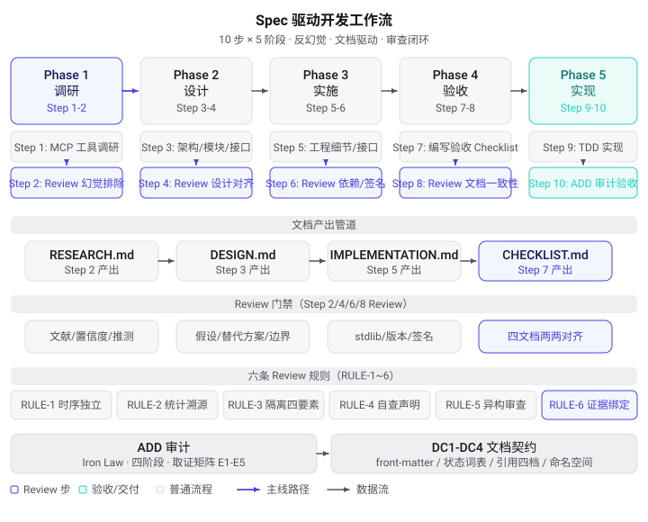

# Spec_Workflow

Spec 驱动开发规范——面向「单人开发者 + LLM Agent」的反幻觉工作流。

本仓库是一套**纯文档型方法论**：无源代码、无构建系统、无运行时。它定义一个 10 步 Spec 流程及其配套审查机制，核心目标是**系统性排除 LLM 生成内容中的幻觉（hallucination）与形式化审查表演**——包括 LLM 自己做的审查。

## 设计哲学：不信任系统

| 不信任什么 | 对应机制 |
|-----------|---------|
| LLM 断言 | 断言 A/B/C 分级 + 生成端强制证据 |
| LLM 自查 | Review 时序独立 + 异构基座复审 |
| 测试通过 | ADD Iron Law：测试通过 ≠ 设计落地 |
| 审查勾选 | 取证矩阵：每条结论绑定可重放证据 |
| 统计表 | 机械枚举：计数由脚本生成，禁止手填 |

这套体系不是理论设计——它从 math-finance-reasoning 项目的真实失效案例（M2 统计虚报、M6 并发自查、Phase 7C 幻觉清单自身含幻觉）中长出来，且每条规则都登记了来源事故与失效条件。

## 解决的问题

| 失效模式 | 对策 | 落点 |
|---------|------|------|
| 调研报告含虚构文献/版本/公式 | 断言分级 + 证据强制 | [断言框架](docs/ASSERTION_EVIDENCE_FRAMEWORK.md) |
| Review checkbox 与正文同次写入 | RULE-1 时序独立 | [SPEC_PROCESS](SPEC_PROCESS.md) |
| 从测试总数推算验收统计（虚报） | RULE-2 统计溯源 | [SPEC_PROCESS](SPEC_PROCESS.md) |
| 单 agent 既写又审无对抗 | RULE-4/5 单视角声明 + 异构复审 | [SPEC_PROCESS](SPEC_PROCESS.md) |
| 审计"全绿表演"（无证据的 ✅） | RULE-6 取证矩阵 E1-E5 | [ADR-0005](adr/ADR-0005-audit-evidence-binding-spec-workflow.md) |
| 测试通过 ≠ 设计落地 | ADD 四阶段审计 | [SPEC_PROCESS](SPEC_PROCESS.md) §与 ADD 的关系 |

## 工作流全景



**5 阶段 × 10 步**：调研（Step 1-2）→ 设计（Step 3-4）→ 实施（Step 5-6）→ 验收（Step 7-8）→ 实现（Step 9-10）。每个偶数步是 Review 门禁，产出四文档管道：`RESEARCH.md → DESIGN.md → IMPLEMENTATION.md → CHECKLIST.md`。

**Step 2 门禁语义**（v1.4）：FALSIFIED 断言已改写、CONFLICT/STEP_GAP 已仲裁、阻断性断言双源满足——满足前禁止进入 Step 3。

## 核心机制

**RULE-1~6**（Review 独立性规则，按"防什么失效"组织）

1. **时序独立**——Review 只能在文档完稿后的独立 pass 勾选
2. **统计溯源**——验收统计只能来自逐项核对表，禁止从总数推算
3. **隔离四要素**——Owner / Deadline(30天) / 降权运行 / Re-qualification
4. **单 Agent 自查声明**——同 agent 既写又审必须标注（文献：同上下文反思纠错率 <2%，arXiv:2510.08308）
5. **审查异质性约束**——reviewer 与 implementer 用异构基座；reviewer 只标记、永不改写实现（文献：同质辩论 36 场景胜率 <20%，arXiv:2502.08788）
6. **审计证据绑定**——取证矩阵 E1-E5，最高等级绑定，诚实结果列

**ADD 审计**（Audit-Driven Development）

- **Iron Law**: 测试通过 ≠ 设计落地
- **四阶段**: Spec 质量门 → 完整性 → 忠实度 → 语义
- **取证矩阵**: E1 可重放命令 / E2 运行时脚本 / E3 静态行号（绑 commit）/ E4 盲区扫描 / E5 推测（禁入结论）

**DC1-DC4 文档契约**（[ADR-0007](adr/ADR-0007-unified-document-contract.md)）

- DC1 front-matter 七字段 / DC2 状态词表 / DC3 引用四档标注 / DC4 命名空间登记

## 仓库结构

```
Spec_Workflow/
├── SPEC_PROCESS.md            # 流程宪法 v1.4（10 步 + 6 规则 + ADD + 取证矩阵）
├── CODE_WIKI.md               # 全仓详解 wiki（模块职责/依赖/历史教训）
├── adr/                       # 架构决策记录 ×6（ADR-0004~0009，全 accepted）
├── docs/
│   ├── ASSERTION_EVIDENCE_FRAMEWORK.md  # 断言分级证据框架 v1.4
│   ├── M7_EVIDENCE_LOG.md     # 审查对比臂数据账本（唯一活载体）
│   ├── 007_hallucination_*.md # Discovery 007（toolized）
│   ├── discoveries/           # 发现三态索引（学习回路载体）
│   ├── PROGRESS.md            # 待办登记（P-001~P-005 全部 done）
│   └── dev-log/               # 开发日志 ×2
└── spec/
    ├── templates/             # 5 个模板（RESEARCH/DESIGN/IMPL/CHECKLIST/ADR）
    ├── doc-contract/          # 文档规范改造方案 v1.5（verified）+ 架构 SVG
    ├── cpp-hub-gap-analysis/  # 差距分析 RESEARCH + 审计报告（含 S1 异基座复验）
    ├── cpp-hub-absorption/    # 吸收复用四件套（已验收 39/40）
    └── adr0006-pointer/       # ADR-0006 迁移指针调研
```

## 快速开始（迁移到你的项目）

1. 复制 `SPEC_PROCESS.md`（v1.2.1 起自包含，正文中的 M6/M2 等历史案例可替换为你自己项目的教训）
2. 复制 `spec/templates/` 下 5 个模板到目标项目 `spec/templates/`
3. 在 `spec/<feature>/` 下按 10 步流程开发，从 Step 1 调研开始

可选：`docs/ASSERTION_EVIDENCE_FRAMEWORK.md` 用于 Step 1-2 的调研断言分级；`CODE_WIKI.md` 是全仓详解，迁移前可通读。

## 文档索引

| 文档 | 定位 |
|------|------|
| [SPEC_PROCESS.md](SPEC_PROCESS.md) | 流程宪法：唯一权威入口 |
| [CODE_WIKI.md](CODE_WIKI.md) | 全仓 wiki：模块职责 + 依赖关系 + 历史教训案例库 |
| [adr/](adr/) | 六份 ADR：异质性约束 / 证据绑定 / 双份权威源 / 文档契约 / Review 门禁 / 发现日志 |
| [docs/ASSERTION_EVIDENCE_FRAMEWORK.md](docs/ASSERTION_EVIDENCE_FRAMEWORK.md) | 断言 A/B/C 分级 + 不对称配置 + 双盲重推导 |
| [docs/M7_EVIDENCE_LOG.md](docs/M7_EVIDENCE_LOG.md) | 审查方法论的实证数据账本 |
| [spec/templates/](spec/templates/) | 五份可直接复制的文档模板 |

## 方法论自实证（M7 证据账本）

这套工作流自身也被当作实验对象测量——每轮审查/审计追加样本至 [M7_EVIDENCE_LOG.md](docs/M7_EVIDENCE_LOG.md)：

- **6 轮审查样本**：覆盖同基座自查 / 异构双盲 / 探针 + 双盲 pilot / 独立审计 / S1 异基座复验
- **形态 II 复发 11 处**（弱记忆填充：版本号/章节号/行号/计数凭印象）：已归纳 4 条复发规律，包括「审计修正自身含计数错误」（第 4 实例，由异基座复验发现——印证 RULE-5 的实证基础）
- **关键结论**：形态 II 无法被"要求给链接"拦截，但可被 E1 机械枚举拦截——正确拦截层是脚本重跑，不是 LLM 自查

## 许可

见 [LICENSE](LICENSE)。
