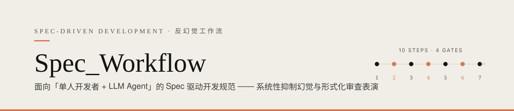
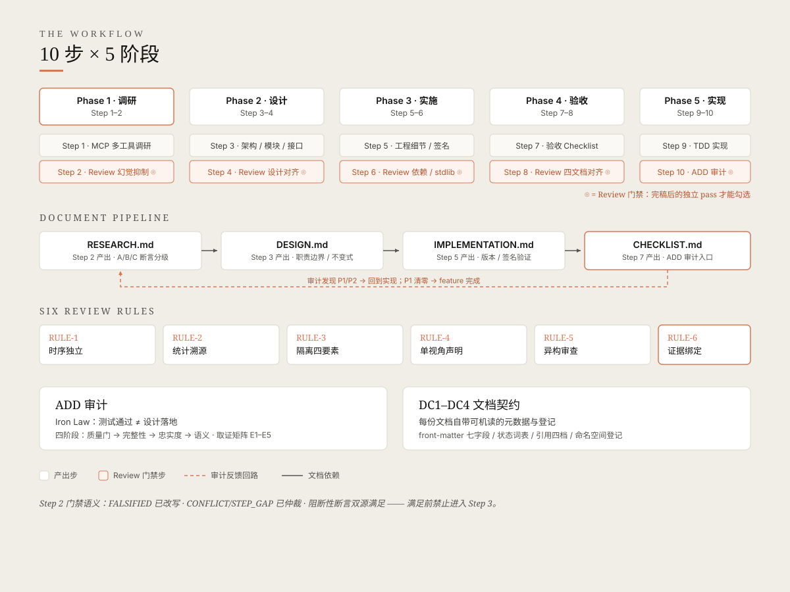
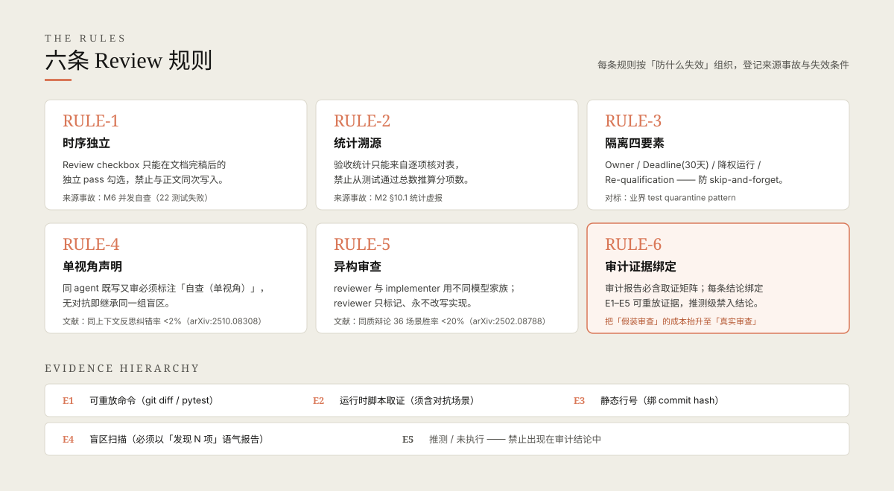
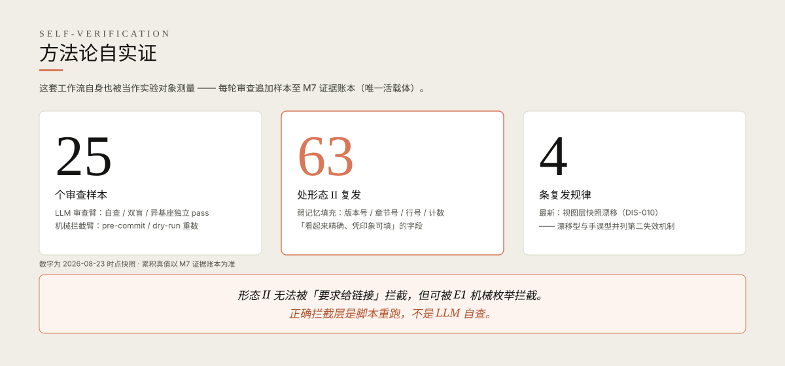

<p align="center">
  
</p>

**中文** · [English](README.en.md)

---

Spec_Workflow 是一套**纯文档型方法论**：无源代码、无构建系统、无运行时。它定义一个 10 步 Spec 流程及其配套审查机制，服务于「单人开发者 + LLM Agent」的工作流，核心目标是**系统性排除 LLM 生成内容中的幻觉与形式化审查表演**——包括 LLM 自己做的审查。

> 这套体系不是理论设计。它从 math-finance-reasoning 项目的真实失效案例中长出来：M2 统计虚报、M6 并发自查、Phase 7C 幻觉清单自身含幻觉。每条规则都登记了来源事故与失效条件，且整套方法论自身也在被持续测量（见[方法论自实证](#方法论自实证)）。

## 设计哲学

一个不信任系统。五层不信任，各对应一个机制：

| 不信任什么 | 对应机制 |
|-----------|---------|
| LLM 断言 | 断言 A/B/C 分级 + 生成端强制证据 |
| LLM 自查 | Review 时序独立 + 异构基座复审 |
| 测试通过 | ADD Iron Law：测试通过 ≠ 设计落地 |
| 审查勾选 | 取证矩阵：每条结论绑定可重放证据 |
| 统计表 | 机械枚举：计数由脚本生成，禁止手填 |

## 工作流



**5 阶段 × 10 步**：调研（1–2）→ 设计（3–4）→ 实施（5–6）→ 验收（7–8）→ 实现（9–10）。每个偶数步是 Review 门禁，产出四文档管道 `RESEARCH → DESIGN → IMPLEMENTATION → CHECKLIST`。Step 10 的 ADD 审计发现 P1/P2 时回到实现，P1 清零才算 feature 完成。

## 六条规则与证据分级



**ADD 审计**（Audit-Driven Development）：Iron Law「测试通过 ≠ 设计落地」+ 四阶段审计（Spec 质量门 → 完整性 → 忠实度 → 语义）+ 取证矩阵。审计者永不自动修复——输出只标记问题，与 RULE-5 的单向权限同构。

**DC1–DC4 文档契约**（[ADR-0007](adr/ADR-0007-unified-document-contract.md)）：front-matter 七字段 / 状态词表 / 引用四档标注 / 命名空间登记。每份文档自带可机读的元数据，编号命名空间的权威登记在 ADR-0007 附录 A。

## 方法论自实证



这套工作流自身也被当作实验对象测量——每轮审查/审计追加样本至 [M7_EVIDENCE_LOG.md](docs/M7_EVIDENCE_LOG.md)。已覆盖 6 轮审查配置（同基座自查 / 异构双盲 / 探针 pilot / 独立审计 / S1 异基座复验），登记形态 II 复发 11 处、归纳 4 条复发规律——其中第 4 条「审计修正自身含计数错误」由异基座复验独立重跑发现，直接印证了 RULE-5 的实证基础。

## 仓库结构

```
Spec_Workflow/
├── SPEC_PROCESS.md            # 流程宪法 v1.4（10 步 + 6 规则 + ADD + 取证矩阵）
├── CODE_WIKI.md               # 全仓详解 wiki
├── adr/                       # 架构决策记录 ×6（ADR-0004~0009，全 accepted）
├── docs/
│   ├── ASSERTION_EVIDENCE_FRAMEWORK.md  # 断言分级证据框架 v1.4
│   ├── M7_EVIDENCE_LOG.md     # 审查对比臂数据账本（唯一活载体）
│   ├── discoveries/           # 发现三态索引（学习回路载体）
│   └── dev-log/               # 开发日志
└── spec/
    ├── templates/             # 5 个模板（四件套 + ADR）
    ├── doc-contract/          # 文档规范改造方案 v1.5（verified）
    └── <feature>/             # 各 feature 四件套实例
```

## 快速开始

迁移到你的项目只需三步：

1. 复制 `SPEC_PROCESS.md`——v1.2.1 起自包含，正文中的 M6/M2 等历史案例可替换为你自己项目的教训，规则本身不变
2. 复制 `spec/templates/` 下 5 个模板到目标项目
3. 在 `spec/<feature>/` 下按 10 步流程开发，从 Step 1 调研开始

可选：`docs/ASSERTION_EVIDENCE_FRAMEWORK.md` 用于 Step 1–2 的调研断言分级；`CODE_WIKI.md` 是全仓详解，迁移前可通读。

## 文档索引

| 文档 | 定位 |
|------|------|
| [SPEC_PROCESS.md](SPEC_PROCESS.md) | 流程宪法：唯一权威入口 |
| [CODE_WIKI.md](CODE_WIKI.md) | 全仓 wiki：模块职责 + 依赖 + 历史教训案例库 |
| [adr/](adr/) | 六份 ADR：异质性 / 证据绑定 / 权威源 / 文档契约 / 门禁 / 发现日志 |
| [docs/ASSERTION_EVIDENCE_FRAMEWORK.md](docs/ASSERTION_EVIDENCE_FRAMEWORK.md) | 断言 A/B/C 分级 + 不对称配置 + 双盲重推导 |
| [docs/M7_EVIDENCE_LOG.md](docs/M7_EVIDENCE_LOG.md) | 方法论实证数据账本 |
| [spec/templates/](spec/templates/) | 五份可直接复制的文档模板 |

## 许可

见 [LICENSE](LICENSE)。
