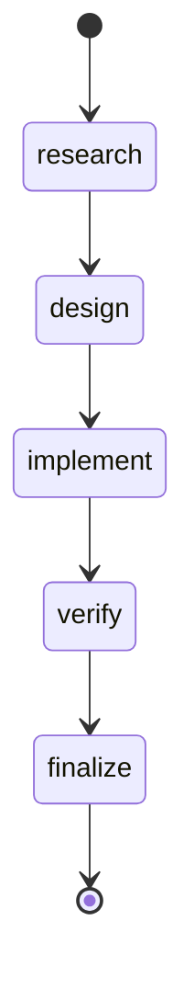
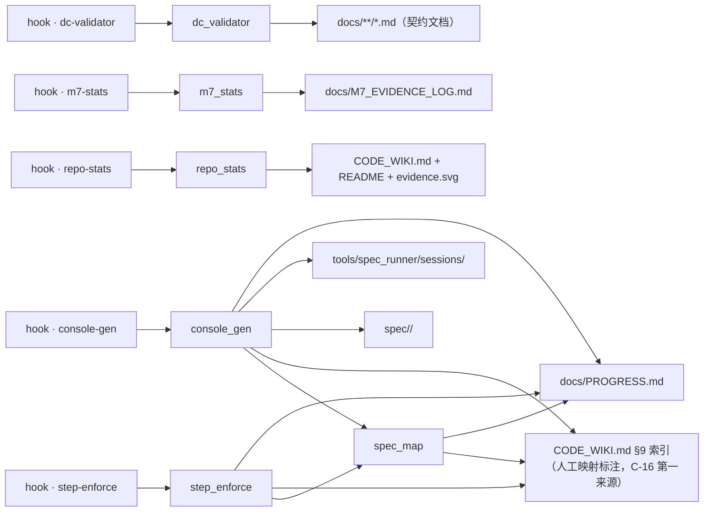
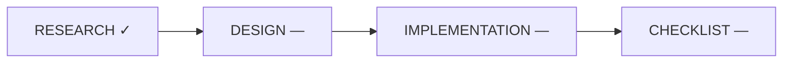
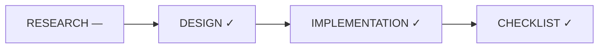
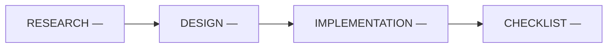

# CONSOLE｜项目控制台（派生视图）
<!-- GENERATED by scripts/console_gen.py —— 纯派生产物，请勿手改；重跑即刷新 -->
> 生成基准：源最大 ts = 2026-10-03T11:20:00+08:00；P 行 = 69；session = 50；feature = 36
> 状态词表 = PROGRESS 原词（I-7）；本视图不重贴标签，只补派生依据与行动档

## ⚑ 需要你 / NEXT
**Needs Attention**
（无）

**Ready to Verify**
（无）

**Recommended**
（无）

## feature 视图（分组键）
| feature | 描述 | 制品链 R/D/I/C | 阶段 | 关联 P | 最远 step |
|---------|------|---------------|------|--------|----------|
| academic-writing-workflow | 学术推理写作工作流 | ✓——— | 调研 | P-040 | finalize |
| adr0006-pointer | ADR-0006 决策 3 跨仓库指针动作 | ✓——— | 调研 | P-001 | — |
| agents-md-bridge | AGENTS.md 桥 | —✓—✓ | 验收 | P-021 | finalize |
| arc-probe | ARC 决策图谱试点调研 | ✓——— | 调研 | P-031 | finalize |
| arc-rollout | ARC 升级实施 | ✓✓✓✓ | 验收 | P-035 | finalize |
| board-generator | board-generator / 任务看板生成器 | —✓✓✓ | 验收 | P-041 | finalize |
| community-ecosystem | spec 宪法 / AGENTS.md 规则 / 决策溯源 / LLM 评测 /… | ✓——— | 调研 | P-018 | — |
| cpp-hub-absorption | Spec_Workflow 吸收复用 Cpp_Hub 规范设计文档 v1.1 | —✓✓✓ | 验收 | P-002 | — |
| cpp-hub-gap-analysis | Cpp_Hub spec 规范体系差距分析调研报告 v1.0 | ✓——— | 调研 | P-004 | — |
| decision-schema | 决策记录 schema 吸收 | —✓—✓ | 验收 | P-016 | — |
| deepeval-arm | DeepEval 臂实施可行性 | ✓✓✓✓ | 验收 | P-037 | finalize |
| deepseek-harness | DeepSeek Harness（dsh）调研：机制 / 证据 / 吸收复用裁决… | ✓——— | 调研 | P-012 | — |
| defect-fixes | 缺陷修复方案 | —✓—✓ | 验收 | P-022 | finalize |
| distributed-agent | 分布式 Agent 执行 | ✓——— | 调研 | P-039 | finalize |
| doc-contract | doc-contract 改造 Step A-G 执行 | ———— | 未启动 | P-003 | — |
| downstream-compliance | 下游符合性 | ✓✓✓✓ | 验收 | P-049 | finalize |
| drift-gate | drift-gate / 意图图-证据图概念吸收 | ✓✓✓✓ | 验收 | P-023 | design |
| hook-surface | hook 面扩展调研评估 | ✓——— | 调研 | P-030 | finalize |
| independent-verify | 独立验证 | ✓✓—✓ | 验收 | P-025 | finalize |
| iteration-backflow | 迭代回写形态件 | ✓✓✓✓ | 验收 | P-058 | finalize |
| langgraph-upgrade | LangGraph 框架化升级调研报告 v1.0 | ✓——— | 调研 | P-006 | — |
| loop-engineering | loop engineering 循环工作流调研 | ✓——— | 调研 | P-028 | research |
| m7-hits-block | M7 hits 机读块 + 样本登记脚本化 | ✓✓✓✓ | 验收 | P-011 | — |
| precommit-dc-validator | pre-commit + DC 契约校验器调研报告 v1.1 | ✓✓✓✓ | 验收 | P-007 | — |
| project-console | 项目控制台 | ✓✓✓✓ | 验收 | P-042 | finalize |
| promptfoo-first-run | promptfoo 首轮评测 | ✓——— | 调研 | P-036 | finalize |
| promptfoo-m7-eval | Promptfoo M7 对比臂声明式评测 | ✓✓✓✓ | 验收 | P-010 | — |
| repo-stats | repo_stats 视图层机械枚举校验器 | ✓✓✓✓ | 验收 | P-014 | — |
| rework-and-decision-paths | 回写流与多方案决策路径 | ✓✓✓✓ | 验收 | P-050 | finalize |
| rework-graph | 回写返工图 | ✓✓✓✓ | 验收 | P-051 | finalize |
| semantica-absorption | Semantica（semantica-agi）调研：图原生决策溯源基础设施 | ✓——— | 调研 | P-015 | — |
| skill-enhancement | 开源 Skill 生态对 SPEC_PROCESS 十步流程的增强调研 v1.0 | ✓——— | 调研 | P-013 | — |
| spec-runner | Spec_Runner 薄壳 runner（P-009 方案 B）调研 | ✓✓✓✓ | 验收 | P-009 | — |
| spec-runner-homing | Spec_Runner 归巢调研（spec-runner-homing）：双仓 … | ✓✓✓✓ | 验收 | P-019 | — |
| step-gate | 每步决策产物管线 | —✓—✓ | 验收 | P-020 | finalize |
| step-gate-enforcement | step-gate 流程强制 | ✓✓—✓ | 验收 | P-024 | research |

## 事项视图（卡片键 · 活动区上限 7）
（无——PROGRESS 无活动事项）

## 决策链状态机


各 step 到达数（由 sessions 决策链机械重数）：research 49 / design 47 / implement 47 / verify 47 / finalize 47

## 架构与流程


> 口径（RESEARCH C-12）：① `hook → script`（entry 直读）② `script → 真值源`（**显式架构契约**，Layer-0 声明于 DESIGN §6）③ `import` 边（`ast` 提取，**有则绘、无则不占位**）。
- **仓内 import 边**：`console_gen` → `spec_map`；`step_enforce` → `spec_map`
- **动态 import（字面量补提取）**：deepeval_m7_eval → `deepeval`
- **未声明关系的脚本（I-8 显式缺口）**：`deepeval_m7_eval`、`downstream_compliance`、`pf_m7_eval`、`rework_graph_check`、`spec_runner`
- **hook 链**（`.pre-commit-config.yaml` 直读）：

- **dc-validator** —— DC contract validator (DC1-DC4 + R7)
  - 命令：`python scripts/dc_validator.py`
  - 触发范围（`files` 正则）：`^(?!.*\.arc/).*\.md$`
  - 传入文件名（`pass_filenames`）：未设（pre-commit 默认「是」）
- **m7-stats** —— M7 ledger hits block validator
  - 命令：`python scripts/m7_stats.py`
  - 触发范围（`files` 正则）：`^docs/M7_EVIDENCE_LOG\.md$`
  - 传入文件名（`pass_filenames`）：未设（pre-commit 默认「是」）
- **repo-stats** —— View-layer enumeration validator (stats block)
  - 命令：`python scripts/repo_stats.py`
  - 触发范围（`files` 正则）：`^(CODE_WIKI\.md|README(\.en)?\.md|\.pre-commit-config\.yaml|docs/|spec/|adr/|scripts/)`
  - 传入文件名（`pass_filenames`）：未设（pre-commit 默认「是」）
- **step-enforce** —— Step decision-stream enforcement (P-024, ADR-0011 A)
  - 命令：`python scripts/step_enforce.py`
  - 触发范围（`files` 正则）：`^spec/[a-z0-9-]+/(?:[A-Z0-9_]+_)?(?:RESEARCH|DESIGN|IMPLEMENTATION|CHECKLIST(?:_FUNC)?)\.md$`
  - 传入文件名（`pass_filenames`）：未设（pre-commit 默认「是」）
- **console-gen** —— Project console generator (derived view, P-043)
  - 命令：`python scripts/console_gen.py --stage`
  - 触发范围（`files` 正则）：`^(docs/PROGRESS\.md|tools/spec_runner/sessions/.*\.jsonl|spec/.*(?:RESEARCH|DESIGN|IMPLEMENTATION|CHECKLIST)\.md)$`
  - 传入文件名（`pass_filenames`）：否

### per-feature 流程（默认折叠）
> **默认展示上方「项目级」架构与流程**；下列 per-feature 流程各自独立折叠，点击摘要行展开。交互形态 = Markdown 原生折叠元素（`details` / `summary`）+ 锚点跳转，**不含 Mermaid `click`**（C-10：默认 `strict` 禁用，`loose` 属 XSS 载体）。

锚点目录：[academic-writing-workflow](#feat-academic-writing-workflow) · [adr0006-pointer](#feat-adr0006-pointer) · [agents-md-bridge](#feat-agents-md-bridge) · [arc-probe](#feat-arc-probe) · [arc-rollout](#feat-arc-rollout) · [board-generator](#feat-board-generator) · [community-ecosystem](#feat-community-ecosystem) · [cpp-hub-absorption](#feat-cpp-hub-absorption) · [cpp-hub-gap-analysis](#feat-cpp-hub-gap-analysis) · [decision-schema](#feat-decision-schema) · [deepeval-arm](#feat-deepeval-arm) · [deepseek-harness](#feat-deepseek-harness) · [defect-fixes](#feat-defect-fixes) · [distributed-agent](#feat-distributed-agent) · [doc-contract](#feat-doc-contract) · [downstream-compliance](#feat-downstream-compliance) · [drift-gate](#feat-drift-gate) · [hook-surface](#feat-hook-surface) · [independent-verify](#feat-independent-verify) · [iteration-backflow](#feat-iteration-backflow) · [langgraph-upgrade](#feat-langgraph-upgrade) · [loop-engineering](#feat-loop-engineering) · [project-console](#feat-project-console) · [promptfoo-first-run](#feat-promptfoo-first-run) · [rework-and-decision-paths](#feat-rework-and-decision-paths) · [rework-graph](#feat-rework-graph) · [semantica-absorption](#feat-semantica-absorption) · [skill-enhancement](#feat-skill-enhancement) · [step-gate](#feat-step-gate) · [step-gate-enforcement](#feat-step-gate-enforcement)

<a name="feat-academic-writing-workflow" id="feat-academic-writing-workflow"></a>
<details>
<summary><b>academic-writing-workflow</b> ｜ 调研 ｜ P-040</summary>

**派生状态**：`done` —— PROGRESS 状态列 = done



**步骤级动态描述**（C-14；来源 = 决策链事件流）：

| 步骤 | 制品 | 主题（本步做什么） | 创建时间 | 简要描述（本步结论） | 修改历史 |
|------|------|--------------------|---------|--------------------|---------|
| research | RESEARCH.md ✓ | P-040 学术推理写作工作流调研立案（用户指令「执行另一个与当前框架存在同构关系的调研任务 以… | 2026-09-11 08:00 | RESEARCH v1.0 立项（14A+4B+3C+2H）：社区案例七类 + 同构分析 B1-… | #1 2026-09-11 |
| design | DESIGN.md — | P-040 设计步（同构裁定）——分阶段吸收 + 本期止于调研（懒加载 gate） | 2026-09-11 08:15 | RESEARCH §5 收敛裁定（C-1/C-2/C-3）定稿 | #1 2026-09-11 |
| implement | IMPLEMENTATION.md — | P-040 实施步（调研落档）——三补调研（v1.1 UI 防过载 / 审计幻觉抑制 / 链条硬… | 2026-09-11 08:30 | RESEARCH v1.0→v1.3 逐版落档（34A+9B+7C+5H）；C-4/C-5/C-… | #1 2026-09-11 |
| verify | CHECKLIST.md — | P-040 验收步——三通道 + 断言计数 = 重数 + 零工具改动 | 2026-09-11 08:45 | 三通道全绿 + 零新增 M7 样本 + 零工具改动（I-1） | #1 2026-09-11 |
| finalize | —（finalize 不新增制品） | P-040 收束——PROGRESS P-040 行登记 + C-7 触发条件显式化 | 2026-09-11 08:55 | P-040 done：同构性分析闭环 + 认知过载真实落点（C-6）与自动刷新三档（C-7）登记 | #1 2026-09-11 |

**决策链**（sessions 机械重数）：research → design → implement → verify → finalize

</details>

<a name="feat-adr0006-pointer" id="feat-adr0006-pointer"></a>
<details>
<summary><b>adr0006-pointer</b> ｜ 调研 ｜ P-001</summary>

**派生状态**：`done` —— PROGRESS 状态列 = done


**步骤级动态描述**（C-14；来源 = 决策链事件流）：

`—` 无 session——**主题 / 创建时间 / 简要描述 / 修改历史 全缺**（决策链缺失，I-8）

**决策链**（sessions 机械重数）：（无 session——决策链缺失）

</details>

<a name="feat-agents-md-bridge" id="feat-agents-md-bridge"></a>
<details>
<summary><b>agents-md-bridge</b> ｜ 验收 ｜ P-021</summary>

**派生状态**：`done` —— PROGRESS 状态列 = done


**步骤级动态描述**（C-14；来源 = 决策链事件流）：

| 步骤 | 制品 | 主题（本步做什么） | 创建时间 | 简要描述（本步结论） | 修改历史 |
|------|------|--------------------|---------|--------------------|---------|
| research | RESEARCH.md — | P-021 AGENTS.md 桥文件生成立案（用户指令「根据调研报告 需要执行AGENTS.m… | 2026-09-08 10:00 | 立项：根 AGENTS.md 五段式桥文件（性质 / 流程 / 校验命令 / 禁止事项 / 权威… | #1 2026-09-08 |
| design | DESIGN.md ✓ | P-021 设计步——桥文件形态选型（方案 A/B/C）+ ADR-0010 三问懒加载审核正式… | 2026-09-08 10:30 | DESIGN v1.0 定稿：五段式结构 + I-1 零可漂移声明（repo_stats PT … | #1 2026-09-08 |
| implement | IMPLEMENTATION.md — | P-021 实施步——根 AGENTS.md 生成 + doc_registry 登记 + CO… | 2026-09-08 11:00 | AGENTS.md 落盘 + 视图层同步完毕 | #1 2026-09-08 |
| verify | CHECKLIST.md ✓ | P-021 验收步——CHECKLIST 20/20 + 三校验器 + 独立 pass 机械复核 | 2026-09-08 11:30 | CHECKLIST 20/20 通过 + 独立 pass 4/4 + 三校验器 0 违规 | #1 2026-09-08 |
| finalize | —（finalize 不新增制品） | P-021 收束——CER H1 定性 + 落档闭环 | 2026-09-08 12:00 | P-021 done：AGENTS.md 桥交付（Layer-0），ADR-0010 三问懒加载… | #1 2026-09-08 |

**决策链**（sessions 机械重数）：research → design → implement → verify → finalize

</details>

<a name="feat-arc-probe" id="feat-arc-probe"></a>
<details>
<summary><b>arc-probe</b> ｜ 调研 ｜ P-031</summary>

**派生状态**：`done` —— PROGRESS 状态列 = done


**步骤级动态描述**（C-14；来源 = 决策链事件流）：

| 步骤 | 制品 | 主题（本步做什么） | 创建时间 | 简要描述（本步结论） | 修改历史 |
|------|------|--------------------|---------|--------------------|---------|
| research | RESEARCH.md ✓ | P-031 ARC 决策图谱试点调研（用户指令「ARC启动调研分析 吃狗粮模式」——CER §3… | 2026-09-09 18:20 | 评估结论 = ARC 可作方向 A 轻量先导（实体档案 + 预链接）或保持 Layer-0 观察… | #1 2026-09-09 |
| design | DESIGN.md — | P-031 design 步——调研结论结构化设计（RESEARCH 文档 §4/§6/§8 结… | 2026-09-09 18:21 | RESEARCH.md 结构定稿（§0-§8 + 附录 B）+ gate 三问结论 = 止于调研… | #1 2026-09-09 |
| implement | IMPLEMENTATION.md — | P-031 implement 步——评估批次落档（仅文档登记，零工具/hook 改动——I-1… | 2026-09-09 18:22 | 落档完成：arc-probe/RESEARCH.md v1.0 全 § 成文 + CER v1.… | #1 2026-09-09 |
| verify | CHECKLIST.md — | P-031 verify 步——三通道校验 + step-gate 决策链自证 + dc_val… | 2026-09-09 18:24 | 三通道全绿 + step-gate 五步链 exit 0 + 断言重数修正闭环；无新增 M7 样… | #1 2026-09-09 |
| finalize | —（finalize 不新增制品） | P-031 finalize 步——批次收束（复核全部修改位点 + 报告用户） | 2026-09-09 18:26 | P-031 调研评估交付完成，工作区状态可供用户检视；ARC 试点实施待用户裁决 | #1 2026-09-09 |

**决策链**（sessions 机械重数）：research → design → implement → verify → finalize

</details>

<a name="feat-arc-rollout" id="feat-arc-rollout"></a>
<details>
<summary><b>arc-rollout</b> ｜ 验收 ｜ P-035</summary>

**派生状态**：`done` —— PROGRESS 状态列 = done


**步骤级动态描述**（C-14；来源 = 决策链事件流）：

| 步骤 | 制品 | 主题（本步做什么） | 创建时间 | 简要描述（本步结论） | 修改历史 |
|------|------|--------------------|---------|--------------------|---------|
| research | RESEARCH.md ✓ | P-035 ARC 升级实施（用户指令「按照吃狗粮模型执行ARC 升级 规避缺陷」——P-034… | 2026-09-09 20:10 | 设计输入完整，四件套结构确定（RESEARCH 引用 + DESIGN + IMPLEMENTA… | #1 2026-09-09 |
| design | DESIGN.md ✓ | P-035 design 步——落地形态设计（DESIGN v1.0 D1-D7） | 2026-09-09 20:12 | DESIGN v1.0 定稿（7 决策 + 7 验收标准 + 风险表） | #1 2026-09-09 |
| implement | IMPLEMENTATION.md ✓ | P-035 implement 步——实施落地（tools/arc/ 四件工具 + 四件套文档） | 2026-09-09 20:14 | 工具全落地：白名单拦截实测（skill/bogus exit 2）+ 8 ADR 导入成功 + … | #1 2026-09-09 |
| verify | CHECKLIST.md ✓ | P-035 verify 步——三通道校验 + 场景实测 + 纪律复核 | 2026-09-09 20:16 | 三通道全绿 + 白名单场景实测通过 + 图价值验证通过 + 决策链校验待跑 | #1 2026-09-09 |
| finalize | —（finalize 不新增制品） | P-035 finalize 步——批次收束（同步 + 报告） | 2026-09-09 20:18 | ARC 升级落地闭环：规避矩阵全部落实，图价值可用（trace/impact 递归），采用完成态 | #1 2026-09-09 |

**决策链**（sessions 机械重数）：research → design → implement → verify → finalize

</details>

<a name="feat-board-generator" id="feat-board-generator"></a>
<details>
<summary><b>board-generator</b> ｜ 验收 ｜ P-041</summary>

**派生状态**：`done` —— PROGRESS 状态列 = done



**步骤级动态描述**（C-14；来源 = 决策链事件流）：

| 步骤 | 制品 | 主题（本步做什么） | 创建时间 | 简要描述（本步结论） | 修改历史 |
|------|------|--------------------|---------|--------------------|---------|
| research | RESEARCH.md — | 用户指令「按 L0 门禁钩子方案落地看板生成器，并验证提交即刷板功能」——RESEARCH C-… | 2026-09-11 09:00 | 确认实施：scripts/board_gen.py（stdlib 只读聚合 → 纯派生 docs… | #1 2026-09-11 |
| design | DESIGN.md ✓ | D1-D7 设计：输出结构（认知块/3 状态分组/NEXT 队列）+ 触发（L0 门禁）+ 确定… | 2026-09-11 09:10 | 方案 A + D1-D7 + I-1~I-6 不变式定稿（唯一写路径 docs/BOARD.md… | #1 2026-09-11 |
| implement | IMPLEMENTATION.md ✓ | scripts/board_gen.py 落地 + hook 接入 + 视图层同步 | 2026-09-11 09:25 | board_gen.py 落地（selftest 11/11）+ 第五 hook 接入 + BO… | #1 2026-09-11 |
| verify | CHECKLIST.md ✓ | 实施批质量门：selftest + 三校验器 + 「提交即刷板」端到端实测 | 2026-09-11 09:40 | selftest 11/11 + 三校验器 0 违规 + pre-commit board-ge… | #1 2026-09-11 |
| finalize | —（finalize 不新增制品） | board-generator 实施批收束（P-041） | 2026-09-11 09:50 | P-041 done：看板生成器交付（L0 提交即刷板），RESEARCH C-7 懒加载 ga… | #1 2026-09-11 |

**决策链**（sessions 机械重数）：research → design → implement → verify → finalize

</details>

<a name="feat-community-ecosystem" id="feat-community-ecosystem"></a>
<details>
<summary><b>community-ecosystem</b> ｜ 调研 ｜ P-018</summary>

**派生状态**：`done` —— PROGRESS 状态列 = done


**步骤级动态描述**（C-14；来源 = 决策链事件流）：

`—` 无 session——**主题 / 创建时间 / 简要描述 / 修改历史 全缺**（决策链缺失，I-8）

**决策链**（sessions 机械重数）：（无 session——决策链缺失）

</details>

<a name="feat-cpp-hub-absorption" id="feat-cpp-hub-absorption"></a>
<details>
<summary><b>cpp-hub-absorption</b> ｜ 验收 ｜ P-002</summary>

**派生状态**：`done` —— PROGRESS 状态列 = done


**步骤级动态描述**（C-14；来源 = 决策链事件流）：

`—` 无 session——**主题 / 创建时间 / 简要描述 / 修改历史 全缺**（决策链缺失，I-8）

**决策链**（sessions 机械重数）：（无 session——决策链缺失）

</details>

<a name="feat-cpp-hub-gap-analysis" id="feat-cpp-hub-gap-analysis"></a>
<details>
<summary><b>cpp-hub-gap-analysis</b> ｜ 调研 ｜ P-004</summary>

**派生状态**：`done` —— PROGRESS 状态列 = done


**步骤级动态描述**（C-14；来源 = 决策链事件流）：

`—` 无 session——**主题 / 创建时间 / 简要描述 / 修改历史 全缺**（决策链缺失，I-8）

**决策链**（sessions 机械重数）：（无 session——决策链缺失）

</details>

<a name="feat-decision-schema" id="feat-decision-schema"></a>
<details>
<summary><b>decision-schema</b> ｜ 验收 ｜ P-016</summary>

**派生状态**：`done` —— PROGRESS 状态列 = done


**步骤级动态描述**（C-14；来源 = 决策链事件流）：

`—` 无 session——**主题 / 创建时间 / 简要描述 / 修改历史 全缺**（决策链缺失，I-8）

**决策链**（sessions 机械重数）：（无 session——决策链缺失）

</details>

<a name="feat-deepeval-arm" id="feat-deepeval-arm"></a>
<details>
<summary><b>deepeval-arm</b> ｜ 验收 ｜ P-037</summary>

**派生状态**：`done` —— PROGRESS 状态列 = done


**步骤级动态描述**（C-14；来源 = 决策链事件流）：

| 步骤 | 制品 | 主题（本步做什么） | 创建时间 | 简要描述（本步结论） | 修改历史 |
|------|------|--------------------|---------|--------------------|---------|
| research | RESEARCH.md ✓ | P-037 DeepEval 臂吃狗粮评估（用户指令「检查是否已评估过实施可行性」→「对它做吃狗… | 2026-09-10 14:00 | G1: 既有评估状态 = 仅浅层候选定位，未评估实施可行性；触发吃狗粮评估 | #1 2026-09-10 |
| design | DESIGN.md ✓ | P-037 design 步——实施可行性判定设计（候选吸收物 = DeepEval 评测臂） | 2026-09-10 14:20 | 三问判定完成：C-1 资质达标 + C-2 止于懒加载（触发条件 = 评测样本库就绪/用户指定首… | #1 2026-09-10 |
| implement | IMPLEMENTATION.md ✓ | P-037 implement 步——吃狗粮实测 + 调研落档（本批零工具改动 I-1） | 2026-09-10 14:40 | RESEARCH 落档 + 决策流 session 建立 + 端到端评测实测完成，零工具改动 | #1 2026-09-10 |
| verify | CHECKLIST.md ✓ | P-037 verify 步——三通道校验 + 纪律复核 | 2026-09-10 15:00 | 三通道全绿 + 断言计数声明=重数 + 决策链校验待跑 | #1 2026-09-10 |
| finalize | —（finalize 不新增制品） | P-037 finalize 步——批次收束（同步 + 报告） | 2026-09-10 15:10 | P-037 闭环：DeepEval 臂资质确认 + 触发条件登记（评测样本库就绪/用户指定首用例… | #1 2026-09-10 |

**决策链**（sessions 机械重数）：research → design → implement → verify → finalize

</details>

<a name="feat-deepseek-harness" id="feat-deepseek-harness"></a>
<details>
<summary><b>deepseek-harness</b> ｜ 调研 ｜ P-012</summary>

**派生状态**：`done` —— PROGRESS 状态列 = done


**步骤级动态描述**（C-14；来源 = 决策链事件流）：

`—` 无 session——**主题 / 创建时间 / 简要描述 / 修改历史 全缺**（决策链缺失，I-8）

**决策链**（sessions 机械重数）：（无 session——决策链缺失）

</details>

<a name="feat-defect-fixes" id="feat-defect-fixes"></a>
<details>
<summary><b>defect-fixes</b> ｜ 验收 ｜ P-022</summary>

**派生状态**：`done` —— PROGRESS 状态列 = done


**步骤级动态描述**（C-14；来源 = 决策链事件流）：

| 步骤 | 制品 | 主题（本步做什么） | 创建时间 | 简要描述（本步结论） | 修改历史 |
|------|------|--------------------|---------|--------------------|---------|
| research | RESEARCH.md — | P-022 缺陷修复批立案（用户指令「分析刚才发现的 DIS-008 竞态和 gate auto… | 2026-09-08 14:00 | 两缺陷立案：修复方案候选 A（git_snapshot opt-in 门控）/ B（精确 sid… | #1 2026-09-08 |
| design | DESIGN.md ✓ | P-022 设计步——方案选型 + subagent 技术审查 + 用户裁决 | 2026-09-08 14:30 | DESIGN v1.0→v1.1：A+B 修正后采纳；DIS-008 修复 = AGENTS.m… | #1 2026-09-08 |
| implement | IMPLEMENTATION.md — | P-022 实施步——spec_runner.py v1.2.0 + 文档同步 | 2026-09-08 15:00 | spec_runner.py v1.2.0 交付；selftest 28/28（原 26 项回归… | #1 2026-09-08 |
| verify | CHECKLIST.md ✓ | P-022 验收步——CHECKLIST_FUNC 13/13 + 三通道 + 独立 pass … | 2026-09-08 15:30 | 13/13 accepting + 三通道全绿（dc_validator 79 文件 / m7_… | #1 2026-09-08 |
| finalize | —（finalize 不新增制品） | P-022 收束——PROGRESS + CODE_WIKI v1.22 同步 | 2026-09-08 16:00 | P-022 done：两缺陷修复落地，DIS-008 规则化进入 AGENTS.md 常驻纪律 | #1 2026-09-08 |

**决策链**（sessions 机械重数）：research → design → implement → verify → finalize

</details>

<a name="feat-distributed-agent" id="feat-distributed-agent"></a>
<details>
<summary><b>distributed-agent</b> ｜ 调研 ｜ P-039 ｜ 2 轮</summary>

**派生状态**：`done` —— PROGRESS 状态列 = done


**步骤级动态描述**（C-14；来源 = 决策链事件流）：

| 步骤 | 制品 | 主题（本步做什么） | 创建时间 | 简要描述（本步结论） | 修改历史 |
|------|------|--------------------|---------|--------------------|---------|
| research | RESEARCH.md ✓ | P-039 v1.4 跨仓观察项登记轮（2026-09-30，用户裁决「RPC 是未来分布式 a… | 2026-09-30 17:05 | 取证三条：① 四项各有明确缺口定性（已裁待实现 / 待裁 / 待选路线 / 无消费者）；② 两处… | 2 轮：#1 2026-09-10 · #2 2026-09-30 |
| design | DESIGN.md — | P-039 v1.4 design 步——登记形态与边界设计（挂载点 / 断言形态 / 触发条件… | 2026-09-30 17:10 | 设计裁定 = 落 §4.5 + A-43/B11/C-7/H7，附录 A/B/C 同步，§0 计… | 2 轮：#1 2026-09-10 · #2 2026-09-30 |
| implement | IMPLEMENTATION.md — | P-039 v1.4 实施步——落档（登记批，零代码变更）。 | 2026-09-30 17:20 | 落档完成：RESEARCH v1.4（§4.5 + A-43/B11/C-7/H7）+ CODE… | 2 轮：#1 2026-09-10 · #2 2026-09-30 |
| verify | CHECKLIST.md — | P-039 v1.4 验证步——三校验器 + 令牌与计数对账 + 全覆盖终验 + 门禁链。 | 2026-09-30 17:30 | 三校验器全绿 + selftest 37/37 PASS + step-gate exit 0 … | 2 轮：#1 2026-09-10 · #2 2026-09-30 |
| finalize | —（finalize 不新增制品） | P-039 v1.4 收束步——全景复核与后续指针。 | 2026-09-30 17:40 | 收束：本会话 = specwf-p039-20260930；工作区就绪（三文件改动 + 本新 s… | 2 轮：#1 2026-09-10 · #2 2026-09-30 |

**决策链**（sessions 机械重数）：research → design → implement → verify → finalize

</details>

<a name="feat-doc-contract" id="feat-doc-contract"></a>
<details>
<summary><b>doc-contract</b> ｜ 未启动 ｜ P-003</summary>

**派生状态**：`done` —— PROGRESS 状态列 = done



**步骤级动态描述**（C-14；来源 = 决策链事件流）：

`—` 无 session——**主题 / 创建时间 / 简要描述 / 修改历史 全缺**（决策链缺失，I-8）

**决策链**（sessions 机械重数）：（无 session——决策链缺失）

</details>

<a name="feat-downstream-compliance" id="feat-downstream-compliance"></a>
<details>
<summary><b>downstream-compliance</b> ｜ 验收 ｜ P-049</summary>

**派生状态**：`done` —— PROGRESS 状态列 = done


**步骤级动态描述**（C-14；来源 = 决策链事件流）：

| 步骤 | 制品 | 主题（本步做什么） | 创建时间 | 简要描述（本步结论） | 修改历史 |
|------|------|--------------------|---------|--------------------|---------|
| research | RESEARCH.md ✓ | P-049 research 步——ADR-0006 §D 的 J-1~J-4 判据可机械化的可… | 2026-09-26 10:00 | 判据机械化可行性确认：J-1~J-4 全为确定性程序可核（无 LLM 判断）；形态定为单脚本 +… | #1 2026-09-26 |
| design | DESIGN.md ✓ | P-049 design 步——落地形态与归属边界裁定（D1 单脚本 + D2 表归消费仓 + … | 2026-09-26 10:10 | DESIGN v1.0 落档：§3 架构（单文件 + CONSUMERS 常量 + 只读消费仓）… | #1 2026-09-26 |
| implement | IMPLEMENTATION.md ✓ | P-049 implement 步——落码：新增 scripts/downstream_comp… | 2026-09-26 10:20 | 落码完成：检查器首轮实跑给出全部读数（exit 1，唯一阻塞 = J-1 未入库）；--emit… | #1 2026-09-26 |
| verify | CHECKLIST.md ✓ | P-049 verify 步——验收逐项核对：判据/接口/不变式/错误处理/连带修复，含诚实结果… | 2026-09-26 10:30 | 验收=有条件通过（零失败项；6 项待办全为未实测/跨仓依赖，不阻塞闭环）；ADD 审计总分 4.… | #1 2026-09-26 |
| finalize | —（finalize 不新增制品） | P-049 收束——ADR-0006 §C/§D 转 accepted + §B2 重审 #2 … | 2026-09-26 10:40 | P-049 done：ADR-0006 v1.1 定稿（决策 5/6 accepted）并落地为… | #1 2026-09-26 |

**决策链**（sessions 机械重数）：research → design → implement → verify → finalize

</details>

<a name="feat-drift-gate" id="feat-drift-gate"></a>
<details>
<summary><b>drift-gate</b> ｜ 验收 ｜ P-023</summary>

**派生状态**：`done` —— PROGRESS 状态列 = done


**步骤级动态描述**（C-14；来源 = 决策链事件流）：

| 步骤 | 制品 | 主题（本步做什么） | 创建时间 | 简要描述（本步结论） | 修改历史 |
|------|------|--------------------|---------|--------------------|---------|
| research | RESEARCH.md ✓ | P-023 drift-gate / 意图图-证据图概念吸收批（用户指令吃狗粮，走到 ADR-0… | 2026-09-09 03:56 | Step1-2 立项调研完成：RESEARCH v1.0（概念登记型，Layer-0 定位确认） | #1 2026-09-09 |
| design | DESIGN.md ✓ | P-023 drift-gate / 意图图-证据图概念吸收批（用户指令吃狗粮，走到 ADR-0… | 2026-09-09 03:56 | Step3-4 设计完成：DESIGN v1.0——仅登记不实施（repo_stats 演进登记… | #1 2026-09-09 |

**决策链**（sessions 机械重数）：research → design

</details>

<a name="feat-hook-surface" id="feat-hook-surface"></a>
<details>
<summary><b>hook-surface</b> ｜ 调研 ｜ P-030</summary>

**派生状态**：`done` —— PROGRESS 状态列 = done


**步骤级动态描述**（C-14；来源 = 决策链事件流）：

| 步骤 | 制品 | 主题（本步做什么） | 创建时间 | 简要描述（本步结论） | 修改历史 |
|------|------|--------------------|---------|--------------------|---------|
| research | RESEARCH.md ✓ | P-030 hook 面扩展调研评估（用户指令「执行后续 hook 面扩展调研评估」——触发 C… | 2026-09-09 17:00 | 评估结论 = hook 面扩展当前不实施（Q2 激活条件未满），止于懒加载 gate（同 P-0… | #1 2026-09-09 |
| design | DESIGN.md — | P-030 design 步——禁止事项机械化可行性矩阵 + 分阶段 hook 增量价值 + A… | 2026-09-09 17:03 | 禁止事项逐条机械化可行性矩阵（6 条：3 可机械化 / 3 不可）+ 分阶段增量表（阶段 1 唯… | #1 2026-09-09 |
| implement | IMPLEMENTATION.md — | P-030 implement 步——评估批次落档（仅文档登记，零工具/hook 改动——I-1… | 2026-09-09 17:06 | 落档完成：spec/hook-surface/RESEARCH.md v1.0（§1-§6 全）… | #1 2026-09-09 |
| verify | CHECKLIST.md — | P-030 verify 步——三通道校验 + step-gate 决策链自证 + verify… | 2026-09-09 17:09 | 三通道全绿 + step-gate 五步链 exit 0 + verify-anchor 锚点全… | #1 2026-09-09 |
| finalize | —（finalize 不新增制品） | P-030 finalize 步——批次收束（PROGRESS/CODE_WIKI 同步 + 提… | 2026-09-09 17:12 | 提交推送完成，工作区干净；P-030 done 登记 | #1 2026-09-09 |

**决策链**（sessions 机械重数）：research → design → implement → verify → finalize

</details>

<a name="feat-independent-verify" id="feat-independent-verify"></a>
<details>
<summary><b>independent-verify</b> ｜ 验收 ｜ P-025</summary>

**派生状态**：`done` —— PROGRESS 状态列 = done

```mermaid
flowchart LR
    R["RESEARCH ✓"] --> D["DESIGN ✓"] --> I["IMPLEMENTATION —"] --> C["CHECKLIST ✓"]
```

**步骤级动态描述**（C-14；来源 = 决策链事件流）：

| 步骤 | 制品 | 主题（本步做什么） | 创建时间 | 简要描述（本步结论） | 修改历史 |
|------|------|--------------------|---------|--------------------|---------|
| research | RESEARCH.md ✓ | P-025 出路 C 独立验证实施批（用户指令按吃狗粮执行，ADR-0011 accepted … | 2026-09-09 04:04 | Step1-2 立项调研完成：RESEARCH v1.0——形态 = spec_runner v… | #1 2026-09-09 |
| design | DESIGN.md ✓ | P-025 出路 C 设计批——verify-anchor 形态选型 | 2026-09-09 04:05 | Step3-4 设计完成：DESIGN v1.0——verify-anchor 只读命令（文件存… | #1 2026-09-09 |
| implement | IMPLEMENTATION.md — | P-025 出路 C 实施批——verify-anchor 命令 + RULE-1 取证清单落地 | 2026-09-09 04:07 | Step5-6 实施完成：spec_runner v1.4.0 verify-anchor 子命… | #1 2026-09-09 |
| verify | CHECKLIST.md ✓ | P-025 出路 C 验收批——CHECKLIST C1-C8 | 2026-09-09 04:07 | Step7-8 验收完成：C1-C8 全过；C9 独立 pass 待落档前执行 | #1 2026-09-09 |
| finalize | —（finalize 不新增制品） | P-025 出路 C 落档收束批（Step 9-10） | 2026-09-09 04:10 | Step9-10 落档完成：P-025 done，ADR-0011 出路 C 闭环（A 已落地 … | #1 2026-09-09 |

**决策链**（sessions 机械重数）：research → design → implement → verify → finalize

</details>

<a name="feat-iteration-backflow" id="feat-iteration-backflow"></a>
<details>
<summary><b>iteration-backflow</b> ｜ 验收 ｜ P-058</summary>

**派生状态**：`done` —— PROGRESS 状态列 = done

```mermaid
flowchart LR
    R["RESEARCH ✓"] --> D["DESIGN ✓"] --> I["IMPLEMENTATION ✓"] --> C["CHECKLIST ✓"]
```

**步骤级动态描述**（C-14；来源 = 决策链事件流）：

| 步骤 | 制品 | 主题（本步做什么） | 创建时间 | 简要描述（本步结论） | 修改历史 |
|------|------|--------------------|---------|--------------------|---------|
| research | RESEARCH.md ✓ | P-058 迭代回写形态件（Layer-0）research 步——用户指令「处理§7.19 迭… | 2026-09-30 21:20 | 研究结论四条确立：三件全落 Layer-0（模板 + 纪律）无需新工具；可机械化上限 = 形态完… | #1 2026-09-30 |
| design | DESIGN.md ✓ | P-058 design 步——定三件的具体形态规格（四元块字段与顺序 / 矩阵表结构与三节必填… | 2026-09-30 21:25 | 设计定稿：三件形态规格（四元块 / 矩阵模板三节 / 纪律四条）、隔离面 I-1 至 I-6、落… | #1 2026-09-30 |
| implement | IMPLEMENTATION.md ✓ | P-058 implement 步——落地 5 处（SPEC_PROCESS 新节 + 新建矩阵… | 2026-09-30 21:32 | 实施完成：SPEC_PROCESS v1.5 新节（rules 块零改动、无 RULE-7）；矩… | #1 2026-09-30 |
| verify | CHECKLIST.md ✓ | P-058 verify 步——三校验器与门禁链复跑加零代码声明核对加全覆盖终验 grep。 | 2026-09-30 21:40 | 验证完成：三校验器全绿（dc 0 违规含新建模板、repo 0 违规且 P3 0、m7 0 违规… | #1 2026-09-30 |
| finalize | —（finalize 不新增制品） | P-058 finalize 步——全景复核与后续指针（含 PROGRESS 行由 pendin… | 2026-09-30 21:45 | 收束：本会话 = specwf-p058-20260930；工作区就绪（SPEC_PROCESS… | #1 2026-09-30 |

**决策链**（sessions 机械重数）：research → design → implement → verify → finalize

</details>

<a name="feat-langgraph-upgrade" id="feat-langgraph-upgrade"></a>
<details>
<summary><b>langgraph-upgrade</b> ｜ 调研 ｜ P-006</summary>

**派生状态**：`done` —— PROGRESS 状态列 = done

```mermaid
flowchart LR
    R["RESEARCH ✓"] --> D["DESIGN —"] --> I["IMPLEMENTATION —"] --> C["CHECKLIST —"]
```

**步骤级动态描述**（C-14；来源 = 决策链事件流）：

`—` 无 session——**主题 / 创建时间 / 简要描述 / 修改历史 全缺**（决策链缺失，I-8）

**决策链**（sessions 机械重数）：（无 session——决策链缺失）

</details>

<a name="feat-loop-engineering" id="feat-loop-engineering"></a>
<details>
<summary><b>loop-engineering</b> ｜ 调研 ｜ P-028 ｜ 3 轮</summary>

**派生状态**：`done` —— PROGRESS 状态列 = done

```mermaid
flowchart LR
    R["RESEARCH ✓"] --> D["DESIGN —"] --> I["IMPLEMENTATION —"] --> C["CHECKLIST —"]
```

**步骤级动态描述**（C-14；来源 = 决策链事件流）：

| 步骤 | 制品 | 主题（本步做什么） | 创建时间 | 简要描述（本步结论） | 修改历史 |
|------|------|--------------------|---------|--------------------|---------|
| research | RESEARCH.md ✓ | P-028 v1.2 错误放大抑制机制专向调研追记（用户指令「借鉴蒸馏金融博主决策思维链的框架 … | 2026-09-09 16:00 | v1.2 追记完成：spec/loop-engineering/RESEARCH.md v1.1… | 3 轮：#1 2026-09-09 · #2 2026-09-09 · #3 2026-09-09 |

**决策链**（sessions 机械重数）：research

</details>

<a name="feat-project-console" id="feat-project-console"></a>
<details>
<summary><b>project-console</b> ｜ 验收 ｜ P-042 ｜ 24 轮</summary>

**派生状态**：`done` —— PROGRESS 状态列 = done

```mermaid
flowchart LR
    R["RESEARCH ✓"] --> D["DESIGN ✓"] --> I["IMPLEMENTATION ✓"] --> C["CHECKLIST ✓"]
```

**步骤级动态描述**（C-14；来源 = 决策链事件流）：

| 步骤 | 制品 | 主题（本步做什么） | 创建时间 | 简要描述（本步结论） | 修改历史 |
|------|------|--------------------|---------|--------------------|---------|
| research | RESEARCH.md ✓ | P-042 v1.25 B′ 采纳裁决回写 · Layer-0 登记批（2026-10-01，用… | 2026-10-01 03:00 | 研究结论：B′ 采纳生效；裁定一升格为已裁决的稳态形态；开关常开路径当前态为关闭；U-7 关闭并… | 24 轮：#1 2026-09-11 · #2 2026-09-11 · #3 2026-09-11 · #4 2026-09-29 · #5 2026-09-29 · #6 2026-09-29 · #7 2026-09-29 · #8 2026-09-30 · #9 2026-09-30 · #10 2026-09-30 · #11 2026-09-30 · #12 2026-09-30 · #13 2026-09-30 · #14 2026-09-30 · #15 2026-09-30 · #16 2026-09-30 · #17 2026-09-30 · #18 2026-09-30 · #19 2026-09-30 · #20 2026-10-01 · #21 2026-10-01 · #22 2026-10-01 · #23 2026-10-01 · #24 2026-10-01 |
| design | DESIGN.md ✓ | P-042 v1.25 design 步——把裁决后果落 DESIGN §5.3，并同步版本号。 | 2026-10-01 03:05 | 设计定稿：DESIGN v1.11 增 §5.3「B′ 采纳追记」（裁定一升格为已裁决的稳态形态… | 23 轮：#1 2026-09-11 · #2 2026-09-11 · #3 2026-09-11 · #5 2026-09-29 · #6 2026-09-29 · #7 2026-09-29 · #8 2026-09-30 · #9 2026-09-30 · #10 2026-09-30 · #11 2026-09-30 · #12 2026-09-30 · #13 2026-09-30 · #14 2026-09-30 · #15 2026-09-30 · #16 2026-09-30 · #17 2026-09-30 · #18 2026-09-30 · #19 2026-09-30 · #20 2026-10-01 · #21 2026-10-01 · #22 2026-10-01 · #23 2026-10-01 · #24 2026-10-01 |
| implement | IMPLEMENTATION.md ✓ | P-042 v1.25 implement 步——文档面落档（RESEARCH 增裁决记录注与 … | 2026-10-01 03:10 | 实施完成：RESEARCH v1.23 与 DESIGN v1.11 与 IMPLEMENTAT… | 23 轮：#1 2026-09-11 · #2 2026-09-11 · #3 2026-09-11 · #5 2026-09-29 · #6 2026-09-29 · #7 2026-09-29 · #8 2026-09-30 · #9 2026-09-30 · #10 2026-09-30 · #11 2026-09-30 · #12 2026-09-30 · #13 2026-09-30 · #14 2026-09-30 · #15 2026-09-30 · #16 2026-09-30 · #17 2026-09-30 · #18 2026-09-30 · #19 2026-10-01 · #20 2026-10-01 · #21 2026-10-01 · #22 2026-10-01 · #23 2026-10-01 · #24 2026-10-01 |
| verify | CHECKLIST.md ✓ | P-042 v1.25 verify 步——三校验器与两 selftest 零改动复跑与门禁链与… | 2026-10-01 03:15 | 验证完成：三校验器全绿（RESEARCH 67A 与 24B 与 36C 与 5H 与 IMPL… | 23 轮：#1 2026-09-11 · #2 2026-09-11 · #3 2026-09-11 · #5 2026-09-29 · #6 2026-09-29 · #7 2026-09-29 · #8 2026-09-30 · #9 2026-09-30 · #10 2026-09-30 · #11 2026-09-30 · #12 2026-09-30 · #13 2026-09-30 · #14 2026-09-30 · #15 2026-09-30 · #16 2026-09-30 · #17 2026-09-30 · #18 2026-09-30 · #19 2026-10-01 · #20 2026-10-01 · #21 2026-10-01 · #22 2026-10-01 · #23 2026-10-01 · #24 2026-10-01 |
| finalize | —（finalize 不新增制品） | P-042 v1.25 finalize 步——全景复核与后续指针。 | 2026-10-01 03:20 | 收束：本会话 = specwf-p042-20261001v4（同日第四轮）；工作区就绪（本 f… | 23 轮：#1 2026-09-11 · #2 2026-09-11 · #3 2026-09-11 · #5 2026-09-29 · #6 2026-09-29 · #7 2026-09-29 · #8 2026-09-30 · #9 2026-09-30 · #10 2026-09-30 · #11 2026-09-30 · #12 2026-09-30 · #13 2026-09-30 · #14 2026-09-30 · #15 2026-09-30 · #16 2026-09-30 · #17 2026-09-30 · #18 2026-09-30 · #19 2026-10-01 · #20 2026-10-01 · #21 2026-10-01 · #22 2026-10-01 · #23 2026-10-01 · #24 2026-10-01 |

**决策链**（sessions 机械重数）：research → design → implement → verify → finalize

</details>

<a name="feat-promptfoo-first-run" id="feat-promptfoo-first-run"></a>
<details>
<summary><b>promptfoo-first-run</b> ｜ 调研 ｜ P-036</summary>

**派生状态**：`done` —— PROGRESS 状态列 = done

```mermaid
flowchart LR
    R["RESEARCH ✓"] --> D["DESIGN —"] --> I["IMPLEMENTATION —"] --> C["CHECKLIST —"]
```

**步骤级动态描述**（C-14；来源 = 决策链事件流）：

| 步骤 | 制品 | 主题（本步做什么） | 创建时间 | 简要描述（本步结论） | 修改历史 |
|------|------|--------------------|---------|--------------------|---------|
| research | RESEARCH.md ✓ | P-036 promptfoo 首轮评测调研-懒加载分析（用户指令「promptfoo 首轮评测… | 2026-09-09 21:10 | G1 触发条件未成立（端点不可达）；H3 研判 = 价值低（概念同构载体不适用）；gate 走向… | #1 2026-09-09 |
| design | DESIGN.md — | P-036 design 步——懒加载 gate 判定设计（候选吸收物 = 首轮评测 + red… | 2026-09-09 21:12 | 三问判定完成：C-1 止于懒加载 + C-2 red team 价值低；触发条件登记 = 端点就… | #1 2026-09-09 |
| implement | IMPLEMENTATION.md — | P-036 implement 步——调研-懒加载分析落档（本批零工具改动 I-1） | 2026-09-09 21:14 | RESEARCH 落档完成 + 决策流 session 建立，零工具改动 | #1 2026-09-09 |
| verify | CHECKLIST.md — | P-036 verify 步——三通道校验 + 纪律复核 | 2026-09-09 21:16 | 三通道全绿 + 断言计数声明=重数 + 决策链校验待跑 | #1 2026-09-09 |
| finalize | —（finalize 不新增制品） | P-036 finalize 步——批次收束（同步 + 报告） | 2026-09-09 21:18 | P-036 闭环：触发条件登记（端点就绪 → P-010 首轮评测待办执行）+ H3 研判更新（… | #1 2026-09-09 |

**决策链**（sessions 机械重数）：research → design → implement → verify → finalize

</details>

<a name="feat-rework-and-decision-paths" id="feat-rework-and-decision-paths"></a>
<details>
<summary><b>rework-and-decision-paths</b> ｜ 验收 ｜ P-050 ｜ 10 轮</summary>

**派生状态**：`done` —— PROGRESS 状态列 = done

```mermaid
flowchart LR
    R["RESEARCH ✓"] --> D["DESIGN ✓"] --> I["IMPLEMENTATION ✓"] --> C["CHECKLIST ✓"]
```

**步骤级动态描述**（C-14；来源 = 决策链事件流）：

| 步骤 | 制品 | 主题（本步做什么） | 创建时间 | 简要描述（本步结论） | 修改历史 |
|------|------|--------------------|---------|--------------------|---------|
| research | RESEARCH.md ✓ | P-050 第 ⑪ 轮（状态真值源位置候选登记）research 步——用户分析「当前框架是否存… | 2026-09-29 19:05 | 取证结论：①命中 ②命中（缺口在**消费端**而非回写格式）③命中（形态 = **载体合一**，… | 10 轮：#1 2026-09-27 · #2 2026-09-27 · #3 2026-09-27 · #4 2026-09-27 · #5 2026-09-27 · #6 2026-09-27 · #7 2026-09-27 · #8 2026-09-27 · #9 2026-09-27 · #10 2026-09-29 |
| design | DESIGN.md ✓ | P-050 第 ⑪ 轮 design 步——登记形态与分层裁定（依 ADR-0010 三问）。 | 2026-09-29 19:12 | 登记形态定稿 = **候选 ④ + 观察项**（形态同 §6 的 FTA / H-RPC 观察项… | 10 轮：#1 2026-09-27 · #2 2026-09-27 · #3 2026-09-27 · #4 2026-09-27 · #5 2026-09-27 · #6 2026-09-27 · #7 2026-09-27 · #8 2026-09-27 · #9 2026-09-27 · #10 2026-09-29 |
| implement | IMPLEMENTATION.md ✓ | P-050 第 ⑪ 轮实施——RESEARCH §3.8.7 落档 + 视图层同步（**零代码变… | 2026-09-29 19:20 | 落档完成：RESEARCH v1.10（§3.8.7 + 变更行 + front-matter … | 10 轮：#1 2026-09-27 · #2 2026-09-27 · #3 2026-09-27 · #4 2026-09-27 · #5 2026-09-27 · #6 2026-09-27 · #7 2026-09-27 · #8 2026-09-27 · #9 2026-09-27 · #10 2026-09-29 |
| verify | CHECKLIST.md ✓ | P-050 第 ⑪ 轮验证——三校验器 + 门禁链 + 版本令牌对账。 | 2026-09-29 19:26 | 验证通过：dc_validator / m7_stats / repo_stats 全绿（含版本… | 10 轮：#1 2026-09-27 · #2 2026-09-27 · #3 2026-09-27 · #4 2026-09-27 · #5 2026-09-27 · #6 2026-09-27 · #7 2026-09-27 · #8 2026-09-27 · #9 2026-09-27 · #10 2026-09-29 |
| finalize | —（finalize 不新增制品） | P-050 第 ⑪ 轮收束——登记状态确认与后续指针。 | 2026-09-29 19:30 | P-050 第 ⑪ 轮 done：状态真值源位置（任务粒度 vs 决策粒度归属错位）+ P-05… | 10 轮：#1 2026-09-27 · #2 2026-09-27 · #3 2026-09-27 · #4 2026-09-27 · #5 2026-09-27 · #6 2026-09-27 · #7 2026-09-27 · #8 2026-09-27 · #9 2026-09-27 · #10 2026-09-29 |

**决策链**（sessions 机械重数）：research → design → implement → verify → finalize

</details>

<a name="feat-rework-graph" id="feat-rework-graph"></a>
<details>
<summary><b>rework-graph</b> ｜ 验收 ｜ P-051 ｜ 2 轮</summary>

**派生状态**：`done` —— PROGRESS 状态列 = done

```mermaid
flowchart LR
    R["RESEARCH ✓"] --> D["DESIGN ✓"] --> I["IMPLEMENTATION ✓"] --> C["CHECKLIST ✓"]
```

**步骤级动态描述**（C-14；来源 = 决策链事件流）：

| 步骤 | 制品 | 主题（本步做什么） | 创建时间 | 简要描述（本步结论） | 修改历史 |
|------|------|--------------------|---------|--------------------|---------|
| research | RESEARCH.md ✓ | P-051 research 步——用户指令「回写流上两个仓各占一半 …… 根据 RPC 框架分… | 2026-09-27 19:00 | 判定 = **完整形态机制层可实现（路径 A）**：三件现状 **1 有 2 缺**；RPC 半… | #1 2026-09-27 |
| design | DESIGN.md ✓ | P-051 design 步——数据载体 / 对账器 / 封闭枚举 / 判定表 / 不变式 / … | 2026-09-27 19:10 | 设计定稿：路径 A（`fork` 零改动）；数据 `docs/rework-graph.json… | #1 2026-09-27 |
| implement | IMPLEMENTATION.md ✓ | 【补建】P-051 追记轮 implement 步——⑪ 候选登记批（2026-09-27）+ … | 2026-09-29 10:00 | 整改落地：IMPLEMENTATION §2.2 + 脚本 docstring → 7 类；CH… | 2 轮：#1 2026-09-27 · #2 2026-09-29 |
| verify | CHECKLIST.md ✓ | 【补建】P-051 追记轮 verify 步——⑫ 真异基座独立 pass：以异基座子代理（显式… | 2026-09-29 10:10 | 验证全过：selftest 30/30 + 真实仓 PASS exit 0 + CHECKLIS… | 2 轮：#1 2026-09-27 · #2 2026-09-29 |
| finalize | —（finalize 不新增制品） | 【补建】P-051 追记轮 finalize 步——收束：控制台覆盖缺口定位 + 事件流补建（本… | 2026-09-29 10:20 | 收束：补建 v2 事件流（implement/verify/finalize 三步，首步明示【补… | 2 轮：#1 2026-09-27 · #2 2026-09-29 |

**决策链**（sessions 机械重数）：implement → verify → finalize

</details>

<a name="feat-semantica-absorption" id="feat-semantica-absorption"></a>
<details>
<summary><b>semantica-absorption</b> ｜ 调研 ｜ P-015</summary>

**派生状态**：`done` —— PROGRESS 状态列 = done

```mermaid
flowchart LR
    R["RESEARCH ✓"] --> D["DESIGN —"] --> I["IMPLEMENTATION —"] --> C["CHECKLIST —"]
```

**步骤级动态描述**（C-14；来源 = 决策链事件流）：

`—` 无 session——**主题 / 创建时间 / 简要描述 / 修改历史 全缺**（决策链缺失，I-8）

**决策链**（sessions 机械重数）：（无 session——决策链缺失）

</details>

<a name="feat-skill-enhancement" id="feat-skill-enhancement"></a>
<details>
<summary><b>skill-enhancement</b> ｜ 调研 ｜ P-013</summary>

**派生状态**：`done` —— PROGRESS 状态列 = done

```mermaid
flowchart LR
    R["RESEARCH ✓"] --> D["DESIGN —"] --> I["IMPLEMENTATION —"] --> C["CHECKLIST —"]
```

**步骤级动态描述**（C-14；来源 = 决策链事件流）：

`—` 无 session——**主题 / 创建时间 / 简要描述 / 修改历史 全缺**（决策链缺失，I-8）

**决策链**（sessions 机械重数）：（无 session——决策链缺失）

</details>

<a name="feat-step-gate" id="feat-step-gate"></a>
<details>
<summary><b>step-gate</b> ｜ 验收 ｜ P-020 ｜ 2 轮</summary>

**派生状态**：`done` —— PROGRESS 状态列 = done

```mermaid
flowchart LR
    R["RESEARCH —"] --> D["DESIGN ✓"] --> I["IMPLEMENTATION —"] --> C["CHECKLIST ✓"]
```

**步骤级动态描述**（C-14；来源 = 决策链事件流）：

| 步骤 | 制品 | 主题（本步做什么） | 创建时间 | 简要描述（本步结论） | 修改历史 |
|------|------|--------------------|---------|--------------------|---------|
| research | RESEARCH.md — | CER §3.5 裁定可行且优先 + ADR-0010 首例三问 8/8 通过 | 2026-09-08 23:07 | 进入 step-gate 开发；契约复用 FWK-DECISION-RECORD | 2 轮：#1 2026-09-08 · #2 2026-09-08 |
| design | DESIGN.md ✓ | 方案 A vs B/C 否决 | 2026-09-08 23:07 | 方案 A：EVENTS 加 decision + cmd_gate_step 只读校验 | 2 轮：#1 2026-09-08 · #2 2026-09-08 |
| implement | IMPLEMENTATION.md — | Q1b 落 tools/spec_runner；零副作用约束 | 2026-09-08 23:07 | EVENTS 扩展 + step-gate 命令 + selftest F20-F24 | 2 轮：#1 2026-09-08 · #2 2026-09-08 |
| verify | CHECKLIST.md ✓ | 原 21/21 扩展至 26/26；三通道回归 | 2026-09-08 23:07 | selftest 26/26 通过；校验器全绿 | 2 轮：#1 2026-09-08 · #2 2026-09-08 |
| finalize | —（finalize 不新增制品） | P-020 step-gate 收束落档完成（PROGRESS P-020 行 / CODE_W… | 2026-09-08 23:18 | 确认 P-020 done：decision 事件 + step-gate 命令交付，吃狗粮全流… | #2 2026-09-08 |

**决策链**（sessions 机械重数）：research → design → implement → verify → finalize

</details>

<a name="feat-step-gate-enforcement" id="feat-step-gate-enforcement"></a>
<details>
<summary><b>step-gate-enforcement</b> ｜ 验收 ｜ P-024</summary>

**派生状态**：`done` —— PROGRESS 状态列 = done

```mermaid
flowchart LR
    R["RESEARCH ✓"] --> D["DESIGN ✓"] --> I["IMPLEMENTATION —"] --> C["CHECKLIST ✓"]
```

**步骤级动态描述**（C-14；来源 = 决策链事件流）：

| 步骤 | 制品 | 主题（本步做什么） | 创建时间 | 简要描述（本步结论） | 修改历史 |
|------|------|--------------------|---------|--------------------|---------|
| research | RESEARCH.md ✓ | P-024 出路A实施批（ADR-0011 accepted A+C 组合，失效条件命中 P-0… | 2026-09-09 03:45 | Step1-2 立项调研完成：RESEARCH 形态=批次级强制 | #1 2026-09-09 |

**决策链**（sessions 机械重数）：research

</details>


## 追溯覆盖
- 活动事项 0 / 有 session 0 / 五步完整 0
- 决策链缺失：无
- 未开工（立项已登记，无决策流）：无
- **缺映射（I-8 显式缺口）**：（无——36 个 feature 全部有映射）
- 证据账本与三通道真值不在此复制（I-6 不增真值）：[M7 证据账本](./M7_EVIDENCE_LOG.md)（由 `scripts/m7_stats.py` 看护）；契约/命名空间/视图层对账见 `scripts/dc_validator.py` + `scripts/repo_stats.py`

## ✅ 已完成（最近 8 条）
| P | 事项 | 最远 step | 上次事件 | 优先级 |
|---|------|----------|---------|--------|
| P-062 | 候选③ 裁决分析落档 + 方向 A 实施（M5 假阳性表述弱纪律） | finalize | 2026-10-01 | 低 |
| P-063 | ADR-0006 到期重审议题登记（条件③ 判据缺陷取证） | finalize | 2026-10-01 | 低 |
| P-064 | `§` 编号空间收口（锚点形态契约：两处正则同改 + 单一常量，Layer-1） | finalize | 2026-10-01 | 中 |
| P-065 | G-13 订正（`PILOT_TASK_CARD.md` §0 与 §2.3/§2.8 的表述同步欠账） | finalize | 2026-10-01 | 低 |
| P-066 | G-12 双源真值取证与指认建议（Lean 双源：`lean4/` vs `LGMM_Lean/LGMM/`） | finalize | 2026-10-01 | 中 |
| P-067 | 学术仓广播提示词落档（`ACADEMIC_AGENT_PROMPT.md`：六轴判据的自足可粘贴形态） | finalize | 2026-10-03 | 低 |
| P-068 | U-6 裁决（存量豁免面处置口径 · A′ = 判据口径 + 机械边界 + I-8 显式登记）+ 实施 | finalize | 2026-10-03 | 中 |
| P-069 | 三问续研：工作流运行期自我维持（跨仓强制 / 回边自愈 / 回写义务）——Layer-1 最小实施（`backflow-audit` + 受控回边受理） | finalize | 2026-10-03 | 中 |
| … | **另有 61 条已完成折叠** | — | — | — |

## ⑂ fork / 支线
- main
