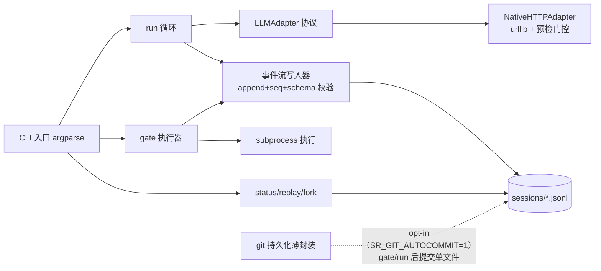

# 设计文档：Spec_Runner 薄壳 runner（P-009 方案 B）v1.0 (2026-08-26)

---
id: spec-runner-DESIGN
type: design
version: 1.0
status: in-review
date: 2026-08-26
depends: [spec-runner-RESEARCH, langgraph-upgrade-RESEARCH, deepseek-harness-RESEARCH]
upstream: null
---

> **Feature**: spec-runner（PROGRESS P-009——薄壳纯 Python runner，方案 B，独立仓库）
> **创建日期**: 2026-08-26（设计批——用户裁决三问三答：设计批先行 / F:\Spec_Runner / 选型开放结构）
> **Spec 步骤**: 本批 Step 3-4（设计）；Step 5-10（实施 + 验收 + 收口）归实施批（触发 = 设计批收口后用户指令）
> **设计规范输入**: [LANGGRAPH_UPGRADE_RESEARCH](../langgraph-upgrade/LANGGRAPH_UPGRADE_RESEARCH.md) v1.2 §5（方案 B 表）/ §6（主判断 + 触发条件）/ §9（L1-L7 + 事件行 schema + 不吸收清单）——§9.5 明确「§5 的跨会话状态行升格为 append-only JSONL 事件流，本节为准」
> **选型输入**: [DEEPSEEK_HARNESS_RESEARCH](../deepseek-harness/DEEPSEEK_HARNESS_RESEARCH.md) v1.0 层 3（dsh SDK vs 裸 API，开放结构裁决见 [SPEC_RUNNER_RESEARCH](./SPEC_RUNNER_RESEARCH.md) §2.3）

---

## 1. 设计目标

把本仓 spec 工作流的三个已实证痛点物理化为可执行件（独立仓库 `F:\Spec_Runner`，零框架依赖，~550-850 行预算）：

1. **门禁物理化**：RULE-1（时序独立）与流程门禁从「靠纪律」变为 `--gate` 命令 + 派生视图检查——审查 gate 未过，实施不可启动
2. **跨会话状态持久化**：append-only JSONL 事件流 + git commit（**P-022 修订：opt-in，`SR_GIT_AUTOCOMMIT=1` 显式激活，默认关**）——状态是事件流的派生视图（§9.5），会话压缩不再丢态
3. **取证副产物化**：E1 证据（RULE-6）从「手工组装」变为运行副产物——log 即证据，replay 即复现

**非目标**（不做清单，承 §9.4 + 方案 B 边界）：Web UI / 可视化（grep/jq 即可）；插件化 log writer（L7 信任层不可换）；持久 PTY / bash 进程状态延续（审查任务是批处理短生命周期）；Cordis 事件总线；多 worker / 水平扩展（单用户用不到——LANGGRAPH §6 理由 4）；LangGraph 迁移本身（触发条件复查制，见 §8）。

## 2. 关键设计决策

### D1. 双仓结构：代码仓 `F:\Spec_Runner`，spec 文档留本仓

| 候选 | 裁决 | 理由 |
|------|------|------|
| **独立仓库 + spec 留本仓（原采纳，P-019 修订）** | ✅➡️➡️ | 原理由：LANGGRAPH §6 主判断明文「独立仓库」；本仓身份 = 纯文档 + 最小工具层，runner 是执行器不是文档契约——三校验器（dc_validator/m7_stats/repo_stats）是本仓契约的机械化，runner 是工作流的机械化，两类可执行件分属两仓；spec 四件套留本仓保证 P-009 与十步流程同轨治理。**P-019 修订（2026-09-08）**：用户裁决并入本仓 `tools/spec_runner/`——外仓 27 天运行实证（无 remote/全 commit 服务本仓）推翻「独立生命周期」论据；管理便利 + 事件流证据同仓。详见 [SPEC_RUNNER_HOMING_DESIGN](../spec-runner-homing/SPEC_RUNNER_HOMING_DESIGN.md) D1 |
| 代码进本仓 scripts/ | ❌ | 违反「纯文档 + 最小工具层」定位的扩张方向；runner 有独立生命周期（自身版本、自身 git 历史、可能推送远程）——**P-019 修订：后两项论据经实证不成立；但「独立仓库存放形态」仍被修订为 tools/spec_runner/（独立工具目录，非 scripts/ 混放）** |
| spec 文档随代码仓 | ❌ | P-009 的 spec 治理（dc_validator DC1-DC4 / M7 登记 / PROGRESS 挂钩）依赖本仓工具链，搬走即脱离看护（不变） |

**E1 取证回流**：runner 事件流文件（`sessions/<session_id>.jsonl`）= 审查轮次的 E1 级证据（LANGGRAPH §9.2「log 即 E1 级证据」）；M7 样本行「来源」列可指向事件流路径 + seq 区间。**双向零依赖**：本仓三校验器不调 runner（本仓验证端不依赖外部工具——P-013「硬规则出裁决」约束）；runner 不依赖本仓任何文件（`--gate` 命令串由调用方注入，runner 只执行记录不内置本仓路径）。

### D2. 事件流为唯一 state（L1-L7 落地映射）

| 原则 | 落地设计 |
|------|---------|
| L1 append-only | 事件流文件 = `sessions/<sid>.jsonl`；写入器仅 `open(mode="a")` + 单行 write + flush；**无任何 update/rewrite 代码路径**（结构上不可表达） |
| L2 记录装配后请求 | `llm_request` 事件 input = 实际 POST 的完整 messages 数组 + 采样参数——取证口径与运行口径合一 |
| L3 未压缩 JSONL | 每行独立完整 JSON（ensure_ascii=False 可读中文）；grep/diff/replay 优先 |
| L4 四操作共享流 | resume = 对已有流追加（seq 续增）；fork = 复制前 i 行至新流；replay = 按序重放校验；search = grep（零代码，README 声明） |
| L5 source 过滤即 Trajectory | 每行 `source` 字段五档（system/user/assistant/tool/gate）——`grep '"source": "gate"'` 即门禁轨迹 |
| L6 新 session_id 强制 | `run` 对已存在 sid 且无 `--resume` 旗标即拒绝（exit 2）——RULE-1 在物理层不可绕过 |
| L7 log writer 固定 | 写入器为 runner 内置单文件组件，无插件接口、无配置替换点——**选型（D4）不影响本层** |

### D3. gate 语义：流程门禁执行器（非 LLM 判断）

`spec_runner.py gate --name <g> --cmd "<command>" [--session <sid>]`：
1. subprocess 执行 `--cmd`，捕获 exit code + stdout 尾部（≤2000 字符）
2. 写 gate 事件入流：`{"event": "gate", "gate": {"name", "cmd", "exit", "verdict": "pass"|"fail", "stdout_tail"}}`
3. **透传 exit code**（0/非零）——可嵌套进 pre-commit/CI 链
4. 派生视图检查：`spec_runner.py status` 重放流输出各 gate 通过态；后续流程步骤启动前检查前置 gate 的通过事件存在，不存在即拒绝执行（**审查 gate 未过 → 实施不可启动 = RULE-1 流程层物理化**）

裁决边界：gate 的 verdict = 命令 exit code 的机械映射，**不含 LLM 判断**（P-013「硬规则出裁决」——skill/LLM 出策略，硬规则出裁决；gate 只封装硬规则命令，如本仓三校验器）。

### D4. adapter 开放结构：裸 API 默认，dsh SDK 为升级候选

```
runner 核心（事件流/gate/git/CLI）── 依赖抽象界面 ──> LLMAdapter 协议
                                                      ├─ NativeHTTPAdapter（默认，urllib 裸调 OpenAI 兼容 API）
                                                      └─ DshSDKAdapter（候选，dsh H2 实测后裁决是否采纳）
```

- adapter 协议面（~40-60 行）：`chat(messages, **params) -> response` + `endpoint_ready() -> bool`
- 核心只依赖协议；两分支的 差异（工具注册/会话管理/JSONL 自带日志）被隔离在 adapter 单点——dsh SDK 若采纳，其自带 JSONL 与 runner 事件流的归一策略届时裁决（候选：dsh 日志作 input 附件并入 runner 流，**runner 流仍是唯一 state**——L1/L7 不破）
- dsh breaking changes 风险（developer preview）只及 adapter，锁版本约束写实施批 IMPL

### D5. 端点配置化 + 就绪门控（承 P-010 方案 Z 模式）

- 端点 = 运行时注入（`--endpoint` / env `SR_ENDPOINT` / config 文件三档，不硬编码 IP）
- 每次 LLM 调用前 `GET /v1/models` 预检（≤3s 超时）；不可达即写 `endpoint_unreachable` 事件 + exit 1，**不发起主调用**（杜绝虚假审查——与 pf_m7_eval 方案 Z 同款纪律）
- 当前实测：三端点均不可达（RESEARCH §2.2）——异构审查臂接入挂端点就绪，骨架其余功能零依赖端点

### D6. 零依赖约束：Python stdlib only

`urllib.request`（HTTP）/ `json` / `argparse` / `subprocess`（git 与 gate 命令）/ `pathlib` / 标准库单元断言（selftest）——与本仓三校验器同哲学（可审计性优先：无供应链、无版本 pin、逐行可读）。Python ≥3.8（对齐 dsh 下界，主控站 3.11+ 实测可用）。

### D7. session 生命周期与命令面（最小内核）

| 命令 | 语义 | L 原则 |
|------|------|--------|
| `run --task <t> --session <sid> [--resume]` | 装配 prompt → adapter.chat → 事件入流；sid 已存在且无 --resume 即 exit 2 | L2/L6 |
| `gate --name <g> --cmd <c>` | D3 门禁执行器 | L1（gate 入流非旁路） |
| `status [--session <sid>]` | 派生视图：gate 通过态 / seq / 末事件 | L1（状态=派生） |
| `replay --session <sid>` | 重放校验：seq 单调 + 每行可解析 + 装配请求可复现 | L4 / ADD 复现 |
| `fork --session <sid> --from <seq> --new <sid2>` | 复制前 seq 行至新流 | L4 |

session 生命周期事件：`session_start`（含 task/model/provider 声明）→ 0..n 业务事件 → `session_end`；`model`/`provider` 字段在 schema 恒在，LLM 相关事件（`llm_request`/`llm_response`/source=assistant）必填非空，非 LLM 事件值 null（RULE-5 追溯锚：grep 字段稳定）。

## 3. 事件行 schema（§9.3 细化定稿）

```json
{"ts": "2026-08-26T12:00:00+08:00", "seq": 42, "session": "p009-impl-001",
 "source": "tool", "model": null, "provider": null,
 "event": "gate",
 "input": {"cmd": "python scripts/dc_validator.py --check-all"},
 "output": {"stdout_tail": "DC 契约校验通过：60 文件，0 违规", "exit": 0},
 "gate": {"name": "dc-validator", "verdict": "pass"}}
```

| 字段 | 类型 | 约束 | 语义 |
|------|------|------|------|
| ts | str ISO8601 | 必填，含时区 | 事件时点 |
| seq | int | 必填，流内单调递增从 1 | append-only 机械保证（replay 校验项） |
| session | str | 必填，`^[a-z0-9-]+$` ≤64 | session_id（L6 审查边界） |
| source | enum | 必填 | system / user / assistant / tool / gate（L5） |
| model | str\|null | LLM 事件必填 | RULE-5 追溯锚 |
| provider | str\|null | LLM 事件必填 | 端点标识（如 lm-studio-a） |
| event | enum | 必填 | session_start / prompt / llm_request / llm_response / tool / gate / endpoint_unreachable / session_end |
| input / output | object\|null | 按事件类型 | L2 口径：input 记装配后实际载荷 |
| gate | object\|null | gate 事件必填 | {name, cmd, exit, verdict, stdout_tail}——门禁结论与过程同流 |

**校验约束（写入器强制）**：必填缺失 / seq 非递增 / source 越界 → 写入器抛错拒绝落盘（坏行不进流，流的完整性由写入端单点把守——单写者原则）。

## 4. 模块架构与 LOC 预算（实施批下达依据）



| 模块 | LOC 预算 | 职责 |
|------|---------|------|
| 事件流写入器 | ~100-150 | D2/L1-L3/L7；schema 校验；唯一写路径 |
| gate 执行器 | ~80-120 | D3；exit 透传；gate 后 git 快照钩子（P-022：opt-in 默认关） |
| adapter 接口 + NativeHTTP | ~120-180 | D4/D5；预检门控；超时重试（2 次） |
| CLI 入口 + 命令分发 | ~60-100 | D7 五命令 |
| status/replay/fork 派生件 | ~60-90 | L4；replay 校验 |
| git 持久化封装 | ~40-60 | subprocess 薄封装（add+commit，gate/run 后触发；P-022：门控默认关 + 精确 sid 单文件 + 会话目录 git 根派生 + --no-verify） |
| selftest | ~150-250 | 零依赖断言式（三校验器先例形态） |
| **合计** | **~550-850** | 落入 LANGGRAPH §5 的 500-1000 区间（RESEARCH B1） |

## 5. 与 Spec_Workflow 的集成契约

1. **spec 治理**：P-009 四件套在本仓 `spec/spec-runner/`（本批 RESEARCH + DESIGN；实施批补 IMPLEMENTATION + CHECKLIST），受 dc_validator DC1-DC4 / M7 / repo_stats 全套看护
2. **E1 回流**：runner 事件流 = 审查轮证据附件；M7 样本行「来源」列格式 `Spec_Runner:sessions/<sid>.jsonl#seq<i>-<j>`（指针化引用，账本不复制内容）
3. **实施批 IMPL 锚定**：IMPL 文档登记 Spec_Runner 仓的 commit hash（双仓漂移防线——DESIGN 风险 5）
4. **触发条件复查**：见 §8

## 6. 实施批规格（Step 9 执行清单）

| # | 动作 | 验收 |
|---|------|------|
| 1 | `F:\Spec_Runner` 建仓（git init + `spec_runner.py` 单文件骨架 + README 最小） | 仓存在；`python spec_runner.py --help` exit 0 |
| 2 | 七模块按 §4 预算实现 | 各模块 LOC ≤ 预算 ×1.2（超限须 IMPL 登记） |
| 3 | selftest（事件流写入/seq 拒绝非单调/schema 拒绝/gate exit 透传/replay 一致性/fork 正确性/L6 拒绝同 sid 复用/端点不可达 exit 1——mock server 用 stdlib `http.server`） | 全绿 + 计数自增（R7 同构，样本⑨ 教训） |
| 4 | 首个真实运行：对本仓执行一轮 gate 序列（dc_validator / m7_stats / repo_stats 三 gate 入流） | 事件流文件落盘；replay exit 0；**自身落地即 E1** |
| 5 | IMPLEMENTATION + CHECKLIST + PROGRESS/CODE_WIKI 视图同步 + 双仓 commit | 四通道全绿 + pre-commit 三 hook |

## 7. 风险

| 风险 | 缓解 |
|------|------|
| 端点长期不可达 → 异构审查臂空转 | D5 门控快速失败；骨架价值独立于端点（gate/事件流/git 无 LLM 也有效——本批 §6 第 4 步即无端点验证路径） |
| 薄壳变厚（scope creep） | §1 不做清单 + §4 LOC 预算硬约束（超限须登记裁决） |
| dsh SDK breaking（若采纳候选） | D4 adapter 隔离 + 实施批锁版本约束 |
| 事件流文件损坏（DIS-008 并行写入同族风险） | 单写者原则（每 session 单进程）+ 写入端 schema/seq 单点把守 + replay 兜底校验 |
| 双仓漂移（代码与 spec 不同步） | §5 集成契约 3（IMPL 锚 commit hash）+ P-009 PROGRESS 行追记制 |

## 8. LangGraph 触发条件登记复查机制（LANGGRAPH §6 承接）

runner 落地后，三条件随每次实施批收口复查并登记（PROGRESS P-009 追记，观察数据源 = 事件流机械重数）：

| 条件 | 观察指标（事件流可 grep） | 当前态 |
|------|-------------------------|--------|
| (a) 状态管理成瓶颈 | 条件分支/回环类事件频次翻倍 | 未现（骨架未落地） |
| (b) 跨会话恢复高频 + JSON 出错 ≥2 次/月 | `--resume` 使用计数 / replay 校验失败计数 | 未现 |
| (c) S1 异构复验自动跑批 ≥每周一次 | 异构审查 session 频次 | 未现（端点阻塞） |

## 9. 替代方案（否决记录）

1. **LangGraph 整体迁移（方案 A）**：否决——LANGGRAPH §6 主判断（仓库身份冲突 + 差异化能力单用户用不到 + 框架抽象失效面）
2. **维持现状 + 增量自动化（方案 C）**：否决——门禁靠纪律与会话压缩丢态是已实证痛点，本批触发裁决已成立
3. **runner 进本仓 scripts/**：否决（D1）
4. **dsh SDK 作默认实现**：否决为默认（D4 开放结构——实测输入被阻塞，breaking 风险前置不明；裸 API 是零依赖约束下确定性最高路径）

---

**Review 签字**: _________ 日期: _________（自查（单视角）完成；设计批收口后实施批另启；独立 pass 挂实施批后——P-010/P-014 收口先例）
